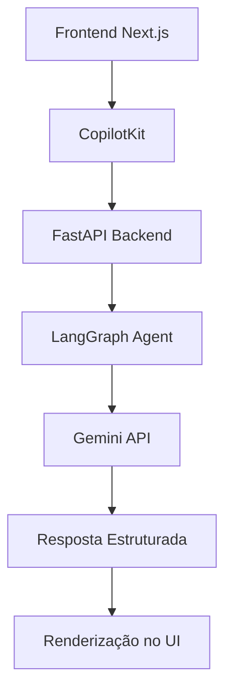

# Guia para Desenvolvedores

<cite>
**Arquivos Referenciados neste Documento**  
- [README.md](file://README.md)
- [agent/main.py](file://agent/main.py)
- [agent/posts_generator_agent.py](file://agent/posts_generator_agent.py)
- [agent/stack_agent.py](file://agent/stack_agent.py)
- [agent/prompts.py](file://agent/prompts.py)
- [app/api/copilotkit/route.ts](file://app/api/copilotkit/route.ts)
- [app/post-generator/page.tsx](file://app/post-generator/page.tsx)
- [app/stack-analyzer/page.tsx](file://app/stack-analyzer/page.tsx)
- [app/prompts/prompts.ts](file://app/prompts/prompts.ts)
- [components/ui/stack-analysis-cards.tsx](file://components/ui/stack-analysis-cards.tsx)
</cite>

## Sumário
1. [Introdução](#introdução)
2. [Pré-requisitos Técnicos](#pré-requisitos-técnicos)
3. [Estrutura do Projeto](#estrutura-do-projeto)
4. [Fluxo de Desenvolvimento](#fluxo-de-desenvolvimento)
5. [Convenções de Código e Git](#convenções-de-código-e-git)
6. [Extensão do Projeto](#extensão-do-projeto)
7. [Depuração e Solução de Problemas](#depuração-e-solução-de-problemas)
8. [Recursos de Aprendizado](#recursos-de-aprendizado)
9. [Áreas Críticas do Código](#áreas-críticas-do-código)

## Introdução

O projeto **Open Gemini Canvas** é uma demonstração prática de como integrar agentes de IA avançados usando **CopilotKit**, **Google Gemini** e **LangGraph**. Ele combina um frontend em **Next.js** com um backend em **FastAPI** para criar agentes especializados em geração de conteúdo e análise de tecnologias. Este guia destina-se a desenvolvedores que desejam contribuir, estender ou depurar o projeto, fornecendo uma visão abrangente da arquitetura, fluxos de trabalho e práticas recomendadas.

**Seção fontes**
- [README.md](file://README.md)

## Pré-requisitos Técnicos

Para contribuir efetivamente com o projeto, é essencial dominar as seguintes tecnologias:

- **TypeScript**: Utilizado extensivamente no frontend para tipagem estática e manutenção de código robusto.
- **React e Next.js**: O frontend é construído com React e utiliza o framework Next.js para renderização no lado do servidor e roteamento.
- **Python**: Linguagem principal do backend, responsável pela lógica dos agentes.
- **FastAPI**: Framework utilizado para criar a API RESTful que serve os agentes.
- **LangGraph**: Biblioteca usada para definir fluxos de trabalho de agentes com estados persistentes e execução condicional.

Além disso, conhecimento em **Gemini API** e **CopilotKit** é altamente recomendado para entender como os agentes interagem com o modelo de IA e com a interface do usuário.

**Seção fontes**
- [README.md](file://README.md)

## Estrutura do Projeto

O projeto é organizado em duas partes principais:

- **`/` (raiz)**: Contém o frontend em Next.js, incluindo páginas, componentes e contexto de estado.
- **`agent/`**: Contém o backend em FastAPI, onde estão definidos os agentes, prompts e lógica de integração com o Gemini.

### Frontend (`app/`)
- `api/copilotkit/route.ts`: Define a rota que conecta o frontend ao backend via CopilotKit.
- `post-generator/page.tsx`: Página principal para geração de posts em LinkedIn e X.
- `stack-analyzer/page.tsx`: Página para análise de repositórios GitHub.
- `contexts/LayoutContext.tsx`: Gerencia o estado global de layout entre páginas.
- `prompts/prompts.ts`: Define mensagens iniciais e sugestões para os agentes.

### Backend (`agent/`)
- `main.py`: Ponto de entrada do FastAPI, registra os agentes e define rotas.
- `posts_generator_agent.py`: Define o grafo de estado para geração de posts, incluindo busca na web.
- `stack_agent.py`: Define o grafo de estado para análise de stack, com extração de dados do GitHub.
- `prompts.py`: Contém prompts do sistema usados pelos agentes para orientar o modelo Gemini.

**Seção fontes**
- [README.md](file://README.md)
- [app/post-generator/page.tsx](file://app/post-generator/page.tsx)
- [app/stack-analyzer/page.tsx](file://app/stack-analyzer/page.tsx)
- [agent/main.py](file://agent/main.py)
- [agent/posts_generator_agent.py](file://agent/posts_generator_agent.py)
- [agent/stack_agent.py](file://agent/stack_agent.py)

## Fluxo de Desenvolvimento

### Configuração do Ambiente
1. Clone o repositório.
2. Crie arquivos `.env` tanto na raiz quanto em `agent/` com a chave da API do Google:
   ```env
   GOOGLE_API_KEY=sua_chave_aqui
   ```
3. Instale as dependências:
   ```bash
   pnpm install
   ```
4. Inicie o servidor:
   ```bash
   pnpm dev
   ```

### Execução e Depuração
- O frontend roda em `http://localhost:3000`.
- O backend (FastAPI) roda em `http://localhost:8000`.
- Use `console.log` no frontend e `print` no backend para depuração.
- O estado dos agentes é emitido via `copilotkit_emit_state`, visível no console do navegador.

**Seção fontes**
- [README.md](file://README.md)
- [agent/main.py](file://agent/main.py)
- [app/api/copilotkit/route.ts](file://app/api/copilotkit/route.ts)

## Convenções de Código e Git

### Convenções de Código
- **TypeScript**: Siga o padrão de tipagem rigorosa. Use interfaces para definir estruturas de dados.
- **Python**: Adote PEP 8. Use anotações de tipo e docstrings claras.
- **Componentes React**: Utilize hooks personalizados (ex: `useCopilotAction`) para lógica de IA.
- **Prompts**: Mantenha prompts claros e estruturados, com regras explícitas para o modelo.

### Processo de Pull Request
1. Crie uma nova branch a partir de `main`.
2. Faça suas alterações com commits descritivos.
3. Abra um pull request com uma descrição clara da mudança.
4. Aguarde revisão e feedback.

**Seção fontes**
- [agent/prompts.py](file://agent/prompts.py)
- [app/post-generator/page.tsx](file://app/post-generator/page.tsx)
- [app/stack-analyzer/page.tsx](file://app/stack-analyzer/page.tsx)

## Extensão do Projeto

### Adicionar Novos Componentes UI
1. Crie um novo componente em `components/ui/`.
2. Importe-o em uma página existente.
3. Use `useCopilotAction` para vincular ações do agente ao componente.

### Modificar Agentes
1. Edite o grafo de estado em `posts_generator_agent.py` ou `stack_agent.py`.
2. Atualize os prompts em `prompts.py` se necessário.
3. Teste localmente antes de enviar.

### Criar Novas Páginas
1. Adicione uma nova pasta em `app/` com `page.tsx`.
2. Defina o layout e integre com `CopilotKit`.
3. Registre o novo agente em `agent/main.py` se necessário.

**Seção fontes**
- [app/post-generator/page.tsx](file://app/post-generator/page.tsx)
- [app/stack-analyzer/page.tsx](file://app/stack-analyzer/page.tsx)
- [agent/posts_generator_agent.py](file://agent/posts_generator_agent.py)
- [agent/stack_agent.py](file://agent/stack_agent.py)

## Depuração e Solução de Problemas

### Comunicação Frontend-Backend
- Verifique se o backend está rodando em `http://localhost:8000`.
- Confira a variável `NEXT_PUBLIC_LANGGRAPH_URL` no frontend.
- Use o DevTools para inspecionar requisições HTTP para `/api/copilotkit`.

### Erros no Processamento de Prompts
- Valide o formato do prompt em `prompts.py`.
- Certifique-se de que o modelo Gemini está recebendo os dados corretos.
- Verifique logs no backend para erros de parsing ou execução.

**Seção fontes**
- [app/api/copilotkit/route.ts](file://app/api/copilotkit/route.ts)
- [agent/main.py](file://agent/main.py)
- [agent/posts_generator_agent.py](file://agent/posts_generator_agent.py)

## Recursos de Aprendizado

- **CopilotKit**: Consulte a [documentação oficial](https://docs.copilotkit.ai) para entender integrações com frontend e backend.
- **LangGraph**: Explore exemplos no [repositório oficial](https://github.com/langchain-ai/langgraph) para dominar grafos com estado.
- **Gemini API**: Acesse a [documentação do Google](https://ai.google.dev/gemini-api/docs) para aprender sobre capacidades e limites do modelo.

**Seção fontes**
- [README.md](file://README.md)

## Áreas Críticas do Código

### `stack_agent.py`
Este arquivo contém a lógica mais complexa do projeto, incluindo:
- Extração de dados do GitHub via API.
- Análise estruturada com `StructuredStackAnalysis`.
- Geração de respostas em formato JSON rigoroso.

### `posts_generator_agent.py`
Implementa um fluxo de trabalho com múltiplos nós:
- `chat_node`: Realiza busca na web e prepara contexto.
- `fe_actions_node`: Gera posts usando ações do frontend.
- `end_node`: Finaliza o fluxo.

### `useCopilotAction`
No frontend, este hook é crucial para renderizar conteúdo gerado pelo agente. Qualquer erro aqui afeta diretamente a experiência do usuário.



**Fontes do Diagrama**
- [app/api/copilotkit/route.ts](file://app/api/copilotkit/route.ts)
- [agent/main.py](file://agent/main.py)
- [agent/posts_generator_agent.py](file://agent/posts_generator_agent.py)

**Seção fontes**
- [agent/stack_agent.py](file://agent/stack_agent.py)
- [agent/posts_generator_agent.py](file://agent/posts_generator_agent.py)
- [app/post-generator/page.tsx](file://app/post-generator/page.tsx)