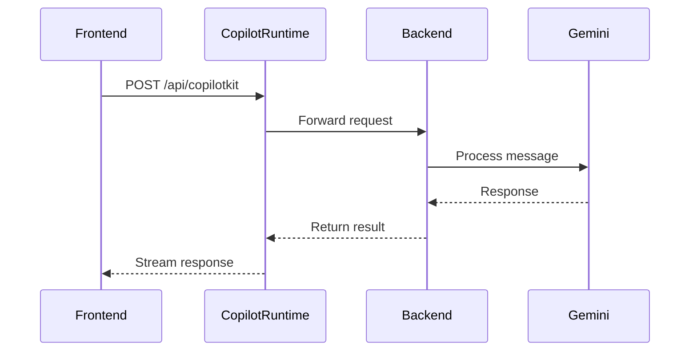
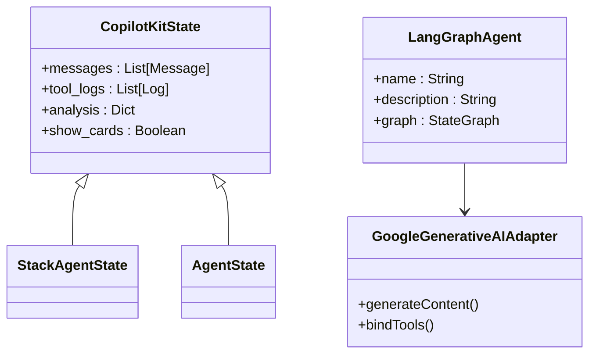

# Integração entre Camadas

<cite>
**Arquivos Referenciados neste Documento**  
- [app/api/copilotkit/route.ts](file://app/api/copilotkit/route.ts)
- [app/api/chat/route.ts](file://app/api/chat/route.ts)
- [agent/main.py](file://agent/main.py)
- [agent/posts_generator_agent.py](file://agent/posts_generator_agent.py)
- [agent/stack_agent.py](file://agent/stack_agent.py)
- [package.json](file://package.json)
- [scripts/setup-agent.sh](file://scripts/setup-agent.sh)
- [agent/pyproject.toml](file://agent/pyproject.toml)
- [README.md](file://README.md)
</cite>

## Sumário
1. [Introdução](#introdução)
2. [Estrutura do Projeto](#estrutura-do-projeto)
3. [Fluxo de Integração Frontend-Backend](#fluxo-de-integração-frontend-backend)
4. [Análise das Rotas API](#análise-das-rotas-api)
5. [Papel do CopilotKit na Serialização](#papel-do-copilotkit-na-serialização)
6. [Fluxo de Dados: Interface ao Backend](#fluxo-de-dados-interface-ao-backend)
7. [Exemplos de Requisições e Formatos](#exemplos-de-requisições-e-formatos)
8. [Configuração de Ambiente e Inicialização](#configuração-de-ambiente-e-inicialização)
9. [Tratamento de Erros e Problemas Comuns](#tratamento-de-erros-e-problemas-comuns)
10. [Conclusão](#conclusão)

## Introdução

O projeto open-gemini-canvas demonstra uma arquitetura moderna de integração entre frontend e backend, utilizando Next.js como camada de interface, FastAPI como servidor de agentes de IA e CopilotKit como middleware de comunicação. Esta documentação detalha como as rotas `/api/copilotkit` e `/api/chat` atuam como pontes entre as camadas, permitindo a execução de agentes de IA baseados em Google Gemini e LangGraph. O foco está na serialização de ações, roteamento de mensagens e sincronização de estado entre frontend e backend.

**Section sources**
- [README.md](file://README.md#L4-L86)

## Estrutura do Projeto

O projeto é organizado em duas partes principais: o frontend em Next.js, localizado na raiz do projeto, e o backend em FastAPI, localizado na pasta `agent/`. O frontend contém páginas como `post-generator` e `stack-analyzer`, que interagem com os agentes Python por meio de rotas API. O backend expõe os agentes LangGraph via endpoints FastAPI, permitindo a execução de tarefas complexas como geração de posts e análise de stacks tecnológicos.

```mermaid
graph TD
subgraph Frontend
A[Next.js App]
B[/api/chat/route.ts]
C[/api/copilotkit/route.ts]
end
subgraph Backend
D[FastAPI Server]
E[main.py]
F[posts_generator_agent.py]
G[stack_agent.py]
end
A --> B
A --> C
B --> D
C --> D
D --> E
E --> F
E --> G
```

**Diagram sources**
- [app/api/copilotkit/route.ts](file://app/api/copilotkit/route.ts#L1-L25)
- [app/api/chat/route.ts](file://app/api/chat/route.ts#L1-L114)
- [agent/main.py](file://agent/main.py#L1-L62)

**Section sources**
- [README.md](file://README.md#L4-L86)

## Fluxo de Integração Frontend-Backend

A integração entre frontend e backend ocorre por meio de chamadas HTTP assíncronas, onde o frontend envia mensagens de usuário e o backend processa essas mensagens usando agentes de IA. O CopilotKit atua como intermediário, gerenciando o estado da conversa, serializando ações e roteando mensagens para os agentes apropriados. O frontend utiliza o SDK do CopilotKit para renderizar componentes de chat e exibir logs de ferramentas, enquanto o backend processa as mensagens com modelos Gemini e LangGraph.

**Section sources**
- [README.md](file://README.md#L4-L86)

## Análise das Rotas API

### Rota `/api/copilotkit`

A rota `app/api/copilotkit/route.ts` é responsável por conectar o frontend ao backend FastAPI. Ela utiliza o `CopilotRuntime` para rotear mensagens para o endpoint remoto do agente, definido pela variável de ambiente `NEXT_PUBLIC_LANGGRAPH_URL`. O `GoogleGenerativeAIAdapter` é usado para integrar com o modelo Gemini, permitindo a geração de respostas multimodais.



**Diagram sources**
- [app/api/copilotkit/route.ts](file://app/api/copilotkit/route.ts#L1-L25)
- [agent/main.py](file://agent/main.py#L1-L62)

**Section sources**
- [app/api/copilotkit/route.ts](file://app/api/copilotkit/route.ts#L1-L25)

### Rota `/api/chat`

A rota `app/api/chat/route.ts` implementa um fluxo de chat direto com o modelo GPT-4o da OpenAI, utilizando a biblioteca `ai`. Ela define ferramentas como `researchTopic` e `generateReport`, que simulam pesquisas e geração de relatórios. Embora use OpenAI, a estrutura é semelhante à do CopilotKit, permitindo streaming de respostas e execução de ferramentas.

**Section sources**
- [app/api/chat/route.ts](file://app/api/chat/route.ts#L1-L114)

## Papel do CopilotKit na Serialização

O CopilotKit desempenha um papel crucial na serialização de ações de IA, transformando chamadas de funções em mensagens estruturadas que podem ser processadas pelo frontend. Ele utiliza o `copilotkit_emit_state` para atualizar o estado da UI em tempo real, mostrando logs de ferramentas e progresso do agente. No backend, o `LangGraphAgent` define os agentes disponíveis, como o gerador de posts e o analisador de stack, que são expostos via FastAPI.



**Diagram sources**
- [agent/posts_generator_agent.py](file://agent/posts_generator_agent.py#L1-L163)
- [agent/stack_agent.py](file://agent/stack_agent.py#L1-L503)

**Section sources**
- [agent/posts_generator_agent.py](file://agent/posts_generator_agent.py#L1-L163)
- [agent/stack_agent.py](file://agent/stack_agent.py#L1-L503)

## Fluxo de Dados: Interface ao Backend

O fluxo de dados começa com o usuário interagindo com a interface em Next.js. A mensagem é enviada para `/api/copilotkit`, que a encaminha ao backend FastAPI. O agente apropriado é selecionado com base na tarefa, e o modelo Gemini processa a mensagem, possivelmente realizando pesquisas na web. Os resultados são serializados e enviados de volta ao frontend, onde são exibidos como mensagens de chat ou componentes UI.

**Section sources**
- [app/api/copilotkit/route.ts](file://app/api/copilotkit/route.ts#L1-L25)
- [agent/main.py](file://agent/main.py#L1-L62)

## Exemplos de Requisições e Formatos

### Exemplo de Requisição HTTP

```http
POST /api/copilotkit HTTP/1.1
Content-Type: application/json

{
  "messages": [
    {
      "role": "user",
      "content": "https://github.com/example/repo"
    }
  ]
}
```

### Formato de Resposta

```json
{
  "messages": [
    {
      "role": "assistant",
      "content": "Análise concluída. Stack detectado: Next.js, FastAPI, PostgreSQL."
    }
  ],
  "tool_logs": [
    {
      "message": "Fetching repository metadata",
      "status": "completed"
    }
  ],
  "show_cards": true
}
```

**Section sources**
- [app/api/copilotkit/route.ts](file://app/api/copilotkit/route.ts#L1-L25)
- [agent/stack_agent.py](file://agent/stack_agent.py#L1-L503)

## Configuração de Ambiente e Inicialização

### Variáveis de Ambiente

#### Frontend (`.env`)
```env
NEXT_PUBLIC_LANGGRAPH_URL=http://localhost:8000/copilotkit
GOOGLE_API_KEY=your-gemini-key
```

#### Backend (`agent/.env`)
```env
GOOGLE_API_KEY=your-gemini-key
GITHUB_TOKEN=your-github-token
```

### Scripts de Inicialização

O script `dev` no `package.json` inicia simultaneamente o frontend e o backend usando `concurrently`. O script `install:agent` configura o ambiente Python com Poetry.

```json
"scripts": {
  "dev": "concurrently \"npm run dev:ui\" \"npm run dev:agent\"",
  "dev:agent": "cd agent && poetry run python main.py",
  "install:agent": ".\\scripts\\setup-agent.bat || sh ./scripts/setup-agent.sh"
}
```

**Section sources**
- [package.json](file://package.json#L1-L85)
- [scripts/setup-agent.sh](file://scripts/setup-agent.sh#L1-L13)
- [agent/pyproject.toml](file://agent/pyproject.toml#L1-L27)

## Tratamento de Erros e Problemas Comuns

### Timeouts

O backend pode enfrentar timeouts em requisições lentas do GitHub. Solução: aumentar o timeout em `_gh_get` ou implementar retry com backoff.

### Erros de CORS

Garanta que o backend FastAPI inclua os headers CORS corretos. O `add_fastapi_endpoint` do CopilotKit já configura CORS, mas pode ser necessário ajustar.

### Sincronização de Versões

Mantenha as versões do CopilotKit sincronizadas entre frontend e backend. Use exatamente a mesma versão no `package.json` e `pyproject.toml`.

### Erros Comuns

- **Chave API ausente**: Verifique `GOOGLE_API_KEY` em ambos os ambientes.
- **Backend não iniciado**: O frontend depende do backend rodando na porta 8000.
- **Variável de ambiente incorreta**: `NEXT_PUBLIC_LANGGRAPH_URL` deve apontar para o endpoint correto.

**Section sources**
- [README.md](file://README.md#L4-L86)
- [agent/main.py](file://agent/main.py#L1-L62)

## Conclusão

A integração entre frontend e backend no open-gemini-canvas é eficiente e bem estruturada, utilizando o CopilotKit como camada de abstração para comunicação com agentes de IA. As rotas API servem como pontes claras, permitindo a serialização de ações e o streaming de respostas. Com a configuração adequada de ambiente e o tratamento de erros, o sistema oferece uma experiência de usuário fluida e poderosa para tarefas de IA avançadas.