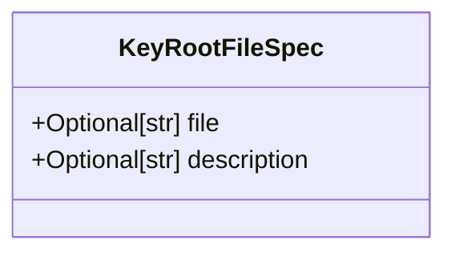
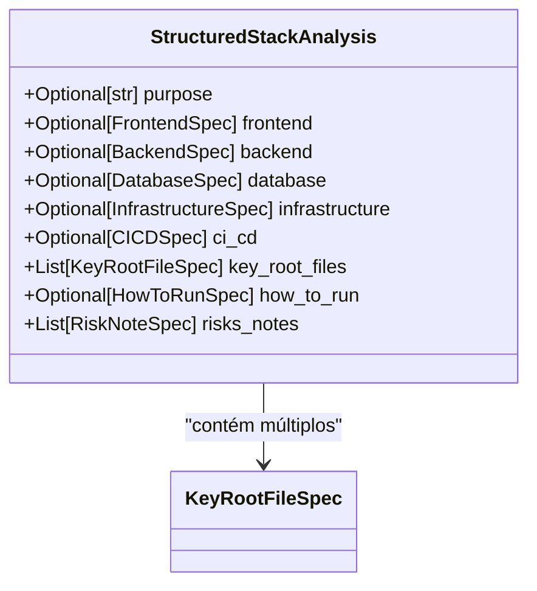
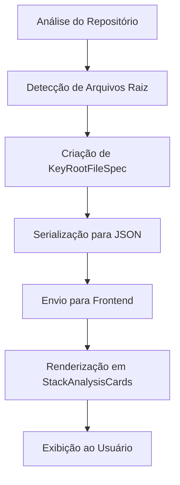

# Especificação de Arquivos Raiz (KeyRootFileSpec)

<cite>
**Arquivos Referenciados neste Documento**  
- [agent/stack_agent.py](file://agent/stack_agent.py)
- [components/ui/stack-analysis-cards.tsx](file://components/ui/stack-analysis-cards.tsx)
</cite>

## Sumário
1. [Introdução](#introdução)
2. [Estrutura da Classe KeyRootFileSpec](#estrutura-da-classe-keyrootfilespec)
3. [Uso em StructuredStackAnalysis](#uso-em-structuredstackanalysis)
4. [Exemplo de Uso e População](#exemplo-de-uso-e-população)
5. [Visualização no Frontend](#visualização-no-frontend)
6. [Conclusão](#conclusão)

## Introdução

A classe `KeyRootFileSpec` desempenha um papel fundamental no processo de análise de repositórios de software dentro do sistema `open-gemini-canvas`. Ela é utilizada para identificar, documentar e estruturar informações sobre arquivos-chave localizados na raiz do repositório, como `README.md`, `package.json`, `Dockerfile`, entre outros. Esses arquivos são essenciais para entender a configuração, as tecnologias utilizadas e as instruções de execução de um projeto.

Essa especificação é parte integrante do modelo `StructuredStackAnalysis`, que organiza a análise técnica de um repositório GitHub de forma estruturada e padronizada, permitindo que o sistema extraia insights valiosos sobre a arquitetura e as dependências do projeto.

**Section sources**  
- [agent/stack_agent.py](file://agent/stack_agent.py#L70-L72)

## Estrutura da Classe KeyRootFileSpec

A classe `KeyRootFileSpec` é definida como um modelo Pydantic (`BaseModel`) e possui dois campos principais, ambos do tipo `str` e opcionais:

- **`file`**: Representa o nome do arquivo raiz detectado (por exemplo, `package.json`, `Dockerfile`). Este campo identifica o arquivo dentro do contexto do repositório.
- **`description`**: Fornece uma descrição textual do propósito do arquivo, inferido com base no seu conteúdo ou nome. Por exemplo, um `Dockerfile` pode ter a descrição "Define a configuração de containerização com Docker".

Esses campos são declarados como `Optional[str]`, o que significa que podem ser nulos, permitindo flexibilidade na análise quando certas informações não estão disponíveis.



**Diagram sources**  
- [agent/stack_agent.py](file://agent/stack_agent.py#L70-L72)

**Section sources**  
- [agent/stack_agent.py](file://agent/stack_agent.py#L70-L72)

## Uso em StructuredStackAnalysis

A classe `KeyRootFileSpec` é utilizada dentro do modelo `StructuredStackAnalysis` como parte de uma lista (`List[KeyRootFileSpec]`), permitindo que múltiplos arquivos raiz sejam documentados de forma estruturada. O campo `key_root_files` é definido com `Field(default_factory=list)`, o que garante que uma nova lista vazia seja criada para cada instância do modelo, evitando efeitos colaterais indesejados de listas compartilhadas entre instâncias.

Esse padrão é essencial para coletar dinamicamente todos os arquivos relevantes encontrados na raiz do repositório durante a análise. O processo de detecção envolve a verificação de uma lista predefinida de arquivos comuns (`ROOT_MANIFEST_CANDIDATES`) e a leitura de seus conteúdos para inferir descrições e tecnologias utilizadas.



**Diagram sources**  
- [agent/stack_agent.py](file://agent/stack_agent.py#L87-L95)

**Section sources**  
- [agent/stack_agent.py](file://agent/stack_agent.py#L87-L95)

## Exemplo de Uso e População

Durante a análise de um repositório, o sistema pode detectar e popular a lista `key_root_files` com entradas como:

```python
[
    KeyRootFileSpec(
        file="package.json",
        description="Define dependências do Node.js e scripts de build para aplicação React"
    ),
    KeyRootFileSpec(
        file="requirements.txt",
        description="Lista pacotes Python para backend FastAPI"
    ),
    KeyRootFileSpec(
        file="Dockerfile",
        description="Configuração de containerização com Docker"
    )
]
```

Essa lista é então serializada em JSON e retornada como parte da análise estruturada, permitindo que o frontend interprete e exiba essas informações de forma clara e organizada.

**Section sources**  
- [agent/stack_agent.py](file://agent/stack_agent.py#L338-L379)

## Visualização no Frontend

No frontend, as informações de `key_root_files` são exibidas em um componente chamado `StackAnalysisCards`. Cada arquivo é renderizado em um cartão com seu nome em formato monoespaçado e sua descrição em texto menor, permitindo uma visualização clara e acessível dos arquivos-chave do projeto.

O componente React `stack-analysis-cards.tsx` define uma interface `RootFileEntry` que espelha a estrutura de `KeyRootFileSpec`, garantindo compatibilidade entre o backend e o frontend.



**Diagram sources**  
- [components/ui/stack-analysis-cards.tsx](file://components/ui/stack-analysis-cards.tsx#L10-L12)
- [agent/stack_agent.py](file://agent/stack_agent.py#L87-L95)

**Section sources**  
- [components/ui/stack-analysis-cards.tsx](file://components/ui/stack-analysis-cards.tsx#L10-L12)
- [components/ui/stack-analysis-cards.tsx](file://components/ui/stack-analysis-cards.tsx#L239-L258)

## Conclusão

A classe `KeyRootFileSpec` é um componente essencial para a documentação automatizada de repositórios de software. Ao estruturar informações sobre arquivos raiz, ela permite que o sistema `open-gemini-canvas` forneça uma visão clara e detalhada da configuração técnica de um projeto, facilitando a compreensão rápida da stack utilizada, das dependências e das instruções de execução. Sua integração com `StructuredStackAnalysis` e o frontend demonstra um fluxo de dados bem projetado e eficiente.