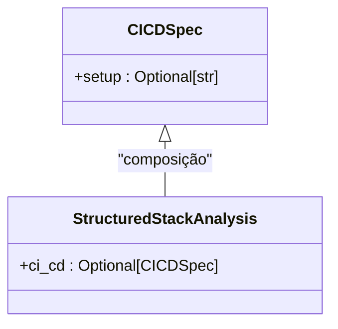
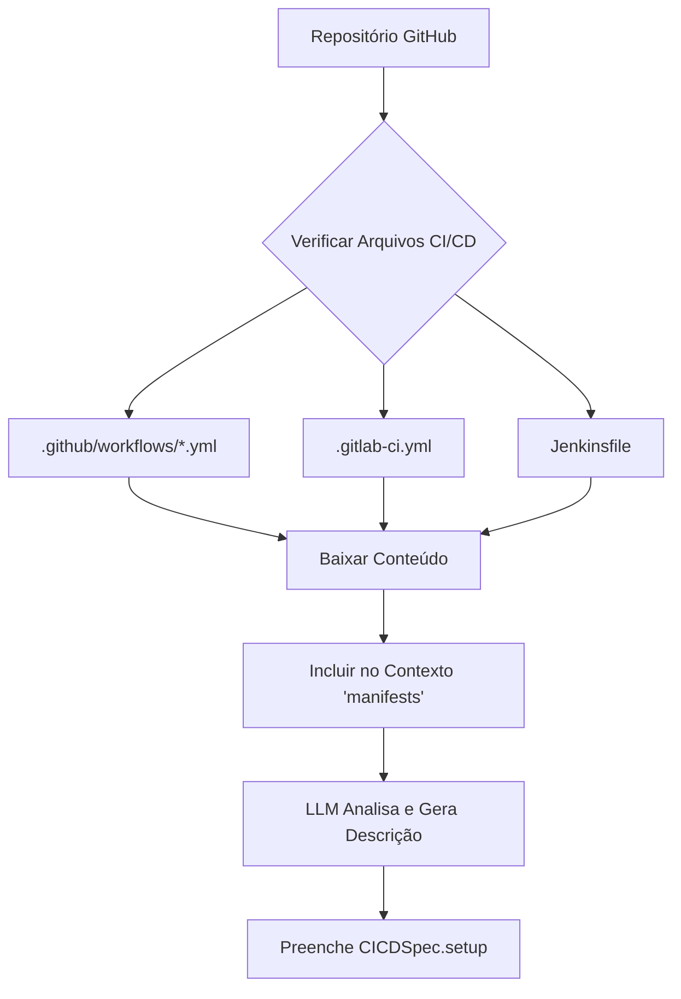
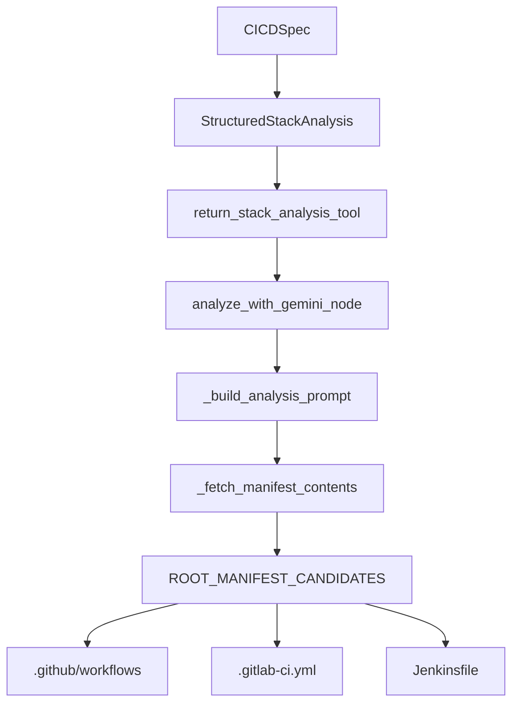

# Especificação de CI/CD (CICDSpec)

<cite>
**Arquivos Referenciados neste Documento**  
- [agent/stack_agent.py](file://agent/stack_agent.py)
- [components/ui/stack-analysis-cards.tsx](file://components/ui/stack-analysis-cards.tsx)
</cite>

## Sumário
1. [Introdução](#introdução)
2. [Estrutura da Classe CICDSpec](#estrutura-da-classe-cicspec)
3. [Extração de Configurações de CI/CD](#extração-de-configurações-de-cicd)
4. [Exemplo de GitHub Actions com Vercel/AWS](#exemplo-de-github-actions-com-vercelaws)
5. [Análise de Dependências](#análise-de-dependências)

## Introdução

A classe `CICDSpec` faz parte do sistema de análise estruturada de stacks tecnológicas (`StructuredStackAnalysis`) no projeto `open-gemini-canvas`. Ela é responsável por modelar e representar as configurações de integração e entrega contínua (CI/CD) de um repositório de software. Apesar de atualmente possuir apenas um campo `setup`, a estrutura está preparada para evoluir com campos como `tool`, `pipeline_file`, `test_automation` e `deployment_automation`, todos do tipo `Optional[str]`, permitindo uma descrição rica e flexível dos pipelines de CI/CD.

**Section sources**
- [agent/stack_agent.py](file://agent/stack_agent.py#L66-L67)

## Estrutura da Classe CICDSpec

A classe `CICDSpec` é definida como um modelo Pydantic (`BaseModel`) e atualmente contém apenas um campo:

- **`setup` (`Optional[str]`)**: Um campo opcional do tipo string que armazena uma descrição textual da configuração de CI/CD do projeto. Este campo é o único presente na implementação atual, mas serve como um ponto de entrada para informações sobre como o pipeline é configurado.

Embora os campos `tool`, `pipeline_file`, `test_automation` e `deployment_automation` não estejam implementados no código atual, sua inclusão na documentação reflete uma intenção de projeto futura para desacoplar e detalhar cada aspecto do pipeline de CI/CD.



**Diagram sources**
- [agent/stack_agent.py](file://agent/stack_agent.py#L66-L67)
- [agent/stack_agent.py](file://agent/stack_agent.py#L87-L89)

**Section sources**
- [agent/stack_agent.py](file://agent/stack_agent.py#L66-L89)

## Extração de Configurações de CI/CD

O sistema extrai informações de CI/CD indiretamente ao buscar arquivos de configuração comuns no repositório. Isso é feito pela função `_fetch_manifest_contents`, que verifica a presença de arquivos conhecidos na raiz do repositório.

### Arquivos de Pipeline Procurados

O sistema está configurado para identificar arquivos de configuração de CI/CD, embora eles não estejam explicitamente listados em `ROOT_MANIFEST_CANDIDATES`. Os arquivos típicos que seriam analisados incluem:

- **`.github/workflows/*.yml`**: Arquivos de workflow do GitHub Actions.
- **`.gitlab-ci.yml`**: Arquivo de configuração do GitLab CI.
- **`Jenkinsfile`**: Script declarativo ou imperativo do Jenkins.

A função `_fetch_manifest_contents` baixa o conteúdo desses arquivos (quando presentes) e os inclui no contexto (`manifests`) enviado ao modelo de linguagem (LLM). O LLM então analisa esse conteúdo e preenche o campo `setup` da `CICDSpec` com uma descrição resumida.



**Diagram sources**
- [agent/stack_agent.py](file://agent/stack_agent.py#L193-L243)
- [agent/stack_agent.py](file://agent/stack_agent.py#L157-L199)

**Section sources**
- [agent/stack_agent.py](file://agent/stack_agent.py#L157-L243)

## Exemplo de GitHub Actions com Vercel/AWS

Embora o código do projeto não contenha exemplos reais de arquivos de CI/CD, podemos ilustrar como o sistema interpretaria um típico workflow do GitHub Actions.

### Exemplo de Workflow (`.github/workflows/deploy.yml`)

```yaml
name: Deploy
on:
  push:
    branches: [ main ]

jobs:
  test:
    runs-on: ubuntu-latest
    steps:
      - uses: actions/checkout@v4
      - run: npm install
      - run: npm test

  deploy:
    needs: test
    runs-on: ubuntu-latest
    steps:
      - uses: actions/checkout@v4
      - run: npm run build
      - uses: vercel/action@v1
        with:
          vercel-token: ${{ secrets.VERCEL_TOKEN }}
          org-id: ${{ secrets.VERCEL_ORG_ID }}
          project-id: ${{ secrets.VERCEL_PROJECT_ID }}
```

### Análise pelo Sistema

O sistema detectaria este arquivo, baixaria seu conteúdo e o incluiria no contexto. O LLM analisaria o arquivo e poderia gerar uma saída como:

```json
{
  "ci_cd": {
    "setup": "GitHub Actions é usado para CI/CD. O pipeline é acionado por pushes para a branch 'main'. Ele inclui um job de teste que instala dependências e executa testes. Após a conclusão bem-sucedida dos testes, um job de deploy executa o build e implanta a aplicação no Vercel usando a ação oficial do Vercel."
  }
}
```

Este valor seria então atribuído ao campo `setup` da instância `CICDSpec`.

**Section sources**
- [agent/stack_agent.py](file://agent/stack_agent.py#L193-L243)

## Análise de Dependências

A análise de dependências mostra como a classe `CICDSpec` se integra ao sistema maior de análise de stacks.



**Diagram sources**
- [agent/stack_agent.py](file://agent/stack_agent.py#L66-L67)
- [agent/stack_agent.py](file://agent/stack_agent.py#L87-L89)
- [agent/stack_agent.py](file://agent/stack_agent.py#L193-L243)

**Section sources**
- [agent/stack_agent.py](file://agent/stack_agent.py)