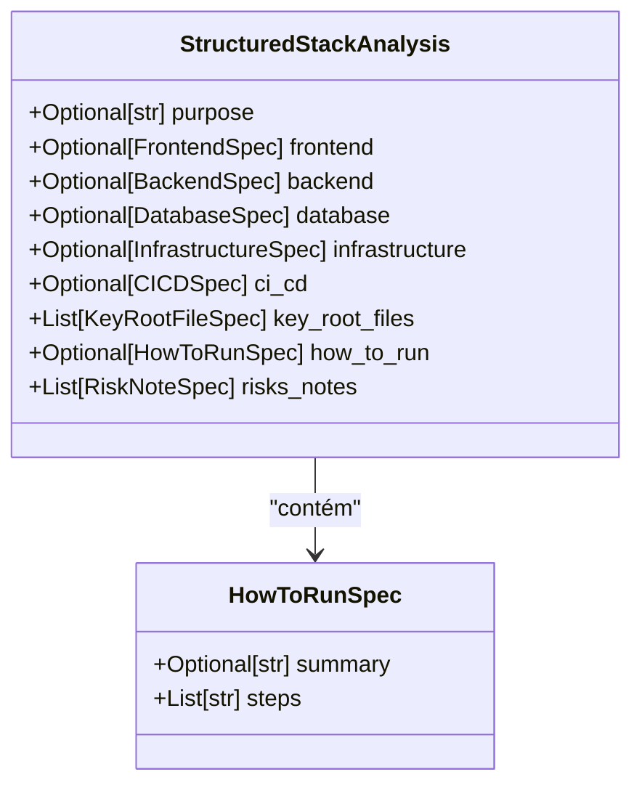
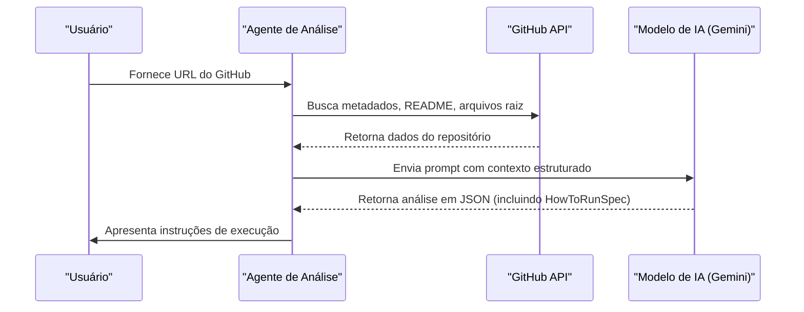
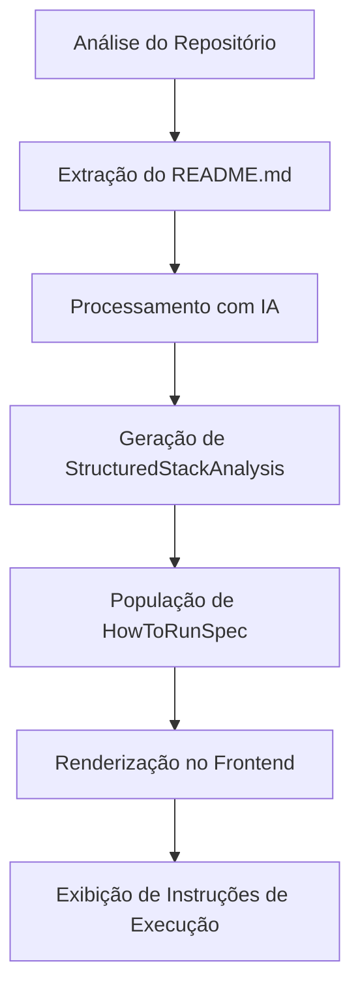

# Especificação de Como Executar (HowToRunSpec)

<cite>
**Arquivos Referenciados neste Documento**  
- [agent/stack_agent.py](file://agent/stack_agent.py)
- [README.md](file://README.md)
- [components/ui/stack-analysis-cards.tsx](file://components/ui/stack-analysis-cards.tsx)
</cite>

## Sumário
1. [Introdução](#introdução)
2. [Estrutura da Classe HowToRunSpec](#estrutura-da-classe-howtorunspec)
3. [Extração de Dados do README.md](#extração-de-dados-do-readmemd)
4. [Análise Estruturada do Projeto](#análise-estruturada-do-projeto)
5. [Exemplo de Execução e Variáveis de Ambiente](#exemplo-de-execução-e-variáveis-de-ambiente)
6. [Integração com a Interface de Usuário](#integração-com-a-interface-de-usuário)

## Introdução

A classe `HowToRunSpec` faz parte do sistema de análise estruturada `StructuredStackAnalysis`, projetado para extrair e organizar informações cruciais sobre como configurar, executar e gerenciar um projeto de software. Seu principal objetivo é fornecer instruções claras e estruturadas para a execução local do projeto, baseadas em análise automática do `README.md` e de arquivos manifestos no diretório raiz.

Essa especificação é fundamental para usuários que desejam replicar o ambiente de desenvolvimento, contribuir com o projeto ou simplesmente entender os passos necessários para colocar a aplicação em funcionamento.

**Section sources**
- [agent/stack_agent.py](file://agent/stack_agent.py#L75-L77)
- [README.md](file://README.md#L1-L173)

## Estrutura da Classe HowToRunSpec

A classe `HowToRunSpec` é definida como um modelo Pydantic (`BaseModel`) e contém dois campos principais:

- `summary`: Um campo opcional do tipo `str` que fornece uma visão geral concisa das instruções de execução.
- `steps`: Uma lista de strings (`List[str]`) que detalha os comandos e procedimentos necessários para configurar e executar o projeto.

Essa estrutura permite que o agente de análise extraia informações do `README.md` e as organize de forma padronizada, facilitando a apresentação na interface de usuário.

**Diagram sources**
- [agent/stack_agent.py](file://agent/stack_agent.py#L75-L77)
- [agent/stack_agent.py](file://agent/stack_agent.py#L85-L94)

**Section sources**
- [agent/stack_agent.py](file://agent/stack_agent.py#L75-L77)

## Extração de Dados do README.md

O processo de extração dos dados de execução começa com a função `_fetch_readme`, que busca o conteúdo do arquivo `README.md` do repositório GitHub fornecido. O conteúdo é então truncado para os primeiros 8000 caracteres e incluído no prompt de análise enviado ao modelo de IA (Google Gemini via OpenRouter).

O modelo interpreta o conteúdo do `README.md`, identificando seções relevantes como "Getting Started", "Installation", "Setup" ou "Running the project", e extrai os comandos e instruções necessárias para popular o campo `steps` da `HowToRunSpec`.

**Section sources**
- [agent/stack_agent.py](file://agent/stack_agent.py#L180-L188)
- [README.md](file://README.md#L1-L173)

## Análise Estruturada do Projeto

A classe `StructuredStackAnalysis` atua como um contêiner para todas as informações extraídas do repositório, incluindo a especificação de como executar o projeto. O campo `how_to_run` é opcional, mas quando presente, fornece um guia passo a passo para a configuração e execução.

O agente utiliza o contexto coletado (metadados do repositório, linguagens, arquivos raiz, manifestos e README) para construir um prompt detalhado, que é processado pelo modelo de IA. O resultado é uma análise estruturada em formato JSON, que inclui a `HowToRunSpec` como parte da resposta final.

**Diagram sources**
- [agent/stack_agent.py](file://agent/stack_agent.py#L250-L320)
- [agent/stack_agent.py](file://agent/stack_agent.py#L350-L400)

**Section sources**
- [agent/stack_agent.py](file://agent/stack_agent.py#L85-L94)

## Exemplo de Execução e Variáveis de Ambiente

Com base no conteúdo do `README.md`, a `HowToRunSpec` pode gerar instruções semelhantes às seguintes:

- `steps`:
  - `pnpm install`
  - `cp .env.example .env`
  - `cp agent/.env.example agent/.env`
  - `pnpm dev`

Além disso, o sistema identifica variáveis de ambiente críticas mencionadas nos arquivos de configuração, como:
- `OPENROUTER_API_KEY`
- `OPENROUTER_MODEL`
- `NEXT_PUBLIC_LANGGRAPH_URL`

Essas variáveis são essenciais para a autenticação e configuração correta do backend e frontend, garantindo que a aplicação possa se comunicar com o serviço de IA.

**Section sources**
- [README.md](file://README.md#L100-L150)

## Integração com a Interface de Usuário

A especificação `HowToRunSpec` é consumida diretamente pela interface de usuário do aplicativo, especificamente no componente `stack-analysis-cards.tsx`. Quando a análise é concluída, o campo `how_to_run` é renderizado em uma seção dedicada com o título "How To Run", exibindo o resumo e a lista numerada de passos.

Isso permite que os usuários visualizem claramente os comandos necessários para executar o projeto, diretamente integrados à análise da pilha tecnológica.

**Diagram sources**
- [components/ui/stack-analysis-cards.tsx](file://components/ui/stack-analysis-cards.tsx#L212-L240)

**Section sources**
- [components/ui/stack-analysis-cards.tsx](file://components/ui/stack-analysis-cards.tsx#L212-L240)