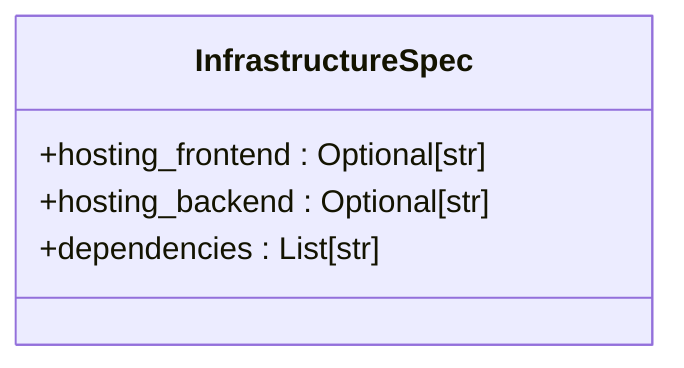
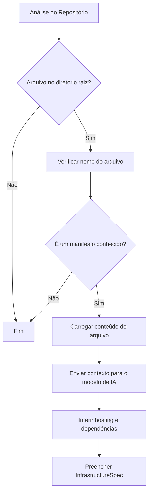
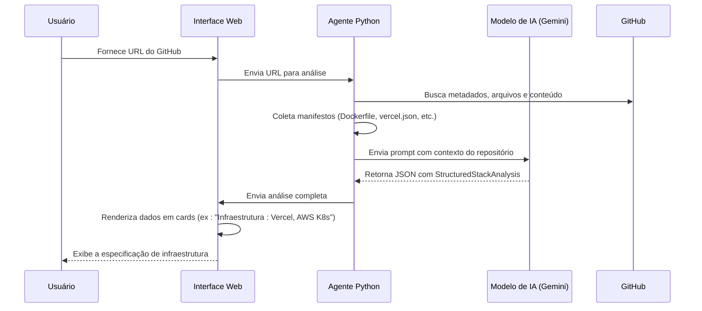

# Especificação de Infraestrutura (InfrastructureSpec)

<cite>
**Arquivos Referenciados neste Documento**  
- [stack_agent.py](file://agent/stack_agent.py)
- [stack-analysis-cards.tsx](file://components/ui/stack-analysis-cards.tsx)
</cite>

## Sumário
1. [Introdução](#introdução)
2. [Estrutura da Classe InfrastructureSpec](#estrutura-da-classe-infrastructurespec)
3. [Inferência de Configurações de Infraestrutura](#inferência-de-configurações-de-infraestrutura)
4. [Exemplo de Aplicação Containerizada](#exemplo-de-aplicação-containerizada)
5. [Fluxo de Análise de Infraestrutura](#fluxo-de-análise-de-infraestrutura)

## Introdução

A classe `InfrastructureSpec` faz parte do sistema de análise de stack `StructuredStackAnalysis` e tem como propósito principal capturar e representar como uma aplicação é implantada e gerenciada em ambientes de produção. Ela desempenha um papel fundamental na abstração dos detalhes de infraestrutura, permitindo que o sistema compreenda onde e como os componentes frontend e backend da aplicação são hospedados, além de identificar dependências críticas. Esta documentação detalha a estrutura da classe, seu mecanismo de inferência baseado em arquivos de configuração e fornece um exemplo prático de uma aplicação moderna.

## Estrutura da Classe InfrastructureSpec

A classe `InfrastructureSpec` é definida como um modelo Pydantic e contém campos que descrevem os aspectos essenciais da infraestrutura de uma aplicação. Os campos são opcionais, refletindo a natureza dinâmica e variada das configurações de implantação encontradas em diferentes repositórios.



**Diagram sources**  
- [stack_agent.py](file://agent/stack_agent.py#L60-L63)

### Campos da Classe

A tabela abaixo detalha os campos da classe `InfrastructureSpec`, seus tipos e propósitos.

| Campo | Tipo | Descrição |
| :--- | :--- | :--- |
| `hosting_frontend` | `Optional[str]` | Especifica o serviço ou plataforma onde o frontend da aplicação é hospedado (por exemplo, "Vercel", "Netlify", "S3"). |
| `hosting_backend` | `Optional[str]` | Especifica o serviço ou plataforma onde o backend da aplicação é hospedado (por exemplo, "Railway", "Render", "EC2"). |
| `dependencies` | `List[str]` | Lista de dependências de infraestrutura identificadas no repositório, como serviços de banco de dados ou mensageria. |

**Section sources**  
- [stack_agent.py](file://agent/stack_agent.py#L60-L63)

## Inferência de Configurações de Infraestrutura

Os valores dos campos em `InfrastructureSpec` são inferidos automaticamente a partir da análise de arquivos de configuração e manifestos presentes no repositório. O processo de inferência é executado pelo agente de análise de stack, que coleta e interpreta esses arquivos para preencher a estrutura de dados.

### Arquivos de Configuração Analisados

O sistema identifica arquivos de configuração relevantes listando os itens no diretório raiz do repositório e buscando por nomes específicos. A lista de candidatos inclui:

- `Dockerfile`: Indica que a aplicação é containerizada com Docker.
- `docker-compose.yml`: Indica a orquestração local de múltiplos contêineres.
- `Procfile`: Usado por plataformas como Heroku para definir comandos de execução.
- `vercel.json` e `netlify.toml`: Configurações específicas para hospedagem no Vercel e Netlify, respectivamente.
- `serverless.yml`: Indica o uso de uma arquitetura serverless.



**Diagram sources**  
- [stack_agent.py](file://agent/stack_agent.py#L193-L243)
- [stack_agent.py](file://agent/stack_agent.py#L240-L266)

### Processo de Inferência

O processo de inferência não é feito diretamente pelo código Python, mas sim pelo modelo de IA (Google Gemini) que recebe o contexto do repositório. O agente coleta os seguintes dados:

1.  **Metadados do Repositório**: Informações gerais do GitHub.
2.  **Uso de Linguagens**: Quais linguagens são predominantes.
3.  **Itens do Diretório Raiz**: Uma lista de arquivos e diretórios principais.
4.  **Conteúdo dos Manifestos**: O texto dos arquivos de configuração listados acima.
5.  **Conteúdo do README**: Documentação fornecida pelo desenvolvedor.

Esses dados são formatados em um prompt que instrui o modelo de IA a inferir a especificação de infraestrutura. O prompt inclui uma instrução explícita: "Infer the stack with specific frameworks and libraries when possible".

**Section sources**  
- [stack_agent.py](file://agent/stack_agent.py#L266-L303)

## Exemplo de Aplicação Containerizada

Considere uma aplicação web moderna com as seguintes características:

- **Frontend**: Uma aplicação React hospedada no **Vercel**.
- **Backend**: Uma API Node.js containerizada com **Docker**.
- **Orquestração**: Implantação no **Kubernetes** (K8s) em um cluster da **AWS**.
- **Banco de Dados**: PostgreSQL hospedado como um serviço gerenciado da AWS (RDS).

### Arquivos de Configuração

Para essa aplicação, os seguintes arquivos de configuração estariam presentes no repositório:

1.  **`vercel.json`**: Configurações de build e roteamento para o Vercel.
2.  **`Dockerfile`**: Instruções para construir a imagem do contêiner do backend.
3.  **`docker-compose.yml`**: Para desenvolvimento local, define os serviços do backend e do banco de dados.
4.  **Manifestos do Kubernetes**: Arquivos `.yaml` (por exemplo, `deployment.yaml`, `service.yaml`) que definem como os contêineres são implantados no cluster K8s.
5.  **`aws-config/`**: Um diretório com scripts ou configurações específicas da AWS.

### Resultado da Inferência

Com base nesses arquivos, o sistema de análise inferiria a seguinte `InfrastructureSpec`:

```json
{
  "infrastructure": {
    "hosting_frontend": "Vercel",
    "hosting_backend": "AWS Kubernetes",
    "dependencies": ["AWS RDS (PostgreSQL)", "AWS S3"]
  }
}
```

Este resultado é gerado porque:
- A presença de `vercel.json` leva à inferência de `hosting_frontend` como "Vercel".
- A presença de `Dockerfile`, `docker-compose.yml` e manifestos do Kubernetes, combinada com a hospedagem na AWS, leva à inferência de `hosting_backend` como "AWS Kubernetes".
- O uso de serviços da AWS é inferido a partir dos nomes de arquivos e do conteúdo do README, resultando na lista de dependências.

## Fluxo de Análise de Infraestrutura

O fluxo completo de como a especificação de infraestrutura é gerada envolve a interação entre componentes do backend (Python) e do frontend (TypeScript).



**Diagram sources**  
- [stack_agent.py](file://agent/stack_agent.py)
- [stack-analysis-cards.tsx](file://components/ui/stack-analysis-cards.tsx)

**Section sources**  
- [stack_agent.py](file://agent/stack_agent.py#L338-L379)
- [stack-analysis-cards.tsx](file://components/ui/stack-analysis-cards.tsx#L150-L185)