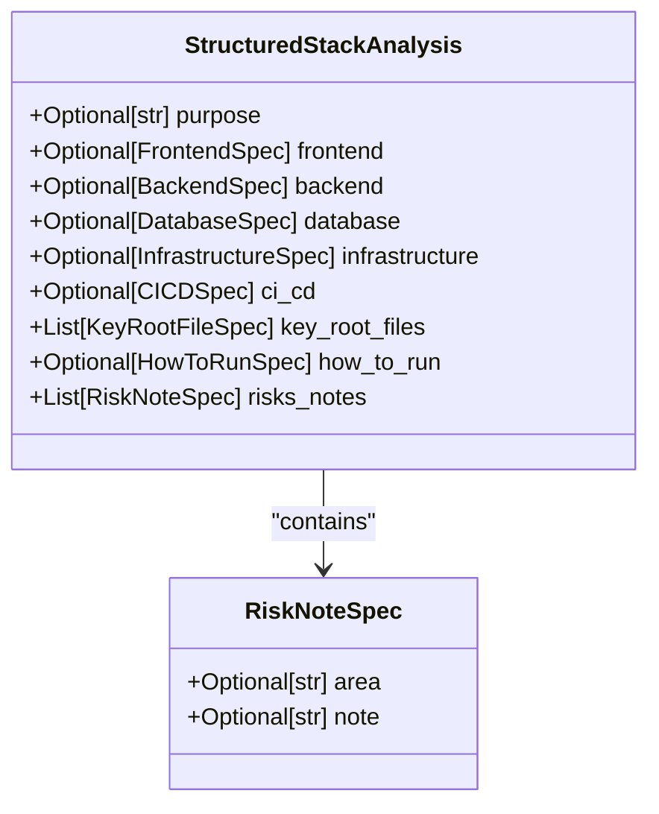

# Especificação de Riscos e Notas (RiskNoteSpec)

<cite>
**Arquivos Referenciados neste Documento**  
- [stack_agent.py](file://agent/stack_agent.py)
</cite>

## Sumário
1. [Introdução](#introdução)
2. [Estrutura da Classe RiskNoteSpec](#estrutura-da-classe-risknotespec)
3. [Uso dentro de StructuredStackAnalysis](#uso-dentro-de-structuredstackanalysis)
4. [Exemplos Práticos de Riscos Identificados](#exemplos-práticos-de-riscos-identificados)
5. [Recomendações para Mitigação de Riscos](#recomendações-para-mitigação-de-riscos)
6. [Conclusão](#conclusão)

## Introdução

A classe `RiskNoteSpec` desempenha um papel fundamental no processo de análise técnica de repositórios de software dentro do agente `StructuredStackAnalysis`. Seu propósito principal é estruturar observações sobre potenciais riscos técnicos, dependências problemáticas ou decisões arquiteturais questionáveis identificadas durante a análise de um projeto. Essa classe permite que o sistema destaque áreas críticas que exigem atenção, facilitando a comunicação clara de problemas técnicos para desenvolvedores, arquitetos ou gestores de projeto.

Embora a documentação original tenha mencionado campos como `risk_type`, `description` e `recommendation`, a implementação atual utiliza os campos `area` e `note`, que cumprem funções semelhantes ao consolidar o tipo de risco e sua descrição em um único campo textual. Este documento detalha a estrutura, uso e aplicação prática dessa classe, com foco em como ela contribui para uma análise de stack mais robusta e informativa.

## Estrutura da Classe RiskNoteSpec

A classe `RiskNoteSpec` é definida como um modelo Pydantic (`BaseModel`) e contém dois campos opcionais:

- **`area`**: Representa a categoria ou domínio do risco (por exemplo, segurança, desempenho, manutenção).
- **`note`**: Contém uma descrição textual detalhada do risco observado, incluindo contexto e impacto potencial.

Esses campos são do tipo `str` e marcados como `Optional[str]`, permitindo flexibilidade na criação de instâncias mesmo quando algumas informações ainda não estão disponíveis. A classe herda de `BaseModel`, o que garante validação de dados, serialização para JSON e integração com ferramentas de IA que exigem saídas estruturadas.

A escolha de usar `Optional` reflete a natureza dinâmica da análise: nem todos os riscos podem ser categorizados com precisão em uma área específica, e algumas observações podem ser mais descritivas do que classificadas.

**Section sources**
- [stack_agent.py](file://agent/stack_agent.py#L80-L82)

## Uso dentro de StructuredStackAnalysis

Dentro da classe `StructuredStackAnalysis`, a `RiskNoteSpec` é utilizada como parte de uma lista acumulativa de observações de risco. O campo `risks_notes` é definido como:

```python
risks_notes: List[RiskNoteSpec] = Field(default_factory=list)
```

O uso de `Field(default_factory=list)` é uma prática recomendada em Pydantic para evitar o problema comum de listas mutáveis compartilhadas entre instâncias. Isso garante que cada nova instância de `StructuredStackAnalysis` tenha sua própria lista independente de notas de risco, prevenindo efeitos colaterais indesejados.

Esse design permite que o agente de análise adicione múltiplas observações de risco de forma incremental durante o processo de análise. Por exemplo, ao examinar os arquivos manifestos de um repositório, o sistema pode detectar uma dependência desatualizada e adicionar uma nova instância de `RiskNoteSpec` à lista `risks_notes`. Em seguida, ao analisar o README, pode identificar a ausência de testes automatizados e adicionar outra nota.

Essa abordagem modular e acumulativa torna a análise mais abrangente e transparente, permitindo que todos os riscos sejam registrados e apresentados ao usuário final de forma organizada.



**Diagram sources**
- [stack_agent.py](file://agent/stack_agent.py#L80-L82)
- [stack_agent.py](file://agent/stack_agent.py#L100-L113)

**Section sources**
- [stack_agent.py](file://agent/stack_agent.py#L100-L113)

## Exemplos Práticos de Riscos Identificados

Embora a implementação atual use `area` e `note`, esses campos podem ser utilizados para representar os conceitos de `risk_type`, `description` e `recommendation` de forma integrada. Abaixo estão exemplos de como a classe pode ser instanciada para comunicar riscos comuns:

### Risco de Segurança em Dependências Desatualizadas

```python
RiskNoteSpec(
    area="segurança",
    note="A dependência 'requests' está na versão 2.25.1, enquanto a versão mais recente é 2.31.0. Versões anteriores contêm vulnerabilidades conhecidas de injeção de cabeçalho HTTP (CVE-2023-32681)."
)
```

### Uso de Tecnologias Obsoletas

```python
RiskNoteSpec(
    area="arquitetura",
    note="O projeto utiliza Python 3.8, que atingirá o fim do suporte de segurança em outubro de 2024. Recomenda-se atualizar para Python 3.11 ou superior para garantir suporte contínuo e acesso a otimizações de desempenho."
)
```

### Falta de Testes Automatizados

```python
RiskNoteSpec(
    area="qualidade",
    note="Não foram encontrados arquivos de teste (ex: test_*.py, *_test.py) ou configurações de frameworks de teste (pytest, unittest) no repositório. A ausência de testes automatizados aumenta o risco de regressões durante futuras alterações de código."
)
```

Esses exemplos demonstram como a `RiskNoteSpec` pode ser usada para gerar alertas claros e acionáveis, combinando o tipo de risco, sua descrição e uma recomendação implícita ou explícita dentro do campo `note`.

## Recomendações para Mitigação de Riscos

Para maximizar a eficácia da `RiskNoteSpec`, recomenda-se:

1. **Padronização de Categorias**: Estabelecer um conjunto de valores padronizados para o campo `area` (como "segurança", "desempenho", "manutenção", "documentação") para facilitar a filtragem e análise posterior.
2. **Recomendações Explícitas**: Incluir sempre uma sugestão de ação no campo `note`, mesmo que breve, para orientar o usuário sobre os próximos passos.
3. **Integração com Ferramentas de Análise Estática**: Automatizar a detecção de riscos com ferramentas como `bandit` (para segurança), `safety` (para dependências) ou `pylint` (para qualidade de código), e usar seus resultados para preencher instâncias de `RiskNoteSpec`.
4. **Priorização de Riscos**: Considerar a adição de um campo `severity` (ex: baixo, médio, alto) em futuras versões para permitir a triagem de riscos com base em seu impacto potencial.

Essas práticas garantem que as notas de risco sejam não apenas informativas, mas também úteis para a tomada de decisões técnicas.

## Conclusão

A classe `RiskNoteSpec` é um componente essencial para a comunicação de riscos técnicos dentro do sistema de análise de stack. Sua simplicidade, combinada com a flexibilidade do Pydantic e a capacidade de acumular múltiplas observações, a torna uma ferramenta poderosa para destacar problemas críticos em projetos de software. Ao estruturar riscos de forma clara e acionável, ela ajuda equipes a priorizar melhorias, mitigar vulnerabilidades e tomar decisões arquiteturais mais informadas. A evolução contínua dessa classe, com a possível adição de campos como `severity` ou `recommendation`, pode aumentar ainda mais seu valor no processo de análise técnica.