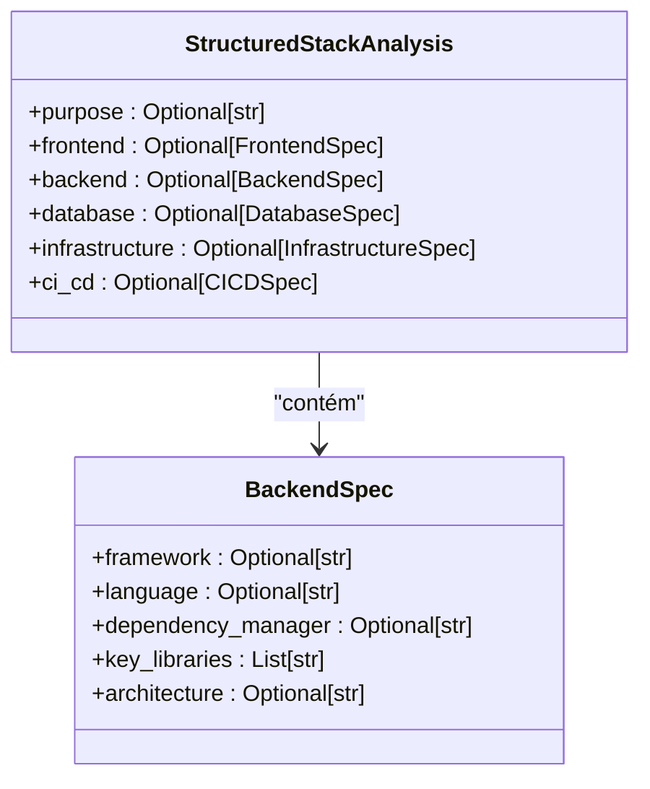
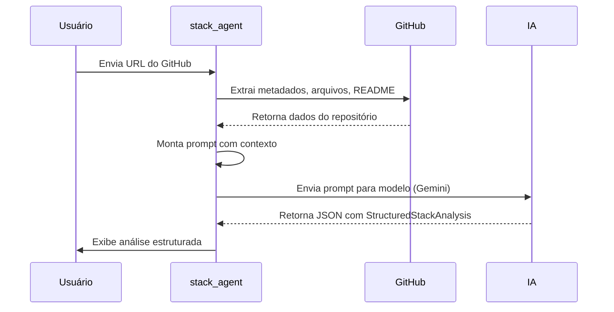

# Especificação do Backend (BackendSpec)

<cite>
**Arquivos Referenciados neste Documento**   
- [stack_agent.py](file://agent/stack_agent.py)
- [stack-analysis-cards.tsx](file://components/ui/stack-analysis-cards.tsx)
</cite>

## Sumário
1. [Introdução](#introdução)
2. [Estrutura da Classe BackendSpec](#estrutura-da-classe-backendspec)
3. [Campos da BackendSpec](#campos-da-backendspec)
4. [Inferência de Informações a Partir do Código-Fonte](#inferência-de-informações-a-partir-do-código-fonte)
5. [Exemplo de Instanciação](#exemplo-de-instanciação)
6. [Fluxo de Análise de Stack](#fluxo-de-análise-de-stack)

## Introdução

A classe `BackendSpec` faz parte do sistema `StructuredStackAnalysis`, um agente de análise de tecnologias que infere a arquitetura de um repositório GitHub. Seu papel principal é descrever a pilha de tecnologias do backend, incluindo linguagem, framework, gerenciador de dependências, bibliotecas-chave e arquitetura. Essa especificação é utilizada para fornecer uma visão estruturada e padronizada da infraestrutura do servidor, facilitando a compreensão da stack tecnológica de um projeto.

**Seção fontes**
- [stack_agent.py](file://agent/stack_agent.py#L47-L52)

## Estrutura da Classe BackendSpec

A classe `BackendSpec` é definida como um modelo Pydantic (`BaseModel`) e contém campos opcionais que descrevem aspectos do backend de uma aplicação. Ela é utilizada dentro da classe `StructuredStackAnalysis`, que agrega informações sobre frontend, backend, banco de dados, infraestrutura e CI/CD.



**Fontes do diagrama**
- [stack_agent.py](file://agent/stack_agent.py#L47-L52)
- [stack_agent.py](file://agent/stack_agent.py#L89-L95)

**Seção fontes**
- [stack_agent.py](file://agent/stack_agent.py#L47-L52)

## Campos da BackendSpec

A seguir estão os campos da classe `BackendSpec`, seus tipos e significados:

| Campo | Tipo | Descrição |
|------|------|-----------|
| **framework** | `Optional[str]` | Framework utilizado no backend (ex: FastAPI, Express, Django). |
| **language** | `Optional[str]` | Linguagem de programação do backend (ex: Python, JavaScript). |
| **dependency_manager** | `Optional[str]` | Gerenciador de dependências (ex: pip, npm, poetry). |
| **key_libraries** | `List[str]` | Lista de bibliotecas ou pacotes importantes usados no projeto. |
| **architecture** | `Optional[str]` | Estilo arquitetural do backend (ex: REST, GraphQL, microservices). |

Esses campos são todos opcionais, permitindo flexibilidade na análise de projetos com diferentes níveis de informação disponível.

**Seção fontes**
- [stack_agent.py](file://agent/stack_agent.py#L47-L52)

## Inferência de Informações a Partir do Código-Fonte

O agente `stack_analysis_graph` coleta informações do repositório GitHub para preencher a `BackendSpec`. O processo de inferência envolve:

1. **Coleta de Contexto**: O agente extrai metadados do repositório, arquivos raiz, linguagens utilizadas e conteúdo do README.
2. **Leitura de Manifestos**: Arquivos como `requirements.txt`, `pyproject.toml`, `package.json` ou `Dockerfile` são baixados e analisados.
3. **Análise com IA**: Um modelo de linguagem (como Gemini) recebe o contexto coletado e estrutura a resposta usando a ferramenta `return_stack_analysis_tool`.

A inferência é feita com base em:
- **`requirements.txt` ou `pyproject.toml`**: Para identificar linguagem (Python), gerenciador de dependências (pip, poetry) e bibliotecas (FastAPI, Pydantic).
- **`Dockerfile`**: Pode indicar linguagem e ambiente de execução.
- **Arquivos de rota (ex: `main.py`)**: Presença de `FastAPI()` ou `app = express()` indica o framework.
- **Testes**: Arquivos com `test_` ou uso de `pytest` ou `Jest` indicam ferramentas de teste.

```mermaid
flowchart TD
A[Repositório GitHub] --> B{Extrair Metadados}
B --> C[Lista de Arquivos Raiz]
B --> D[Linguagens Usadas]
B --> E[Conteúdo do README]
C --> F{Buscar Manifestos}
F --> G[requirements.txt]
F --> H[pyproject.toml]
F --> I[package.json]
F --> J[Dockerfile]
G --> K[Inferir: Python, pip, FastAPI]
H --> K
I --> L[Inferir: JavaScript, npm, Express]
J --> M[Inferir: Ambiente, Linguagem]
K --> N[Construir Prompt]
L --> N
M --> N
E --> N
D --> N
N --> O[Modelo de IA (Gemini)]
O --> P[Retornar StructuredStackAnalysis]
P --> Q[BackendSpec Preenhido]
```

**Fontes do diagrama**
- [stack_agent.py](file://agent/stack_agent.py#L219-L240)
- [stack_agent.py](file://agent/stack_agent.py#L257-L266)

**Seção fontes**
- [stack_agent.py](file://agent/stack_agent.py#L219-L418)

## Exemplo de Instanciação

Abaixo está um exemplo de como a `BackendSpec` pode ser preenchida para um backend Python com FastAPI:

```python
BackendSpec(
    framework="FastAPI",
    language="Python",
    dependency_manager="pip",
    key_libraries=["fastapi", "pydantic", "uvicorn", "sqlalchemy", "python-jose"],
    architecture="REST API com JWT"
)
```

Neste caso:
- O framework é identificado pela importação de `FastAPI`.
- A linguagem é inferida do uso de `requirements.txt` ou `pyproject.toml`.
- O gerenciador de dependências é `pip` (ou `poetry` se `pyproject.toml` estiver presente).
- As bibliotecas-chave incluem `fastapi`, `pydantic`, e `python-jose` para autenticação JWT.
- A arquitetura é descrita como uma API REST com autenticação baseada em tokens.

**Seção fontes**
- [stack_agent.py](file://agent/stack_agent.py#L47-L52)

## Fluxo de Análise de Stack

O fluxo completo do agente de análise envolve três etapas principais:



O agente utiliza o padrão LangGraph para orquestrar o fluxo entre os nodos `gather_context`, `analyze` e `end`, garantindo uma análise robusta e progressiva.

**Fontes do diagrama**
- [stack_agent.py](file://agent/stack_agent.py#L330-L350)
- [stack_agent.py](file://agent/stack_agent.py#L358-L411)

**Seção fontes**
- [stack_agent.py](file://agent/stack_agent.py#L330-L505)