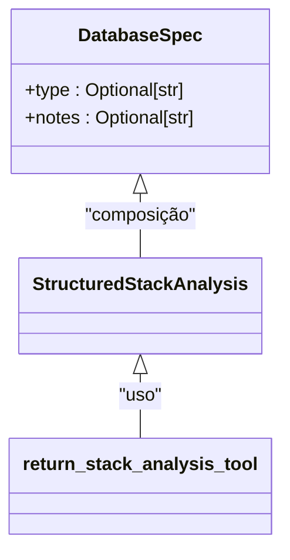
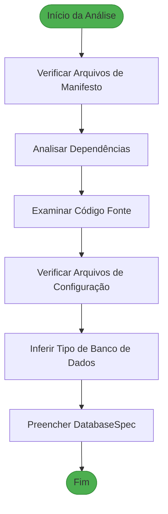
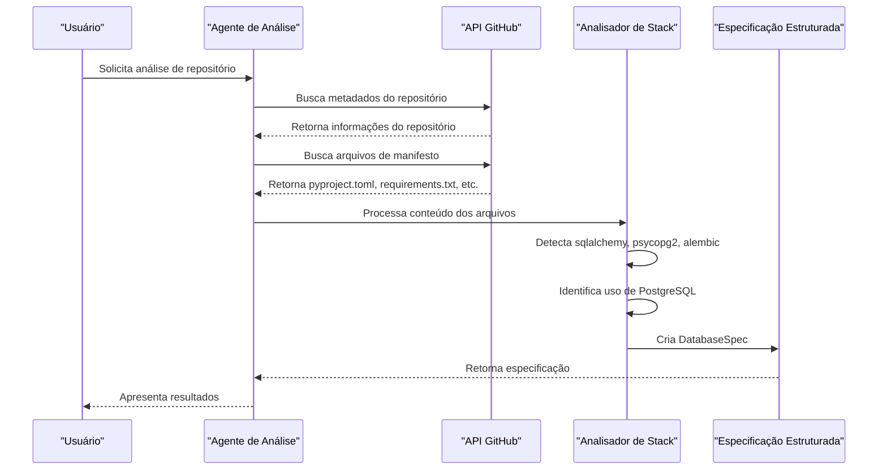
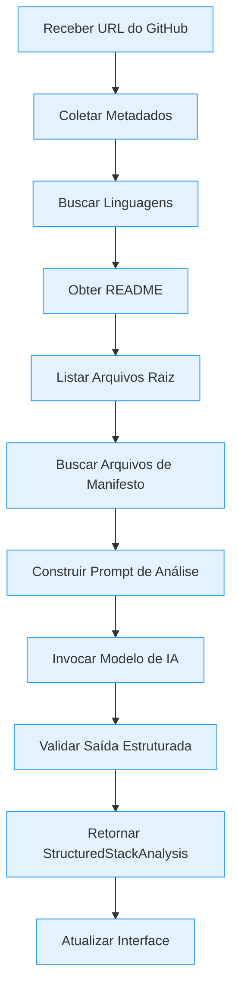
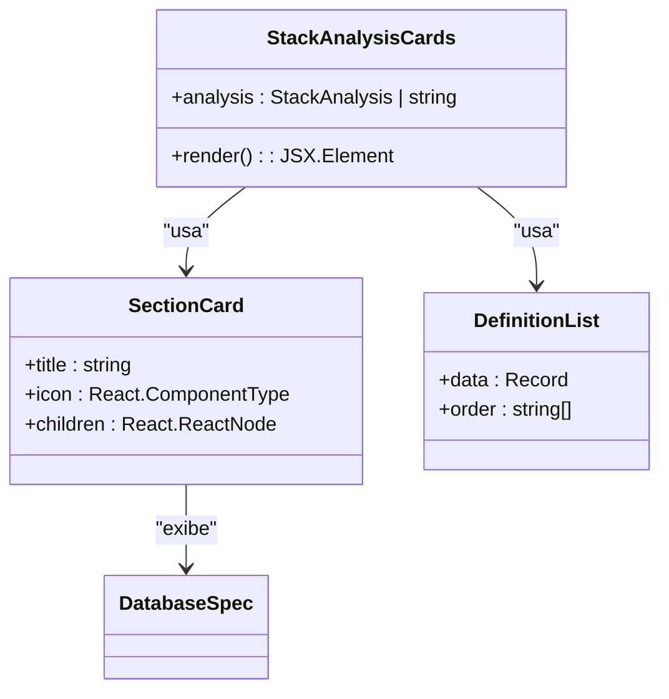

# Especificação do Banco de Dados (DatabaseSpec)

<cite>
**Arquivos Referenciados neste Documento**   
- [stack_agent.py](file://agent/stack_agent.py)
- [checkpointing.py](file://agent/checkpointing.py)
- [pyproject.toml](file://agent/pyproject.toml)
- [stack-analysis-cards.tsx](file://components/ui/stack-analysis-cards.tsx)
</cite>

## Sumário
1. [Introdução](#introdução)
2. [Estrutura da Classe DatabaseSpec](#estrutura-da-classe-databasespec)
3. [Campos da Especificação do Banco de Dados](#campos-da-especificação-do-banco-de-dados)
4. [Detecção de Tecnologias de Banco de Dados](#detecção-de-tecnologias-de-banco-de-dados)
5. [Exemplo de Uso: Projeto com PostgreSQL, SQLAlchemy e Alembic](#exemplo-de-uso-projeto-com-postgresql-sqlalchemy-e-alembic)
6. [Fluxo de Análise de Stack](#fluxo-de-análise-de-stack)
7. [Integração com a Interface de Usuário](#integração-com-a-interface-de-usuário)
8. [Conclusão](#conclusão)

## Introdução

A classe `DatabaseSpec` é um componente fundamental do sistema de análise de stack no repositório `open-gemini-canvas`. Ela faz parte do modelo `StructuredStackAnalysis`, que tem como objetivo fornecer uma visão estruturada e detalhada da arquitetura tecnológica de um repositório de software. A `DatabaseSpec` especificamente modela as tecnologias e práticas de persistência de dados utilizadas no projeto analisado.

O sistema de análise é capaz de inferir automaticamente a configuração do banco de dados ao examinar arquivos de manifesto, dependências e código-fonte do repositório. Essa análise é realizada por um agente de IA que processa metadados do repositório, linguagens utilizadas, arquivos raiz e conteúdo do README para construir um perfil completo da stack tecnológica.

**Seção fontes**
- [stack_agent.py](file://agent/stack_agent.py#L55-L57)

## Estrutura da Classe DatabaseSpec

A classe `DatabaseSpec` é definida como um modelo Pydantic, garantindo validação de tipos e estrutura de dados. Ela é utilizada para representar de forma estruturada as informações sobre o banco de dados detectado no repositório analisado.



**Fontes do Diagrama**
- [stack_agent.py](file://agent/stack_agent.py#L55-L57)

**Seção fontes**
- [stack_agent.py](file://agent/stack_agent.py#L55-L57)

## Campos da Especificação do Banco de Dados

A classe `DatabaseSpec` contém dois campos principais, ambos do tipo `Optional[str]`, o que significa que são opcionais e podem conter um valor de string ou serem nulos.

### Campo `type`

O campo `type` representa o tipo de banco de dados utilizado no projeto. Ele é preenchido com base na detecção automática de tecnologias de persistência presentes no repositório. Os valores comuns incluem:

- `PostgreSQL`
- `MongoDB`
- `SQLite`
- `MySQL`
- `Redis`

Este campo é crucial para identificar a tecnologia principal de armazenamento de dados utilizada pela aplicação.

### Campo `notes`

O campo `notes` fornece informações adicionais ou observações sobre a configuração do banco de dados. Pode incluir detalhes sobre:

- Práticas de configuração recomendadas
- Observações sobre segurança
- Notas sobre desempenho
- Recomendações de otimização

Este campo permite que o sistema forneça insights contextuais além da simples identificação do tipo de banco de dados.

**Seção fontes**
- [stack_agent.py](file://agent/stack_agent.py#L55-L57)

## Detecção de Tecnologias de Banco de Dados

O sistema de análise detecta as tecnologias de banco de dados através de uma combinação de métodos que examinam diferentes aspectos do repositório.

### Análise de Dependências

O sistema examina arquivos de dependência como `pyproject.toml`, `requirements.txt` ou `Pipfile` para identificar bibliotecas relacionadas a bancos de dados. Por exemplo, a presença de `psycopg2` ou `asyncpg` indica o uso de PostgreSQL, enquanto `pymongo` indica MongoDB.



**Fontes do Diagrama**
- [stack_agent.py](file://agent/stack_agent.py#L200-L250)
- [pyproject.toml](file://agent/pyproject.toml#L10-L25)

### Exemplos de Detecção

O repositório contém evidências de uso de diferentes tecnologias de banco de dados:

1. **SQLite**: Utilizado no módulo `checkpointing.py` como backend de armazenamento para checkpoints, com a configuração padrão definida como `StorageBackend.SQLITE`.

2. **PostgreSQL**: Explicitamente listado como uma opção de backend de armazenamento no enum `StorageBackend`, indicando suporte para este sistema de banco de dados.

3. **Redis**: Também listado como opção de backend, mostrando que o sistema foi projetado para suportar múltiplos tipos de armazenamento.

**Seção fontes**
- [checkpointing.py](file://agent/checkpointing.py#L140-L148)
- [pyproject.toml](file://agent/pyproject.toml#L10-L25)

## Exemplo de Uso: Projeto com PostgreSQL, SQLAlchemy e Alembic

Embora o repositório atual não contenha explicitamente um exemplo com SQLAlchemy e Alembic, podemos descrever como o sistema de análise funcionaria para um projeto que utiliza PostgreSQL com SQLAlchemy como ORM e Alembic para migrações.

### Estrutura Esperada do Projeto

Para um projeto com esta configuração, o sistema de análise detectaria os seguintes elementos:

1. **Dependências no pyproject.toml**:
   - `sqlalchemy` como ORM
   - `psycopg2` ou `asyncpg` como driver PostgreSQL
   - `alembic` como ferramenta de migração

2. **Arquivos de Configuração**:
   - `alembic.ini` para configuração das migrações
   - Diretório `migrations/` com scripts de migração

3. **Código Fonte**:
   - Modelos definidos com SQLAlchemy
   - Conexões com banco de dados usando URLs com prefixo `postgresql://`

### Processo de Detecção

O agente de análise seguiria este fluxo:



**Fontes do Diagrama**
- [stack_agent.py](file://agent/stack_agent.py#L200-L450)
- [pyproject.toml](file://agent/pyproject.toml#L10-L25)

### Resultado da Análise

Para um projeto com esta configuração, a `DatabaseSpec` resultante seria:

```python
DatabaseSpec(
    type="PostgreSQL",
    notes="Projeto utiliza SQLAlchemy como ORM com migrações gerenciadas pelo Alembic. Recomenda-se verificar a integridade das migrações e garantir que o ambiente de produção esteja sincronizado com o repositório."
)
```

Esta especificação seria então integrada à `StructuredStackAnalysis` completa, fornecendo ao usuário uma visão clara da camada de persistência de dados.

## Fluxo de Análise de Stack

O processo completo de análise de stack envolve múltiplas etapas que coletam e sintetizam informações sobre o repositório.



**Fontes do Diagrama**
- [stack_agent.py](file://agent/stack_agent.py#L300-L450)

O modelo de IA (atualmente configurado para usar o Gemini) recebe todo o contexto coletado e é instruído a preencher a estrutura `StructuredStackAnalysis` com as informações relevantes, incluindo a `DatabaseSpec`.

**Seção fontes**
- [stack_agent.py](file://agent/stack_agent.py#L300-L500)

## Integração com a Interface de Usuário

A especificação do banco de dados é apresentada aos usuários através da interface da aplicação, especificamente no componente `stack-analysis-cards.tsx`.



**Fontes do Diagrama**
- [stack-analysis-cards.tsx](file://components/ui/stack-analysis-cards.tsx#L150-L185)

O componente `StackAnalysisCards` recebe a análise estruturada e a renderiza em cartões organizados por categoria, incluindo um cartão específico para o banco de dados que exibe os campos `type` e `notes` da `DatabaseSpec`.

**Seção fontes**
- [stack-analysis-cards.tsx](file://components/ui/stack-analysis-cards.tsx#L150-L185)

## Conclusão

A classe `DatabaseSpec` desempenha um papel crucial no sistema de análise de stack, fornecendo uma representação estruturada e padronizada das tecnologias de persistência de dados utilizadas em um repositório. Seu design simples com campos opcionais permite flexibilidade na representação de diferentes configurações de banco de dados, desde projetos simples com SQLite até arquiteturas complexas com PostgreSQL e ferramentas avançadas de migração como o Alembic.

O processo de detecção automática combina análise de dependências, exame de arquivos de configuração e interpretação de código-fonte para inferir com precisão a stack de banco de dados. Esta abordagem permite que o sistema forneça insights valiosos sobre a arquitetura de dados de qualquer repositório analisado, ajudando desenvolvedores e arquitetos a entenderem rapidamente a infraestrutura de persistência de um projeto.