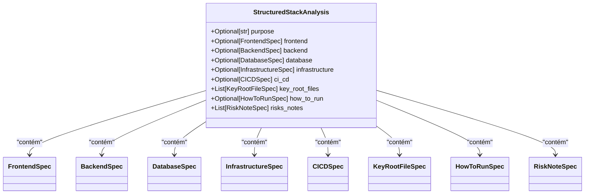

# Especificações Técnicas dos Submodelos

<cite>
**Arquivos Referenciados neste Documento**  
- [agent/stack_agent.py](file://agent/stack_agent.py)
- [package.json](file://package.json)
- [README.md](file://README.md)
</cite>

## Sumário
1. [Introdução](#introdução)
2. [Estrutura do Modelo `StructuredStackAnalysis`](#estrutura-do-modelo-structuredstackanalysis)
3. [Análise Detalhada das Especificações](#análise-detalhada-das-especificações)
   - [FrontendSpec](#frontendspec)
   - [BackendSpec](#backendspec)
   - [DatabaseSpec](#databasespec)
   - [InfrastructureSpec](#infrastructurespec)
   - [CICDSpec](#cicdspec)
   - [KeyRootFileSpec](#keyrootfilespec)
   - [HowToRunSpec](#howtorunspec)
   - [RiskNoteSpec](#risknotespec)
4. [Mecanismos de Flexibilidade no Modelo](#mecanismos-de-flexibilidade-no-modelo)
5. [População do Modelo a Partir de Arquivos-Chave](#população-do-modelo-a-partir-de-arquivos-chave)
6. [Exemplo de Instanciação com Dados Reais](#exemplo-de-instanciação-com-dados-reais)

## Introdução

O agente de análise de stack do projeto `open-gemini-canvas` utiliza um modelo de dados estruturado chamado `StructuredStackAnalysis` para organizar e apresentar informações detalhadas sobre repositórios GitHub. Este modelo é composto por várias classes aninhadas, cada uma representando uma camada específica da arquitetura de software. O objetivo deste documento é fornecer uma análise detalhada dessas classes, explicando seu propósito, campos e como são utilizadas para modelar a estrutura de um repositório de código.

**Section sources**
- [agent/stack_agent.py](file://agent/stack_agent.py#L85-L94)

## Estrutura do Modelo `StructuredStackAnalysis`

A classe `StructuredStackAnalysis` atua como um contêiner principal que agrupa todas as especificações técnicas de um projeto. Ela é definida como um modelo Pydantic e serve como a estrutura de saída final para a análise de um repositório. Cada campo opcional dentro desta classe representa uma dimensão diferente da arquitetura do software, permitindo uma análise abrangente e modular.



**Diagram sources**
- [agent/stack_agent.py](file://agent/stack_agent.py#L85-L94)

**Section sources**
- [agent/stack_agent.py](file://agent/stack_agent.py#L85-L94)

## Análise Detalhada das Especificações

### FrontendSpec

A classe `FrontendSpec` é responsável por modelar as tecnologias e configurações relacionadas à camada de interface do usuário de uma aplicação.

- **Propósito**: Capturar o framework, linguagem, gerenciador de pacotes, bibliotecas principais e opções de estilização utilizadas no frontend.
- **Campos Obrigatórios**: Nenhum. Todos os campos são opcionais, refletindo a possibilidade de um projeto não ter um frontend ou de algumas informações não serem detectáveis.
- **Campos Opcionais**:
  - `framework`: O framework principal (ex: Next.js, React, Vue).
  - `language`: A linguagem de programação (ex: TypeScript, JavaScript).
  - `package_manager`: O gerenciador de pacotes (ex: pnpm, npm, yarn).
  - `styling`: Tecnologias de estilização (ex: Tailwind CSS, CSS Modules).
  - `key_libraries`: Lista de bibliotecas importantes utilizadas.

Esta especificação é populada com base na análise de arquivos como `package.json`, `next.config.mjs` e `tsconfig.json`.

**Section sources**
- [agent/stack_agent.py](file://agent/stack_agent.py#L39-L44)

### BackendSpec

A classe `BackendSpec` modela os componentes do lado do servidor da aplicação.

- **Propósito**: Identificar o framework, linguagem, gerenciador de dependências, bibliotecas principais e arquitetura do backend.
- **Campos Obrigatórios**: Nenhum.
- **Campos Opcionais**:
  - `framework`: O framework do backend (ex: FastAPI, Express).
  - `language`: A linguagem de programação (ex: Python, Node.js).
  - `dependency_manager`: Ferramenta de gerenciamento de dependências (ex: Poetry, pip).
  - `key_libraries`: Lista de bibliotecas críticas (ex: langchain, copilotkit).
  - `architecture`: Padrão arquitetural (ex: REST, microservices).

A detecção é feita através de arquivos como `pyproject.toml`, `requirements.txt`, `main.py` e `Dockerfile`.

**Section sources**
- [agent/stack_agent.py](file://agent/stack_agent.py#L47-L52)

### DatabaseSpec

A classe `DatabaseSpec` fornece informações sobre o sistema de banco de dados utilizado.

- **Propósito**: Especificar o tipo de banco de dados e incluir notas adicionais sobre sua configuração.
- **Campos Obrigatórios**: Nenhum.
- **Campos Opcionais**:
  - `type`: O tipo de banco de dados (ex: PostgreSQL, MongoDB, SQLite).
  - `notes`: Observações adicionais sobre a configuração ou uso do banco de dados.

As informações são inferidas a partir de dependências no `package.json` ou `pyproject.toml` e de arquivos de configuração.

**Section sources**
- [agent/stack_agent.py](file://agent/stack_agent.py#L55-L57)

### InfrastructureSpec

A classe `InfrastructureSpec` descreve onde e como a aplicação é hospedada.

- **Propósito**: Documentar os provedores de hospedagem para o frontend e backend, bem como outras dependências de infraestrutura.
- **Campos Obrigatórios**: Nenhum.
- **Campos Opcionais**:
  - `hosting_frontend`: Plataforma de hospedagem do frontend (ex: Vercel, Netlify).
  - `hosting_backend`: Plataforma de hospedagem do backend (ex: AWS, Render).
  - `dependencies`: Lista de serviços de infraestrutura externos (ex: OpenRouter, Cloudinary).

A detecção é baseada em arquivos de configuração como `vercel.json`, `netlify.toml` e variáveis de ambiente.

**Section sources**
- [agent/stack_agent.py](file://agent/stack_agent.py#L60-L63)

### CICDSpec

A classe `CICDSpec` captura as práticas de integração e entrega contínua do projeto.

- **Propósito**: Descrever a configuração do pipeline CI/CD.
- **Campos Obrigatórios**: Nenhum.
- **Campos Opcionais**:
  - `setup`: Descrição do sistema CI/CD em uso (ex: GitHub Actions, Vercel).

A análise é feita a partir de scripts no `package.json` e de arquivos na pasta `.github/workflows`.

**Section sources**
- [agent/stack_agent.py](file://agent/stack_agent.py#L66-L67)

### KeyRootFileSpec

A classe `KeyRootFileSpec` representa arquivos importantes no diretório raiz do repositório.

- **Propósito**: Listar arquivos-chave e fornecer uma breve descrição de seu propósito.
- **Campos Obrigatórios**: Nenhum.
- **Campos Opcionais**:
  - `file`: Nome do arquivo (ex: `Dockerfile`, `README.md`).
  - `description`: Descrição do papel do arquivo no projeto.

Esta especificação é construída a partir da listagem de arquivos no diretório raiz.

**Section sources**
- [agent/stack_agent.py](file://agent/stack_agent.py#L70-L72)

### HowToRunSpec

A classe `HowToRunSpec` fornece instruções sobre como executar o projeto localmente.

- **Propósito**: Oferecer um resumo e uma lista de passos para configurar e executar a aplicação.
- **Campos Obrigatórios**: Nenhum.
- **Campos Opcionais**:
  - `summary`: Resumo textual das instruções de execução.
  - `steps`: Lista de comandos ou ações necessárias.

As informações são extraídas principalmente do `README.md`.

**Section sources**
- [agent/stack_agent.py](file://agent/stack_agent.py#L75-L77)

### RiskNoteSpec

A classe `RiskNoteSpec` identifica áreas potenciais de risco ou preocupação no projeto.

- **Propósito**: Documentar problemas ou desafios técnicos identificados.
- **Campos Obrigatórios**: Nenhum.
- **Campos Opcionais**:
  - `area`: A área do projeto em risco (ex: segurança, desempenho).
  - `note`: Descrição detalhada do risco.

Essa análise é gerada pela IA com base em padrões de código, dependências desatualizadas ou configurações potencialmente inseguras.

**Section sources**
- [agent/stack_agent.py](file://agent/stack_agent.py#L80-L82)

## Mecanismos de Flexibilidade no Modelo

O modelo utiliza três mecanismos principais para garantir flexibilidade e robustez:

1.  **`Optional[str]`**: Permite que campos escalares (como strings) sejam omitidos se a informação não estiver disponível. Isso evita erros de validação quando um campo não pode ser inferido.
2.  **`List[str]`**: Define campos que podem conter múltiplos valores, como listas de bibliotecas ou comandos.
3.  **`Field(default_factory=list)`**: Garante que campos de lista sejam inicializados como listas vazias por padrão, em vez de `None`. Isso permite que operações como `.append()` sejam realizadas sem verificar se o campo é `None`, simplificando o código que manipula o modelo.

Essa combinação permite que o modelo represente com precisão repositórios com estruturas variadas, desde projetos simples até aplicações complexas com múltiplas camadas.

**Section sources**
- [agent/stack_agent.py](file://agent/stack_agent.py#L39-L82)

## População do Modelo a Partir de Arquivos-Chave

O processo de análise segue um fluxo bem definido para preencher o modelo:

1.  **Coleta de Contexto**: O agente extrai metadados do repositório, linguagens utilizadas, conteúdo do `README.md` e uma lista de arquivos no diretório raiz.
2.  **Leitura de Manifestos**: Arquivos de configuração como `package.json`, `pyproject.toml` e `Dockerfile` são baixados e seus conteúdos são armazenados.
3.  **Geração de Prompt**: Um prompt detalhado é construído, contendo todos os dados coletados.
4.  **Análise com IA**: O modelo de linguagem (acessado via OpenRouter) analisa o prompt e preenche a estrutura `StructuredStackAnalysis`.
5.  **Emissão de Resultado**: A estrutura preenchida é retornada como uma resposta JSON estruturada.

```mermaid
flowchart TD
A[URL do GitHub] --> B{Análise de Contexto}
B --> C[Metadados do Repositório]
B --> D[Linguagens]
B --> E[Conteúdo do README.md]
B --> F[Listagem de Arquivos Raiz]
B --> G[Conteúdo de Manifestos]
C --> H[Construção do Prompt]
D --> H
E --> H
F --> H
G --> H
H --> I[Modelo de IA (Gemini)]
I --> J[Instância de StructuredStackAnalysis]
J --> K[Resposta JSON Estruturada]
```

**Diagram sources**
- [agent/stack_agent.py](file://agent/stack_agent.py#L160-L250)

**Section sources**
- [agent/stack_agent.py](file://agent/stack_agent.py#L160-L250)
- [README.md](file://README.md#L0-L172)
- [package.json](file://package.json#L0-L86)

## Exemplo de Instanciação com Dados Reais

Com base no repositório analisado, uma instância de `StructuredStackAnalysis` poderia ser populada da seguinte forma:

```python
analysis = StructuredStackAnalysis(
    purpose="Demonstrar a construção de agentes de IA com CopilotKit, OpenRouter e LangGraph.",
    frontend=FrontendSpec(
        framework="Next.js",
        language="TypeScript",
        package_manager="pnpm",
        styling="Tailwind CSS",
        key_libraries=["react", "ai", "copilotkit"]
    ),
    backend=BackendSpec(
        framework="FastAPI",
        language="Python",
        dependency_manager="Poetry",
        key_libraries=["langchain", "copilotkit", "pydantic"],
        architecture="REST API"
    ),
    database=None,
    infrastructure=InfrastructureSpec(
        hosting_frontend="Vercel",
        hosting_backend=None,
        dependencies=["OpenRouter"]
    ),
    ci_cd=CICDSpec(setup="Configuração manual via scripts"),
    key_root_files=[
        KeyRootFileSpec(file="package.json", description="Dependências e scripts do frontend"),
        KeyRootFileSpec(file="pyproject.toml", description="Dependências e configurações do backend"),
        KeyRootFileSpec(file="Dockerfile", description="Configuração para containerização")
    ],
    how_to_run=HowToRunSpec(
        summary="Instale as dependências e execute os scripts de desenvolvimento.",
        steps=[
            "pnpm install",
            "pnpm dev"
        ]
    ),
    risks_notes=[]
)
```

Este exemplo demonstra como as classes aninhadas são instanciadas com dados extraídos dos arquivos do repositório, criando uma representação rica e estruturada da arquitetura do software.

**Section sources**
- [agent/stack_agent.py](file://agent/stack_agent.py#L85-L94)
- [package.json](file://package.json#L0-L86)
- [README.md](file://README.md#L0-L172)