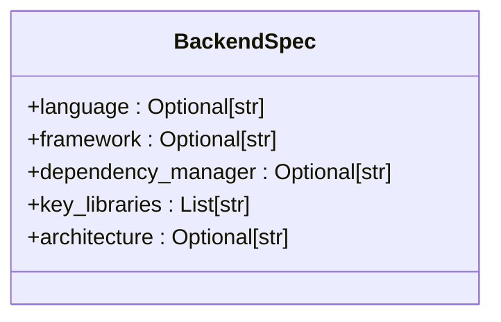
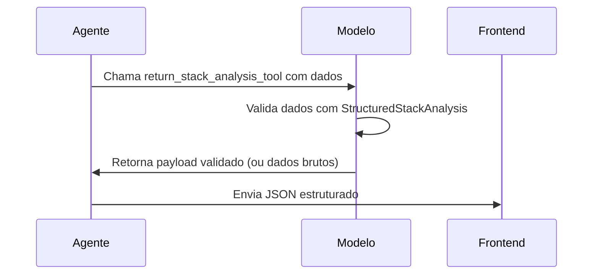
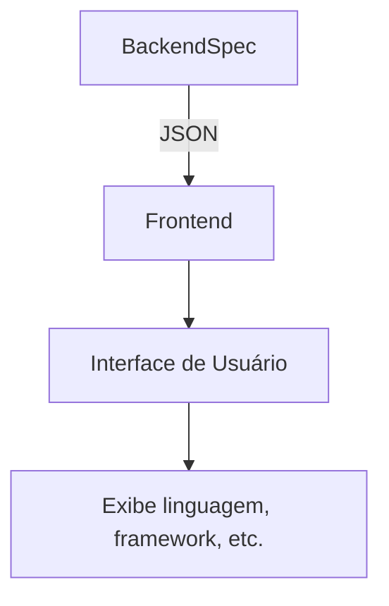

# Campo Backend do Modelo StructuredStackAnalysis

<cite>
**Arquivos Referenciados neste Documento**  
- [agent/stack_agent.py](file://agent/stack_agent.py)
- [components/ui/stack-analysis-cards.tsx](file://components/ui/stack-analysis-cards.tsx)
</cite>

## Sumário
1. [Introdução](#introdução)
2. [Estrutura do Campo Backend](#estrutura-do-campo-backend)
3. [Identificação de Tecnologias Backend](#identificação-de-tecnologias-backend)
4. [Exemplo Prático com Python e FastAPI](#exemplo-prático-com-python-e-fastapi)
5. [Validação e Consistência do Modelo](#validação-e-consistência-do-modelo)
6. [Integração com o Frontend](#integração-com-o-frontend)

## Introdução

O campo `backend` da classe `StructuredStackAnalysis` desempenha um papel central na representação e análise das tecnologias utilizadas no lado do servidor de um repositório de software. Ele é responsável por capturar informações estruturadas sobre linguagens de programação, frameworks, gerenciadores de dependências, arquitetura e bibliotecas-chave utilizadas na implementação do backend. Essa análise estruturada permite que o agente forneça uma visão clara e padronizada da pilha tecnológica do servidor, facilitando a compreensão do projeto por desenvolvedores, arquitetos e stakeholders.

**Section sources**
- [agent/stack_agent.py](file://agent/stack_agent.py#L47-L52)

## Estrutura do Campo Backend

O campo `backend` é definido pela classe `BackendSpec`, que herda de `BaseModel` (Pydantic) e contém os seguintes subcampos:

- `language`: Linguagem de programação principal utilizada no backend (ex: Python, Java, Node.js).
- `framework`: Framework ou biblioteca principal utilizada (ex: FastAPI, Spring Boot, Express).
- `dependency_manager`: Ferramenta de gerenciamento de dependências (ex: pip, npm, Maven).
- `key_libraries`: Lista de bibliotecas ou pacotes importantes utilizados no projeto.
- `architecture`: Descrição da arquitetura do backend (ex: monolito, microserviços, serverless).

Esses subcampos são opcionais, permitindo flexibilidade na análise de projetos com diferentes níveis de detalhamento nos arquivos de manifesto.



**Diagram sources**
- [agent/stack_agent.py](file://agent/stack_agent.py#L47-L52)

**Section sources**
- [agent/stack_agent.py](file://agent/stack_agent.py#L47-L52)

## Identificação de Tecnologias Backend

O agente identifica as tecnologias backend analisando arquivos-chave presentes na raiz do repositório. O processo de identificação envolve:

1. **Coleta de Manifestos**: O método `_fetch_manifest_contents` busca arquivos como `requirements.txt`, `pom.xml`, `Dockerfile`, `package.json`, entre outros, listados em `ROOT_MANIFEST_CANDIDATES`.
2. **Análise de Conteúdo**: O conteúdo desses arquivos é incluído no prompt de análise, permitindo que o modelo de IA (Gemini) infira as tecnologias utilizadas.
3. **Inferência Contextual**: O modelo utiliza o contexto do README, linguagens detectadas pelo GitHub e metadados do repositório para inferir frameworks e arquitetura.

Por exemplo, a presença de `requirements.txt` indica um projeto Python, enquanto `pom.xml` aponta para Java com Maven. O conteúdo do `requirements.txt` pode revelar o uso de FastAPI ou Django.

**Section sources**
- [agent/stack_agent.py](file://agent/stack_agent.py#L240-L266)

## Exemplo Prático com Python e FastAPI

Considere um repositório Python com FastAPI. O agente pode preencher o campo `backend` da seguinte forma:

```json
"backend": {
  "language": "Python",
  "framework": "FastAPI",
  "dependency_manager": "pip",
  "key_libraries": ["uvicorn", "pydantic", "sqlalchemy"],
  "architecture": "API RESTful"
}
```

Esse preenchimento é possível porque:
- O arquivo `requirements.txt` contém `fastapi` e `uvicorn`.
- O `pyproject.toml` ou `setup.py` confirma o uso de Python.
- O README ou código pode indicar um padrão de API RESTful.

**Section sources**
- [agent/stack_agent.py](file://agent/stack_agent.py#L240-L266)

## Validação e Consistência do Modelo

A validação do campo `backend` é garantida pelo uso do Pydantic (`BaseModel`). Quando o agente chama a ferramenta `return_stack_analysis_tool`, os dados fornecidos são validados contra o esquema `StructuredStackAnalysis`. Se a validação falhar, os dados brutos são retornados, mas a estrutura esperada é mantida.

O método `model_dump(exclude_none=True)` garante que apenas campos com valores definidos sejam incluídos na resposta final, evitando campos nulos e mantendo a consistência do JSON enviado ao frontend.



**Diagram sources**
- [agent/stack_agent.py](file://agent/stack_agent.py#L85-L94)

**Section sources**
- [agent/stack_agent.py](file://agent/stack_agent.py#L85-L94)

## Integração com o Frontend

O frontend consome o campo `backend` através do componente `StackAnalysisCards`. O componente `stack-analysis-cards.tsx` mapeia os campos do `backend` para uma interface de usuário clara, exibindo:

- Linguagem e framework em destaque.
- Gerenciador de dependências e arquitetura em lista definida.
- Bibliotecas-chave como badges interativos.

A ordem de exibição é controlada pelo parâmetro `order` no `DefinitionList`, garantindo uma apresentação consistente e intuitiva.



**Diagram sources**
- [components/ui/stack-analysis-cards.tsx](file://components/ui/stack-analysis-cards.tsx#L150-L185)

**Section sources**
- [components/ui/stack-analysis-cards.tsx](file://components/ui/stack-analysis-cards.tsx#L150-L185)