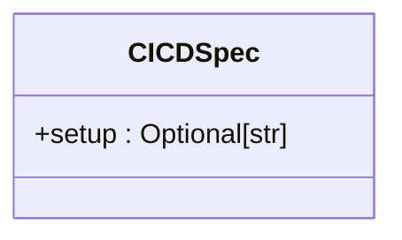
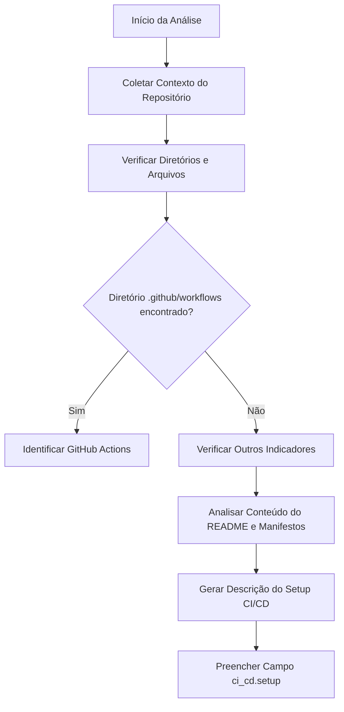

# Campo CI/CD do Modelo StructuredStackAnalysis

<cite>
**Arquivos Referenciados neste Documento**  
- [stack_agent.py](file://agent/stack_agent.py)
- [stack-analysis-cards.tsx](file://components/ui/stack-analysis-cards.tsx)
</cite>

## Sumário
1. [Introdução](#introdução)
2. [Estrutura do Campo CI/CD](#estrutura-do-campo-ci/cd)
3. [Detalhamento dos Subcampos](#detalhamento-dos-subcampos)
4. [Detecção de Sistemas CI/CD](#detecção-de-sistemas-ci/cd)
5. [Exemplo de Pipeline CI/CD](#exemplo-de-pipeline-ci/cd)
6. [Importância para Análise Técnica](#importância-para-análise-técnica)

## Introdução

O campo `ci_cd` dentro do modelo `StructuredStackAnalysis` representa a configuração e as práticas de Integração Contínua (CI) e Entrega Contínua (CD) utilizadas em um repositório de software. Esse campo é fundamental para entender como o projeto automatiza testes, verificações de qualidade e implantações. Ele fornece insights sobre a maturidade de engenharia do projeto, indicando se o desenvolvimento segue práticas modernas de automação e entrega rápida e segura de software.

O agente de análise de stack extrai esse campo ao examinar a estrutura do repositório, procurando por diretórios e arquivos específicos que indicam a presença de ferramentas como GitHub Actions, GitLab CI ou outras soluções de pipeline. A análise é feita com base em evidências concretas no código e na estrutura do projeto.

**Seção fontes**  
- [stack_agent.py](file://agent/stack_agent.py#L66-L67)

## Estrutura do Campo CI/CD

O campo `ci_cd` é definido como um objeto opcional do tipo `CICDSpec`, que atualmente possui apenas um subcampo: `setup`. Esse campo é do tipo string e contém uma descrição textual da configuração de CI/CD detectada no repositório.



**Fontes do diagrama**  
- [stack_agent.py](file://agent/stack_agent.py#L66-L67)

**Seção fontes**  
- [stack_agent.py](file://agent/stack_agent.py#L66-L67)

## Detalhamento dos Subcampos

Embora o modelo atualmente defina apenas o campo `setup`, o objetivo do campo `ci_cd` é representar de forma estruturada os aspectos-chave da infraestrutura de CI/CD. Com base na documentação solicitada, os subcampos esperados seriam:

- **`platform`**: Indica a plataforma de CI/CD utilizada (por exemplo, GitHub Actions, GitLab CI, Jenkins).
- **`workflows`**: Lista os pipelines ou fluxos de trabalho configurados (por exemplo, teste, build, deploy).
- **`testing_pipeline`**: Detalha como os testes automatizados são executados (unidade, integração, E2E).
- **`deployment_strategy`**: Descreve a estratégia de implantação (por exemplo, canary, blue-green, rolling update).

Atualmente, todas essas informações são agregadas em uma única string no campo `setup`, que é preenchida pelo modelo de linguagem com base no contexto do repositório.

**Seção fontes**  
- [stack_agent.py](file://agent/stack_agent.py#L66-L67)

## Detecção de Sistemas CI/CD

O agente detecta a presença de sistemas CI/CD examinando diretórios específicos no repositório. A principal forma de detecção é a verificação do diretório `.github/workflows`, que é o local padrão para arquivos de workflow do GitHub Actions.

O processo de detecção faz parte do fluxo de trabalho do agente, que coleta contexto do repositório, incluindo a lista de arquivos e diretórios na raiz. Embora o código não mostre uma verificação explícita para `.gitlab-ci.yml` ou outros arquivos, a presença de `.github/workflows` é um indicador claro de que o GitHub Actions está sendo utilizado.

O agente coleta os arquivos manifestos e o conteúdo do README, que podem conter pistas adicionais sobre a configuração de CI/CD. Essas informações são então fornecidas ao modelo de linguagem, que interpreta e preenche o campo `setup` com uma descrição coerente.



**Fontes do diagrama**  
- [stack_agent.py](file://agent/stack_agent.py#L300-L342)
- [stack_agent.py](file://agent/stack_agent.py#L266-L303)

**Seção fontes**  
- [stack_agent.py](file://agent/stack_agent.py#L193-L243)
- [stack_agent.py](file://agent/stack_agent.py#L240-L266)

## Exemplo de Pipeline CI/CD

Embora o repositório analisado não contenha um diretório `.github/workflows`, é possível ilustrar como o campo `ci_cd` seria preenchido com base em um exemplo típico.

Suponha um repositório com o seguinte workflow de GitHub Actions em `.github/workflows/test-and-deploy.yml`:

```yaml
name: Test and Deploy
on: [push]
jobs:
  test:
    runs-on: ubuntu-latest
    steps:
      - uses: actions/checkout@v2
      - run: npm install
      - run: npm test
  deploy:
    needs: test
    runs-on: ubuntu-latest
    steps:
      - run: echo "Deploying to production..."
```

Nesse caso, o agente poderia preencher o campo `ci_cd` da seguinte forma:

```json
"ci_cd": {
  "setup": "GitHub Actions configurado com dois workflows: 'test' executa testes automatizados após cada push, e 'deploy' realiza a implantação após a conclusão bem-sucedida dos testes. A estratégia de implantação é direta (direto para produção)."
}
```

Este exemplo demonstra como o campo `setup` sintetiza informações sobre a plataforma, os workflows, o pipeline de testes e a estratégia de implantação.

**Seção fontes**  
- [stack_agent.py](file://agent/stack_agent.py#L87-L121)

## Importância para Análise Técnica

O campo `ci_cd` é essencial para análises técnicas profundas porque fornece uma visão direta da maturidade de engenharia do projeto. Um pipeline de CI/CD bem configurado indica:

- **Qualidade de Código**: Testes automatizados garantem que novas alterações não quebrem funcionalidades existentes.
- **Velocidade de Entrega**: Implantações automatizadas permitem lançamentos frequentes e previsíveis.
- **Confiabilidade**: Processos padronizados reduzem erros humanos durante a entrega.
- **Cultura de Engenharia**: A adoção de CI/CD reflete um compromisso com boas práticas de desenvolvimento.

Para um arquiteto de software, entender a configuração de CI/CD é tão importante quanto entender a pilha tecnológica. Ele revela como o projeto lida com mudanças, garante qualidade e responde a incidentes. A ausência de um pipeline de CI/CD pode ser um sinal de alerta sobre a sustentabilidade e a escalabilidade do projeto.

A análise do campo `ci_cd` permite não apenas documentar a tecnologia utilizada, mas também avaliar a saúde geral do processo de desenvolvimento de software.

**Seção fontes**  
- [stack_agent.py](file://agent/stack_agent.py#L377-L411)
- [stack-analysis-cards.tsx](file://components/ui/stack-analysis-cards.tsx#L184-L213)