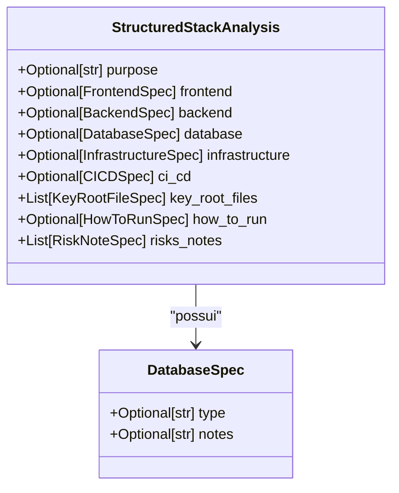
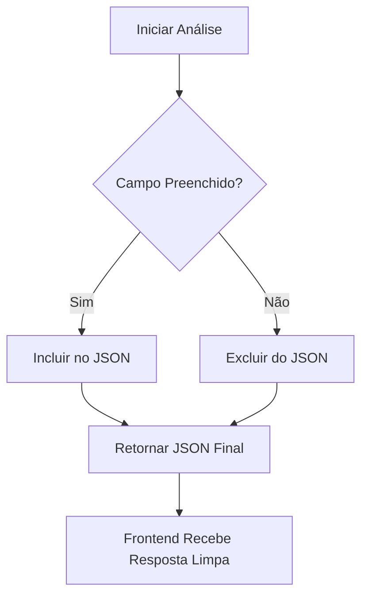

# Campo Database do Modelo StructuredStackAnalysis

<cite>
**Arquivos Referenciados neste Documento**   
- [stack_agent.py](file://agent/stack_agent.py)
- [stack-analysis-cards.tsx](file://components/ui/stack-analysis-cards.tsx)
</cite>

## Tabela de Conteúdos
1. [Introdução](#introdução)
2. [Estrutura do Campo Database](#estrutura-do-campo-database)
3. [Análise de Stack de Dados](#análise-de-stack-de-dados)
4. [Exemplo com PostgreSQL e Prisma](#exemplo-com-postgresql-e-prisma)
5. [Tratamento de Múltiplos Bancos e Valores Nulos](#tratamento-de-múltiplos-bancos-e-valores-nulos)
6. [Conclusão](#conclusão)

## Introdução

O campo `database` dentro do modelo `StructuredStackAnalysis` desempenha um papel fundamental na representação dos sistemas de armazenamento de dados utilizados em um projeto de software. Este campo é responsável por capturar informações essenciais sobre a camada de persistência, incluindo o tipo de banco de dados, tecnologias de mapeamento objeto-relacional (ORM), ferramentas de migração e detalhes sobre a conexão. A análise precisa deste campo permite que desenvolvedores, arquitetos e stakeholders compreendam rapidamente a infraestrutura de dados subjacente a uma aplicação.

**Section sources**
- [stack_agent.py](file://agent/stack_agent.py#L89)

## Estrutura do Campo Database

O campo `database` é definido como um objeto opcional do tipo `DatabaseSpec`. Esta especificação é uma classe Pydantic que estrutura os dados de forma clara e validada. Atualmente, a classe `DatabaseSpec` contém dois campos principais:

- **`type`**: Uma string opcional que indica o sistema de gerenciamento de banco de dados (DBMS) utilizado no projeto. Este campo pode representar bancos de dados relacionais (como PostgreSQL, MySQL), NoSQL (como MongoDB, Redis), sistemas de cache (como Memcached) ou ORMs (como Prisma, SQLAlchemy).
- **`notes`**: Uma string opcional destinada a armazenar observações adicionais sobre a configuração ou uso do banco de dados, fornecendo contexto que não se encaixa diretamente no campo `type`.

Essa estrutura simples, mas eficaz, permite flexibilidade na representação de stacks de dados complexos, enquanto mantém a clareza e a consistência na saída da análise.



**Diagram sources**
- [stack_agent.py](file://agent/stack_agent.py#L55-L57)
- [stack_agent.py](file://agent/stack_agent.py#L89)

**Section sources**
- [stack_agent.py](file://agent/stack_agent.py#L55-L57)

## Análise de Stack de Dados

O agente realiza a inferência do stack de dados analisando arquivos de configuração e dependências do projeto. O processo começa com a coleta de metadados do repositório, incluindo a lista de arquivos na raiz e o conteúdo de manifestos comuns (como `package.json`, `pyproject.toml`, `go.mod`, entre outros). O agente examina esses arquivos em busca de pistas sobre as tecnologias de banco de dados utilizadas.

Por exemplo, a presença de dependências como `prisma`, `@prisma/client`, `pg` (para PostgreSQL), `mysql2`, `mongoose` (para MongoDB) ou `redis` em um arquivo `package.json` é um indicativo forte do stack de dados. Da mesma forma, a existência de arquivos de configuração específicos, como `prisma/schema.prisma`, `docker-compose.yml` com serviços de banco de dados, ou scripts de migração, fornece evidências cruciais para a inferência.

O agente utiliza um modelo de linguagem (LLM) para interpretar esse contexto coletado e preencher o campo `database.type` com o nome do sistema de banco de dados identificado, como "PostgreSQL", "MongoDB", ou "Prisma com SQLite". O campo `database.notes` pode ser usado para incluir detalhes adicionais, como a versão do banco ou configurações específicas, se inferidas.

**Section sources**
- [stack_agent.py](file://agent/stack_agent.py#L200-L250)

## Exemplo com PostgreSQL e Prisma

Um exemplo claro do funcionamento do campo `database` pode ser observado em um repositório que utiliza PostgreSQL como banco de dados e Prisma como ORM. Nesse cenário, o agente detectaria a seguinte evidência:

- A dependência `"@prisma/client"` no arquivo `package.json`.
- A definição de um provedor `"postgresql"` no arquivo `prisma/schema.prisma`.
- A URL de conexão com um host PostgreSQL no arquivo `.env`.

Com base nessas informações, o LLM inferiria que o stack de dados principal é o PostgreSQL, possivelmente com Prisma como camada de abstração. O resultado da análise seria então estruturado da seguinte forma:

```json
{
  "database": {
    "type": "PostgreSQL",
    "notes": "Utiliza Prisma ORM para acesso aos dados"
  }
}
```

Este exemplo demonstra como o agente combina evidências de múltiplos arquivos para formar uma conclusão coerente e útil sobre a arquitetura de dados do projeto.

**Section sources**
- [supervisor.py](file://agent/supervisor.py#L124-L164)

## Tratamento de Múltiplos Bancos e Valores Nulos

O campo `database` é projetado para representar o sistema de armazenamento de dados principal do projeto. Em casos onde um repositório utiliza múltiplos bancos de dados (por exemplo, PostgreSQL para dados principais e Redis para cache), o agente é programado para identificar e reportar o banco de dados mais central ou predominante. A decisão sobre qual banco é o "principal" é feita pelo LLM com base na análise do contexto, como a frequência de uso nos arquivos de código e a importância na arquitetura.

Um aspecto crucial do processamento é a exclusão de valores nulos para manter a resposta limpa e útil para o frontend. Isso é alcançado pela chamada ao método `model_dump(exclude_none=True)` quando o objeto `StructuredStackAnalysis` é serializado. Esse parâmetro garante que quaisquer campos opcionais que não foram preenchidos (como `database` em um projeto frontend puro, ou `notes` se não houver observações) sejam completamente omitidos do JSON final. Isso evita a poluição da resposta com campos `null` ou `undefined`, resultando em uma saída mais concisa e fácil de consumir pela interface do usuário.



**Diagram sources**
- [stack_agent.py](file://agent/stack_agent.py#L104)
- [stack-analysis-cards.tsx](file://components/ui/stack-analysis-cards.tsx#L127)

**Section sources**
- [stack_agent.py](file://agent/stack_agent.py#L104)
- [stack_agent.py](file://agent/stack_agent.py#L420)

## Conclusão

O campo `database` do modelo `StructuredStackAnalysis` é um componente essencial para a compreensão da arquitetura de dados de um projeto de software. Sua estrutura simples, baseada na classe `DatabaseSpec`, permite uma representação clara do sistema de banco de dados principal. O processo de inferência, que envolve a análise de arquivos de configuração e dependências, demonstra a capacidade do agente de extrair insights significativos do código. A funcionalidade de exclusão de valores nulos garante que a saída seja sempre limpa e otimizada para consumo, destacando a atenção do projeto à qualidade da experiência do usuário no frontend.