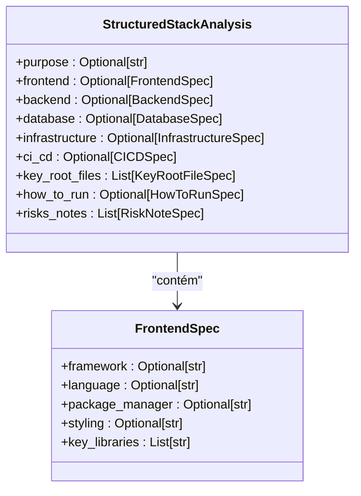
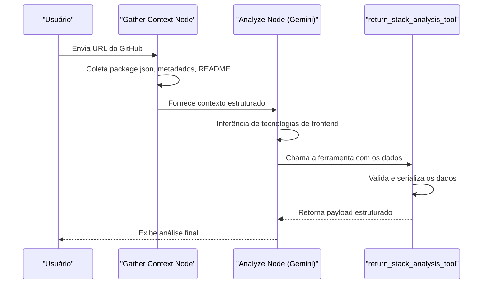

<cite>
**Arquivos Referenciados neste Documento**  
- [stack_agent.py](file://agent/stack_agent.py)
- [package.json](file://package.json)
- [main.py](file://agent/main.py)
</cite>

## Sumário
1. [Introdução](#introdução)
2. [Estrutura do Modelo StructuredStackAnalysis](#estrutura-do-modelo-structuredstackanalysis)
3. [Detalhamento do Campo Frontend](#detalhamento-do-campo-frontend)
4. [Processo de Extração e Inferência de Dados](#processo-de-extração-e-inferência-de-dados)
5. [Exemplo de Preenchimento pelo Gemini](#exemplo-de-preenchimento-pelo-gemini)
6. [Tratamento de Valores Nulos e Normalização](#tratamento-de-valores-nulos-e-normalização)

## Introdução

O campo `frontend` é uma parte essencial do modelo Pydantic `StructuredStackAnalysis`, utilizado no agente de análise de stack do projeto Open-Gemini-Canvas. Este campo tem como objetivo fornecer uma visão estruturada e detalhada das tecnologias empregadas na camada de interface do usuário (UI) de um repositório de código analisado. Ele é definido como opcional e do tipo `FrontendSpec`, uma subclasse de `BaseModel` que encapsula informações específicas sobre o frontend, como frameworks, linguagens, ferramentas de build e bibliotecas-chave. A documentação a seguir explora a estrutura, o processo de preenchimento e a importância desse campo dentro do fluxo de análise do sistema.

## Estrutura do Modelo StructuredStackAnalysis

O modelo `StructuredStackAnalysis` serve como o esquema de saída estruturada para a análise de um repositório de software. Ele é projetado para ser retornado por uma ferramenta (`return_stack_analysis_tool`) que é chamada por um modelo de linguagem (LLM), como o Gemini, após a análise do contexto do repositório. O modelo é composto por vários campos opcionais que representam diferentes aspectos da arquitetura do software.

**Section sources**
- [stack_agent.py](file://agent/stack_agent.py#L85-L94)

## Detalhamento do Campo Frontend

O campo `frontend` dentro de `StructuredStackAnalysis` é do tipo `Optional[FrontendSpec]`, indicando que a informação sobre a camada de interface pode não estar presente em todos os repositórios analisados. A classe `FrontendSpec` define os subcampos específicos que compõem a análise do frontend:

- **`framework`**: Uma string opcional que identifica o framework principal utilizado (ex: Next.js, React, Vue).
- **`language`**: Uma string opcional que especifica a linguagem de programação principal (ex: TypeScript, JavaScript).
- **`package_manager`**: Uma string opcional que indica o gerenciador de pacotes (ex: npm, pnpm, yarn).
- **`styling`**: Uma string opcional que descreve a abordagem ou biblioteca de estilização (ex: Tailwind CSS, CSS Modules).
- **`key_libraries`**: Uma lista de strings que contém bibliotecas de UI ou utilitários importantes (ex: Radix UI, Lucide React).

Este campo é crucial para fornecer uma visão clara da pilha tecnológica utilizada na construção da interface do usuário, permitindo que o usuário final do sistema compreenda rapidamente as escolhas de tecnologia.



**Diagram sources**
- [stack_agent.py](file://agent/stack_agent.py#L39-L44)
- [stack_agent.py](file://agent/stack_agent.py#L85-L94)

**Section sources**
- [stack_agent.py](file://agent/stack_agent.py#L39-L44)

## Processo de Extração e Inferência de Dados

A informação para preencher o campo `frontend` é extraída e inferida a partir da análise de diversos arquivos do repositório. O processo é orquestrado pela função `gather_context_node`, que coleta dados do repositório do GitHub, incluindo metadados, linguagens utilizadas, conteúdo do README e, o mais importante, os arquivos de manifesto da raiz do projeto.

O arquivo `package.json` é a fonte primária de informação. Ele é analisado para identificar dependências que indicam o uso de frameworks (como `next`), bibliotecas de UI (como `@radix-ui/react-*`), ferramentas de estilização (como `tailwindcss`) e o próprio gerenciador de pacotes (inferido do nome do arquivo de lock, como `pnpm-lock.yaml`). O campo `languages` do metadado do repositório fornece uma indicação da linguagem principal (por exemplo, "TypeScript"). O conteúdo do README pode conter menções explícitas ao framework ou à arquitetura, complementando a inferência.

**Section sources**
- [stack_agent.py](file://agent/stack_agent.py#L200-L210)
- [package.json](file://package.json#L1-L87)

## Exemplo de Preenchimento pelo Gemini

Com base na análise do repositório, o modelo de linguagem Gemini preenche o campo `frontend` com dados inferidos. Por exemplo, ao analisar o `package.json` deste projeto, o Gemini pode gerar um objeto como o seguinte:

```json
"frontend": {
  "framework": "Next.js",
  "language": "TypeScript",
  "package_manager": "pnpm",
  "styling": "Tailwind CSS",
  "key_libraries": [
    "Radix UI",
    "Lucide React",
    "React Hook Form"
  ]
}
```

Este preenchimento é feito pela ferramenta `return_stack_analysis_tool`, que valida os dados recebidos contra o esquema `StructuredStackAnalysis`. A função `_build_analysis_prompt` monta um prompt rico em contexto, fornecendo ao Gemini todas as informações necessárias (metadados, linguagens, manifestos, README) para fazer inferências precisas sobre a stack de frontend.



**Diagram sources**
- [stack_agent.py](file://agent/stack_agent.py#L200-L300)
- [stack_agent.py](file://agent/stack_agent.py#L100-L106)

**Section sources**
- [stack_agent.py](file://agent/stack_agent.py#L100-L106)
- [stack_agent.py](file://agent/stack_agent.py#L200-L300)

## Tratamento de Valores Nulos e Normalização

O tratamento de valores nulos é uma característica fundamental do modelo, garantida pelo uso de `Optional` e do parâmetro `exclude_none=True` no método `model_dump()`. Isso significa que campos que não puderam ser inferidos (por exemplo, se o framework não foi identificado) são simplesmente omitidos do JSON final, resultando em uma saída limpa e sem valores `null` desnecessários.

A normalização dos dados ocorre implicitamente durante a validação do Pydantic. Quando o Gemini fornece os dados brutos para `return_stack_analysis_tool`, o Pydantic os valida contra o esquema `FrontendSpec`. Isso garante que os tipos de dados estejam corretos (por exemplo, `key_libraries` é sempre uma lista) e que os nomes dos campos estejam padronizados. Essa etapa de normalização é vital antes da serialização para o frontend, pois garante que o cliente (a aplicação Next.js) receba um JSON consistente e previsível, simplificando o consumo e a renderização das informações.

**Section sources**
- [stack_agent.py](file://agent/stack_agent.py#L100-L106)