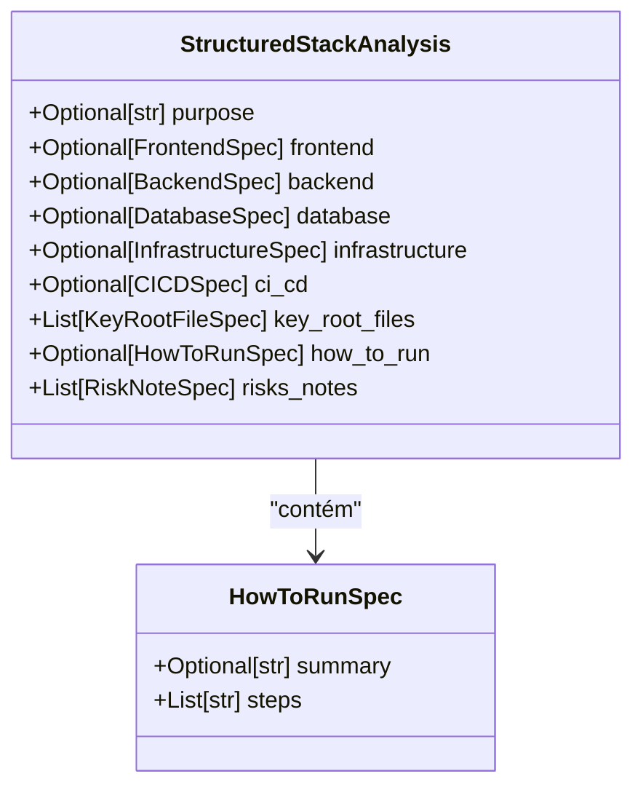
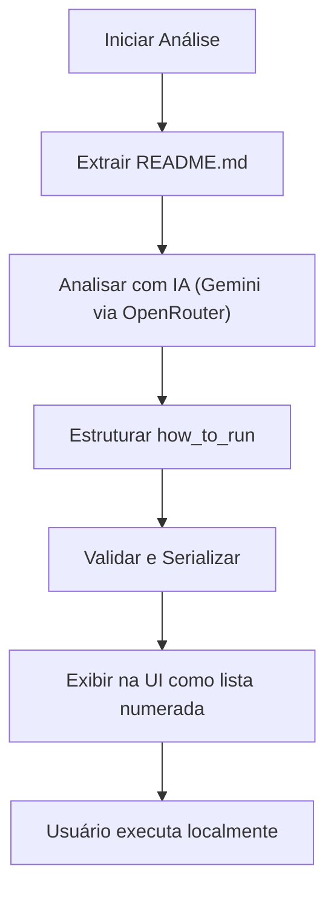

# Campo How to Run do Modelo StructuredStackAnalysis

<cite>
**Arquivos Referenciados neste Documento**  
- [stack_agent.py](file://agent/stack_agent.py)
- [README.md](file://README.md)
- [stack-analysis-cards.tsx](file://components/ui/stack-analysis-cards.tsx)
</cite>

## Sumário
1. [Introdução](#introdução)
2. [Estrutura do Campo how_to_run](#estrutura-do-campo-how_to_run)
3. [Processamento do Conteúdo do README.md](#processamento-do-conteúdo-do-readmemd)
4. [Estruturação e Validação das Instruções](#estruturação-e-validação-das-instruções)
5. [Importância do Campo how_to_run para Usuários](#importância-do-campo-how_to_run-para-usuários)
6. [Representação na Interface do Usuário](#representação-na-interface-do-usuário)

## Introdução
O campo `how_to_run` pertence ao modelo `StructuredStackAnalysis`, utilizado no agente de análise de tecnologias (stack) do projeto Open Gemini Canvas. Este campo tem como objetivo fornecer instruções claras, estruturadas e executáveis para que um usuário possa rodar localmente o projeto analisado. Ele é gerado com base na análise automatizada do arquivo `README.md` e outros arquivos de documentação do repositório, extraídos e sintetizados por um agente de IA. O conteúdo é organizado em etapas lógicas e validado para garantir clareza e utilidade prática.

**Seção fontes**  
- [stack_agent.py](file://agent/stack_agent.py#L75-L77)
- [README.md](file://README.md#L1-L173)

## Estrutura do Campo how_to_run
O campo `how_to_run` é definido como uma instância da classe `HowToRunSpec`, que faz parte do modelo `StructuredStackAnalysis`. Ele contém dois atributos principais:

- **summary**: Uma breve descrição textual do processo geral necessário para executar o projeto.
- **steps**: Uma lista ordenada de strings, onde cada item representa um comando ou ação específica a ser realizada.

Essa estrutura permite que as instruções sejam apresentadas de forma clara e sequencial, facilitando a replicação do ambiente de desenvolvimento por usuários com diferentes níveis de experiência.

**Fontes do diagrama**  
- [stack_agent.py](file://agent/stack_agent.py#L75-L77)
- [stack_agent.py](file://agent/stack_agent.py#L85-L94)

**Seção fontes**  
- [stack_agent.py](file://agent/stack_agent.py#L75-L77)

## Processamento do Conteúdo do README.md
O agente extrai o conteúdo do `README.md` do repositório fornecido pelo usuário. Esse processo é realizado pela função `_fetch_readme` no arquivo `stack_agent.py`, que utiliza a API do GitHub para obter o conteúdo do arquivo em formato base64 e o decodifica para texto UTF-8. Caso o `README.md` não esteja disponível diretamente, o agente busca por arquivos alternativos como `readme.txt` ou `readme.rst`.

Após a extração, o conteúdo do `README.md` é analisado por um modelo de IA (via OpenRouter, acessando Google Gemini) para identificar comandos relevantes, como:
- `pnpm install`
- `python main.py`
- `docker-compose up`
- `cp .env.example .env`

Esses comandos são extraídos com base em padrões comuns de instalação, configuração e execução de projetos, garantindo que as instruções sejam práticas e diretamente aplicáveis.

**Seção fontes**  
- [stack_agent.py](file://agent/stack_agent.py#L245-L265)
- [README.md](file://README.md#L1-L173)

## Estruturação e Validação das Instruções
Após a extração dos comandos, o agente organiza as instruções em etapas lógicas e sequenciais. Por exemplo:
1. Clonar o repositório
2. Instalar dependências
3. Configurar variáveis de ambiente
4. Executar o projeto

Essa estruturação é feita para garantir que o usuário siga um fluxo coerente, evitando erros comuns como tentar executar o projeto antes de instalar as dependências. Além disso, o modelo `StructuredStackAnalysis` valida os dados antes de retorná-los, assegurando que o campo `how_to_run` esteja presente e bem formado, mesmo que parcial.

O uso do `Field(default_factory=list)` para o campo `steps` garante que, mesmo em caso de falha parcial na extração, a lista será inicializada corretamente, evitando erros de execução.

**Seção fontes**  
- [stack_agent.py](file://agent/stack_agent.py#L75-L77)
- [stack_agent.py](file://agent/stack_agent.py#L245-L265)

## Importância do Campo how_to_run para Usuários
O campo `how_to_run` desempenha um papel crucial para usuários que desejam replicar, testar ou contribuir com o projeto analisado. Ele elimina a necessidade de leitura manual do `README.md`, especialmente em repositórios complexos ou mal documentados, fornecendo um guia rápido e confiável.

Além disso, ao sintetizar e validar as instruções, o agente reduz o risco de erros humanos, como comandos faltantes ou ordem incorreta de execução. Isso é especialmente útil em ambientes de desenvolvimento rápido, onde a eficiência e a precisão são essenciais.

**Seção fontes**  
- [stack_agent.py](file://agent/stack_agent.py#L75-L77)
- [README.md](file://README.md#L1-L173)

## Representação na Interface do Usuário
Na interface da aplicação (Next.js), o campo `how_to_run` é exibido em um componente chamado `stack-analysis-cards.tsx`. Ele é renderizado como uma lista numerada (`<ol>`), com cada passo como um item (`<li>`), garantindo uma apresentação clara e fácil de seguir.

O componente verifica se o campo `how_to_run` existe e, caso exista, exibe o resumo (`summary`) seguido pela lista de passos (`steps`). Isso garante que a interface permaneça limpa e funcional, mesmo quando o campo está vazio ou parcialmente preenchido.

**Fontes do diagrama**  
- [stack_agent.py](file://agent/stack_agent.py#L245-L265)
- [stack-analysis-cards.tsx](file://components/ui/stack-analysis-cards.tsx#L212-L240)

**Seção fontes**  
- [stack-analysis-cards.tsx](file://components/ui/stack-analysis-cards.tsx#L212-L240)