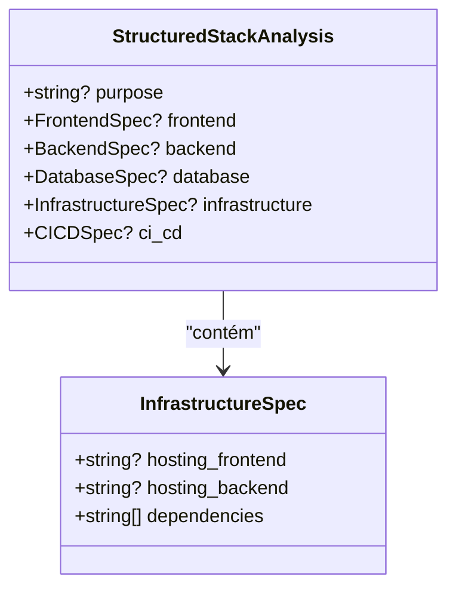
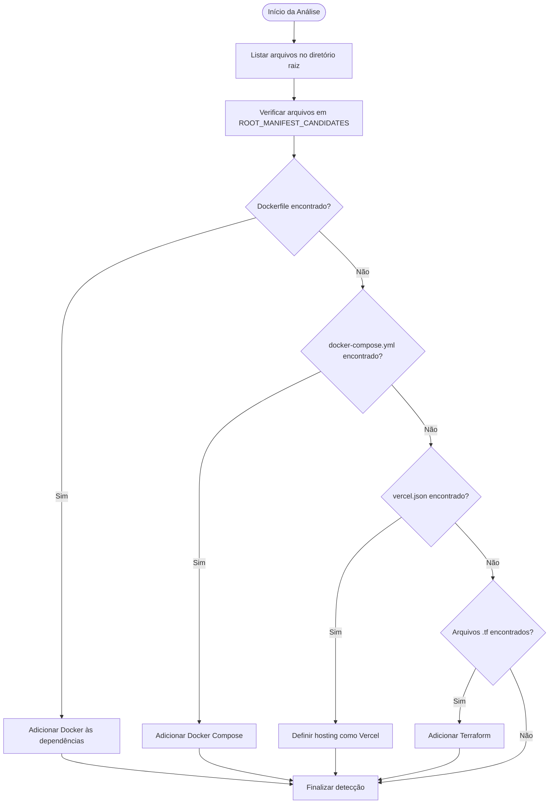

# Campo Infrastructure do Modelo StructuredStackAnalysis

<cite>
**Arquivos Referenciados neste Documento**  
- [stack_agent.py](file://agent/stack_agent.py)
- [stack-analysis-cards.tsx](file://components/ui/stack-analysis-cards.tsx)
</cite>

## Sumário
1. [Introdução](#introdução)
2. [Estrutura do Campo Infrastructure](#estrutura-do-campo-infrastructure)
3. [Detecção Automática de Tecnologias de Infraestrutura](#detecção-automática-de-tecnologias-de-infraestrutura)
4. [Exemplo de Análise de Projeto com Docker e AWS](#exemplo-de-análise-de-projeto-com-docker-e-aws)
5. [Importância do Campo Infrastructure](#importância-do-campo-infrastructure)
6. [Conclusão](#conclusão)

## Introdução

O campo `infrastructure` da classe `StructuredStackAnalysis` desempenha um papel fundamental na análise de repositórios de software, fornecendo uma visão estruturada e detalhada da camada de infraestrutura do projeto. Este campo é projetado para capturar informações essenciais sobre hospedagem, contêineres, orquestração, ferramentas de infraestrutura como código (IaC) e redes de distribuição de conteúdo (CDN). Ao identificar e organizar esses elementos, o agente de análise oferece ao usuário um contexto operacional completo, permitindo decisões informadas sobre migração, manutenção ou escalabilidade de aplicações.

**Section sources**  
- [stack_agent.py](file://agent/stack_agent.py#L60-L63)

## Estrutura do Campo Infrastructure

O campo `infrastructure` é definido pela classe `InfrastructureSpec`, que encapsula subcampos específicos para descrever diferentes aspectos da infraestrutura do projeto. Esses subcampos incluem:

- **`hosting_frontend`**: Indica o serviço ou plataforma utilizado para hospedar a interface do usuário (frontend), como Vercel, Netlify ou AWS S3.
- **`hosting_backend`**: Especifica onde a lógica de negócios e APIs (backend) estão hospedadas, podendo ser serviços como Railway, AWS EC2, Google Cloud Run ou Heroku.
- **`dependencies`**: Lista as dependências de infraestrutura detectadas no projeto, como ferramentas de contêineres, orquestração ou IaC.

Essa estrutura permite uma representação clara e padronizada da configuração de infraestrutura, facilitando a compreensão e o compartilhamento de informações entre equipes técnicas.



**Diagram sources**  
- [stack_agent.py](file://agent/stack_agent.py#L60-L63)

**Section sources**  
- [stack_agent.py](file://agent/stack_agent.py#L60-L63)

## Detecção Automática de Tecnologias de Infraestrutura

O agente realiza a detecção automática de tecnologias de infraestrutura ao analisar arquivos de configuração presentes na raiz do repositório. Essa análise é baseada em uma lista predefinida de candidatos a manifestos, que inclui arquivos-chave como `Dockerfile`, `docker-compose.yml`, `vercel.json`, entre outros.

### Mecanismo de Detecção

O processo de detecção ocorre em etapas:

1. **Listagem de Arquivos Raiz**: O agente lista todos os arquivos no diretório raiz do repositório.
2. **Verificação de Manifestos**: Compara os arquivos encontrados com uma lista de candidatos conhecidos (`ROOT_MANIFEST_CANDIDATES`).
3. **Leitura de Conteúdo**: Quando um arquivo correspondente é encontrado, seu conteúdo é baixado e armazenado para análise.
4. **Inferência de Tecnologias**: Com base no nome e conteúdo do arquivo, o agente infere as tecnologias de infraestrutura utilizadas.

Por exemplo:
- A presença de um `Dockerfile` indica o uso de Docker para contêineres.
- Um `docker-compose.yml` sugere orquestração local com Docker Compose.
- Um `vercel.json` aponta para hospedagem no Vercel.
- Arquivos como `main.tf` ou diretórios com extensão `.tf` indicam o uso do Terraform.

Embora o repositório analisado não contenha arquivos específicos de Kubernetes ou Terraform, o agente está preparado para detectá-los caso estejam presentes.



**Diagram sources**  
- [stack_agent.py](file://agent/stack_agent.py#L193-L206)

**Section sources**  
- [stack_agent.py](file://agent/stack_agent.py#L193-L243)

## Exemplo de Análise de Projeto com Docker e AWS

Considere um projeto que utiliza Docker para contêineres e AWS para hospedagem. O agente detectaria os seguintes elementos:

- **`Dockerfile`**: Presente na raiz, indicando que o projeto é empacotado como um contêiner Docker.
- **`docker-compose.yml`**: Define serviços como banco de dados e backend, orquestrados localmente.
- **Configurações de AWS**: Embora não haja um arquivo específico como `aws.json`, a presença de variáveis de ambiente ou scripts de implantação pode levar o agente a inferir o uso da AWS.

Nesse cenário, o campo `infrastructure` seria populado da seguinte forma:

```json
"infrastructure": {
  "hosting_frontend": "AWS S3",
  "hosting_backend": "AWS EC2",
  "dependencies": ["Docker", "Docker Compose", "AWS CLI"]
}
```

Essa representação permite ao usuário entender rapidamente que o frontend é servido estaticamente via S3, enquanto o backend roda em instâncias EC2, com todos os componentes gerenciados por contêineres Docker.

**Section sources**  
- [stack_agent.py](file://agent/stack_agent.py#L60-L63)

## Importância do Campo Infrastructure

O campo `infrastructure` é essencial para fornecer um contexto operacional completo ao usuário final. Ele vai além da mera listagem de tecnologias, oferecendo insights sobre:

- **Topologia de Implantação**: Mostra onde cada componente da aplicação está hospedado.
- **Complexidade Operacional**: Indica o nível de sofisticação da infraestrutura (ex: uso de orquestração, IaC).
- **Dependências Críticas**: Destaca ferramentas necessárias para reproduzir o ambiente localmente.
- **Compatibilidade e Migração**: Facilita a avaliação de compatibilidade com outras plataformas ou a migração para novos provedores.

Além disso, ao integrar-se com componentes de interface como `stack-analysis-cards.tsx`, o campo permite uma visualização clara e acessível dessas informações, tornando a análise útil tanto para desenvolvedores quanto para gestores técnicos.

**Section sources**  
- [stack_agent.py](file://agent/stack_agent.py#L60-L63)  
- [stack-analysis-cards.tsx](file://components/ui/stack-analysis-cards.tsx#L107-L153)

## Conclusão

O campo `infrastructure` da classe `StructuredStackAnalysis` é um componente central na análise de stacks tecnológicos, proporcionando uma visão estruturada e automatizada da infraestrutura subjacente a um projeto de software. Ao detectar arquivos de configuração como `Dockerfile`, `docker-compose.yml` e `vercel.json`, o agente consegue inferir com precisão as tecnologias utilizadas, desde contêineres até plataformas de hospedagem. Essa capacidade não apenas economiza tempo, mas também reduz erros humanos na avaliação de repositórios, tornando o processo de análise mais eficiente e confiável.