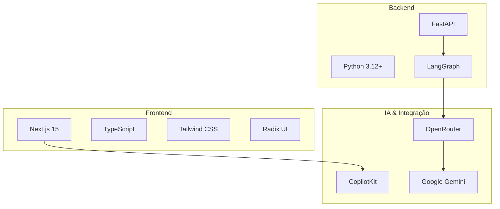
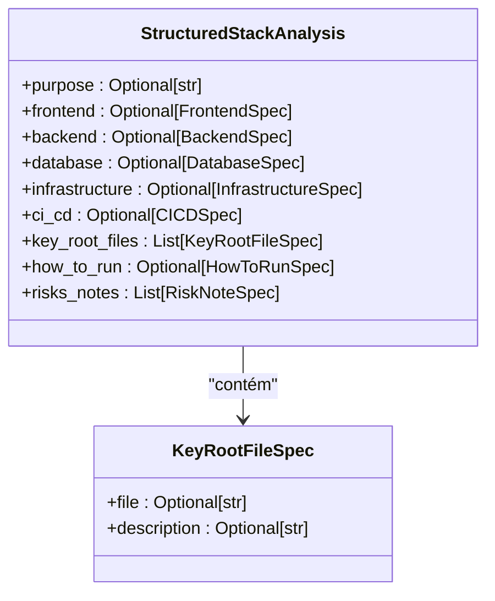
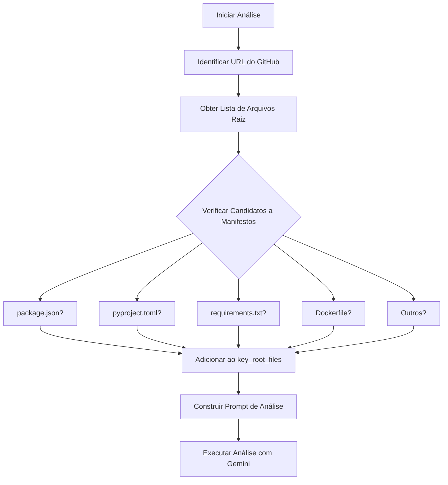

# Campo Key Root Files do Modelo StructuredStackAnalysis

<cite>
**Arquivos Referenciados neste Documento**  
- [agent/stack_agent.py](file://agent/stack_agent.py)
- [README.md](file://README.md)
- [package.json](file://package.json)
- [next.config.mjs](file://next.config.mjs)
- [agent/pyproject.toml](file://agent/pyproject.toml)
</cite>

## Sumário
1. [Introdução](#introdução)
2. [Estrutura do Projeto](#estrutura-do-projeto)
3. [Análise do Campo key_root_files](#análise-do-campo-key_root_files)
4. [Exemplos de Arquivos-Chave no Repositório](#exemplos-de-arquivos-chave-no-repositório)
5. [Processo de Extração e Classificação](#processo-de-extração-e-classificação)
6. [Impacto na Análise do Stack Tecnológico](#impacto-na-análise-do-stack-tecnológico)
7. [Conclusão](#conclusão)

## Introdução

O campo `key_root_files` da classe `StructuredStackAnalysis` desempenha um papel fundamental na análise inicial de repositórios de software. Este campo armazena uma lista estruturada de arquivos localizados no diretório raiz do repositório que fornecem pistas cruciais sobre a arquitetura, configuração e tecnologias utilizadas no projeto. A identificação e interpretação desses arquivos permitem ao agente de análise compreender rapidamente o stack tecnológico, as dependências, o ambiente de execução e as práticas de desenvolvimento adotadas.

**Section sources**
- [agent/stack_agent.py](file://agent/stack_agent.py#L85-L94)

## Estrutura do Projeto

O repositório analisado combina tecnologias modernas de frontend e backend, com uma arquitetura baseada em agentes de IA. O frontend é construído com Next.js 15 e TypeScript, enquanto o backend utiliza FastAPI com Python 3.12+. O projeto integra CopilotKit para interface conversacional, LangGraph para orquestração de agentes e OpenRouter para acesso a modelos de IA como o Google Gemini.

A estrutura do projeto reflete um design modular, com diretórios claramente definidos para agentes, componentes de interface, hooks, bibliotecas e scripts de configuração. Essa organização facilita a identificação de arquivos-chave no diretório raiz que revelam as decisões arquiteturais do sistema.



**Diagram sources**
- [README.md](file://README.md#L20-L35)

## Análise do Campo key_root_files

O campo `key_root_files` é definido como uma lista de objetos do tipo `KeyRootFileSpec`, que contém dois atributos principais: `file` (nome do arquivo) e `description` (descrição do papel do arquivo no projeto). Este campo é parte integrante da classe `StructuredStackAnalysis`, que modela a análise estruturada de um stack tecnológico.

Durante o processo de análise, o agente identifica arquivos no diretório raiz do repositório que são indicadores confiáveis da tecnologia e configuração do projeto. Esses arquivos são então catalogados neste campo, permitindo que a análise posterior seja direcionada e contextualizada com base nas evidências encontradas.

A presença de arquivos específicos no diretório raiz atua como um "mapa" para o agente, guiando sua interpretação sobre:

- O framework de frontend utilizado
- O gerenciador de dependências e pacotes
- As tecnologias de backend e infraestrutura
- Os ambientes de execução e implantação
- As práticas de CI/CD e monitoramento



**Diagram sources**
- [agent/stack_agent.py](file://agent/stack_agent.py#L70-L72)
- [agent/stack_agent.py](file://agent/stack_agent.py#L85-L94)

**Section sources**
- [agent/stack_agent.py](file://agent/stack_agent.py#L70-L94)

## Exemplos de Arquivos-Chave no Repositório

O repositório analisado contém vários arquivos no diretório raiz que são classificados como arquivos-chave pelo agente. Cada um desses arquivos fornece informações específicas que contribuem para a análise completa do stack tecnológico.

### Arquivo package.json

O arquivo `package.json` indica que o projeto utiliza o ecossistema JavaScript/TypeScript com Node.js. Este arquivo revela que o frontend é baseado em Next.js 15, utiliza TypeScript e depende de bibliotecas como React, Tailwind CSS e Radix UI. Além disso, mostra que o projeto utiliza `pnpm` como gerenciador de pacotes, conforme indicado pelo arquivo `pnpm-lock.yaml`.

**Section sources**
- [package.json](file://package.json#L1-L87)

### Arquivo next.config.mjs

A presença do `next.config.mjs` confirma que o projeto utiliza o framework Next.js para o frontend. A configuração específica, como a desativação do lint durante builds e a desativação de erros de build no TypeScript, indica um ambiente de desenvolvimento otimizado para produtividade, com foco em velocidade de iteração.

**Section sources**
- [next.config.mjs](file://next.config.mjs#L1-L15)

### Arquivo pyproject.toml

O arquivo `pyproject.toml` no diretório `agent/` é um indicador claro de que o backend utiliza Python com Poetry como gerenciador de dependências. Este arquivo é característico de projetos Python modernos que adotam o padrão PEP 518. Ele especifica que o projeto requer Python 3.12+, utiliza FastAPI como framework web, LangGraph para orquestração de agentes e integra-se com OpenRouter para acesso a modelos de IA.

A presença de Poetry, em vez de ferramentas tradicionais como `pip` e `requirements.txt`, indica uma abordagem mais sofisticada de gerenciamento de dependências, com suporte a ambientes isolados, trancamento de versões e publicação de pacotes.

**Section sources**
- [agent/pyproject.toml](file://agent/pyproject.toml#L1-L27)

### Arquivo README.md

O `README.md` serve como documento principal do projeto, fornecendo contexto sobre sua finalidade, tecnologias utilizadas e instruções de configuração. Neste caso, o README revela que o projeto foi migrado para usar OpenRouter em vez da API direta do Google Gemini, proporcionando maior flexibilidade, confiabilidade e escalabilidade. Ele também detalha o processo de configuração das variáveis de ambiente e os scripts de inicialização.

**Section sources**
- [README.md](file://README.md#L1-L173)

## Processo de Extração e Classificação

O agente realiza a extração e classificação dos arquivos-chave durante a fase inicial de análise do repositório. Este processo é implementado na função `_fetch_manifest_contents` do arquivo `stack_agent.py`, que enumera uma lista predefinida de arquivos candidatos a manifestos e configurações.

### Lista de Candidatos a Manifestos

O agente mantém uma lista abrangente de arquivos que são indicadores comuns de tecnologias específicas:

```python
ROOT_MANIFEST_CANDIDATES = [
    "package.json",
    "pnpm-lock.yaml",
    "yarn.lock",
    "bun.lockb",
    "requirements.txt",
    "pyproject.toml",
    "Pipfile",
    "Pipfile.lock",
    "setup.py",
    "go.mod",
    "pom.xml",
    "build.gradle",
    "build.gradle.kts",
    "Cargo.toml",
    "Gemfile",
    "composer.json",
    "Dockerfile",
    "docker-compose.yml",
    "Procfile",
    "serverless.yml",
    "vercel.json",
    "netlify.toml",
    "next.config.js",
    "next.config.mjs",
    "nuxt.config.js",
    "nuxt.config.ts",
    "angular.json",
    "vite.config.ts",
    "vite.config.js",
]
```

Esta lista cobre tecnologias de múltiplos ecossistemas, incluindo JavaScript/TypeScript, Python, Go, Java, Rust, Ruby, PHP e ferramentas de infraestrutura como Docker e Vercel.

### Fluxo de Extração

O processo de extração segue os seguintes passos:

1. **Listagem do Diretório Raiz**: O agente lista todos os arquivos e diretórios no nível raiz do repositório.
2. **Correlação com Candidatos**: Compara os arquivos encontrados com a lista de candidatos a manifestos.
3. **Download de Conteúdo**: Para cada arquivo correspondente, o agente faz o download do conteúdo via API do GitHub.
4. **Armazenamento Estruturado**: Os arquivos identificados são armazenados no campo `key_root_files` com uma descrição contextual.



**Diagram sources**
- [agent/stack_agent.py](file://agent/stack_agent.py#L200-L230)

**Section sources**
- [agent/stack_agent.py](file://agent/stack_agent.py#L200-L230)

## Impacto na Análise do Stack Tecnológico

A informação extraída dos arquivos-chave é fundamental para direcionar a análise mais profunda do stack tecnológico. O agente utiliza esses dados para:

- **Inferir a Arquitetura**: A combinação de `package.json` e `pyproject.toml` revela uma arquitetura full-stack com frontend Next.js e backend FastAPI.
- **Identificar Dependências**: Os arquivos de lock (`pnpm-lock.yaml`) e configuração (`pyproject.toml`) permitem mapear todas as dependências diretas e indiretas.
- **Determinar Ambientes de Execução**: A presença de `Dockerfile` ou configurações de Vercel/Netlify indica como o projeto é implantado.
- **Compreender Fluxos de Desenvolvimento**: Scripts no `package.json` revelam comandos de build, dev e lint, mostrando o fluxo de trabalho do desenvolvedor.

No caso específico deste repositório, a presença de `pyproject.toml` com dependências de `langgraph` e `copilotkit` indica um projeto avançado de agentes de IA, enquanto `next.config.mjs` confirma um frontend moderno com Next.js. Essa combinação orienta o agente a focar sua análise nas integrações entre frontend, backend e modelos de IA, proporcionando uma avaliação precisa e contextualizada do stack tecnológico.

## Conclusão

O campo `key_root_files` da classe `StructuredStackAnalysis` representa uma abordagem inteligente e eficiente para análise de repositórios de software. Ao focar em arquivos específicos no diretório raiz, o agente consegue rapidamente compreender a essência tecnológica de um projeto sem necessidade de análise completa de todo o código-fonte.

A presença de arquivos como `pyproject.toml` serve como um marcador claro de projetos Python modernos com Poetry, enquanto `package.json` e `next.config.mjs` indicam stacks JavaScript/TypeScript com Next.js. Essa estratégia de "análise por indícios" permite que o agente forneça insights precisos e relevantes sobre a arquitetura, dependências e práticas de desenvolvimento, tornando-se uma ferramenta valiosa para avaliação rápida de projetos de software.