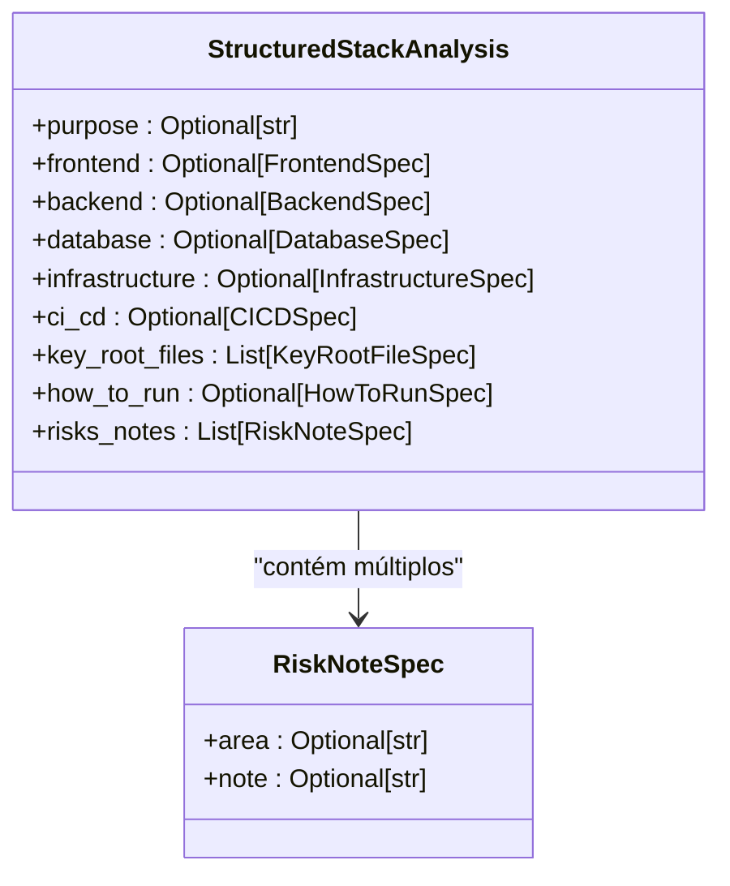
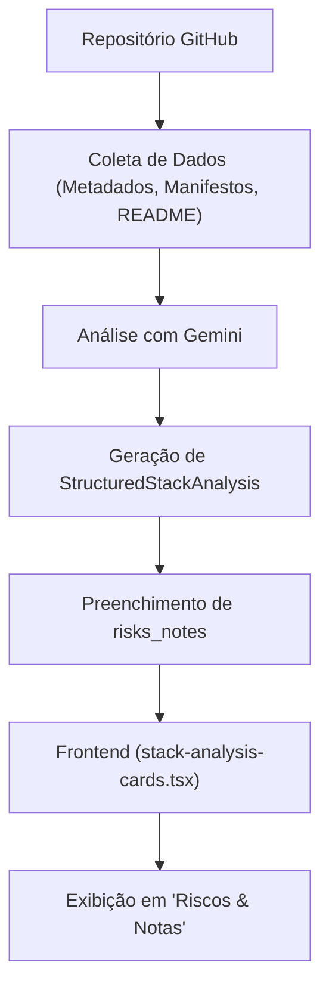

# Campo Risk Notes do Modelo StructuredStackAnalysis

<cite>
**Arquivos Referenciados neste Documento**  
- [agent/stack_agent.py](file://agent/stack_agent.py)
- [components/ui/stack-analysis-cards.tsx](file://components/ui/stack-analysis-cards.tsx)
</cite>

## Sumário

1. [Introdução](#introdução)
2. [Estrutura do Campo `risk_notes`](#estrutura-do-campo-risk_notes)
3. [Geração das Observações de Risco pelo Gemini](#geração-das-observações-de-risco-pelo-gemini)
4. [Exemplos Comuns de Observações de Risco](#exemplos-comuns-de-observações-de-risco)
5. [Valor das Observações para a Análise de Código](#valor-das-observações-para-a-análise-de-código)
6. [Visualização no Frontend](#visualização-no-frontend)

## Introdução

O campo `risk_notes` da classe `StructuredStackAnalysis` desempenha um papel fundamental na análise técnica de repositórios de software realizada pelo agente Open-Gemini. Este campo armazena observações críticas geradas pelo modelo de IA Gemini, destacando potenciais riscos técnicos identificados durante a análise do código, estrutura, dependências e práticas de desenvolvimento do repositório. Essas observações são essenciais para fornecer ao usuário uma visão clara sobre problemas que podem afetar a manutenibilidade, segurança e escalabilidade do projeto analisado.

**Section sources**
- [agent/stack_agent.py](file://agent/stack_agent.py#L85-L94)

## Estrutura do Campo `risk_notes`

O campo `risk_notes` é definido como uma lista de objetos do tipo `RiskNoteSpec`. Cada objeto `RiskNoteSpec` contém duas propriedades principais:

- **`area`**: Uma string opcional que indica a categoria ou domínio do risco identificado (por exemplo, "Dependências", "Segurança", "CI/CD").
- **`note`**: Uma string opcional que contém a descrição detalhada da observação de risco.

Essa estrutura permite que o agente organize as observações de forma clara e categorizada, facilitando a compreensão do usuário sobre a natureza e o contexto de cada risco.

**Diagram sources**
- [agent/stack_agent.py](file://agent/stack_agent.py#L80-L82)
- [agent/stack_agent.py](file://agent/stack_agent.py#L85-L94)

**Section sources**
- [agent/stack_agent.py](file://agent/stack_agent.py#L80-L82)

## Geração das Observações de Risco pelo Gemini

As observações no campo `risk_notes` são geradas pelo modelo de IA Gemini como parte do processo de análise de pilha (`analyze_with_gemini_node`). O agente coleta informações contextuais do repositório, como metadados do GitHub, linguagens utilizadas, arquivos raiz (como `package.json`, `requirements.txt`, etc.) e o conteúdo do README. Esses dados são então estruturados em um prompt que instrui o Gemini a atuar como um arquiteto de software sênior.

O prompt solicita explicitamente uma análise estruturada do repositório, incluindo a identificação de riscos. O Gemini analisa os padrões comuns de risco com base nesse contexto, como:
- A presença de dependências desatualizadas ou não mantidas.
- A ausência de arquivos de configuração de CI/CD (como `.github/workflows`).
- Práticas de segurança fracas (por exemplo, chaves de API expostas no código).
- Arquitetura monolítica ou falta de documentação clara.
- Baixa cobertura de testes inferida pela ausência de diretórios como `tests/` ou `__tests__`.

O modelo então formata essas observações de acordo com o esquema `StructuredStackAnalysis`, preenchendo a lista `risks_notes` com as descobertas relevantes.

**Section sources**
- [agent/stack_agent.py](file://agent/stack_agent.py#L338-L379)

## Exemplos Comuns de Observações de Risco

Com base na estrutura do sistema e nos padrões de análise, exemplos típicos de observações que podem aparecer no campo `risk_notes` incluem:

- **`area: "Dependências"`**, **`note: "Alta dependência de pacotes não mantidos ou desatualizados, o que pode levar a vulnerabilidades de segurança."`**
- **`area: "CI/CD"`**, **`note: "Falta de pipeline de CI/CD configurado, aumentando o risco de erros em produção e dificultando integrações contínuas."`**
- **`area: "Segurança"`**, **`note: "Possível exposição de credenciais sensíveis no código-fonte ou em arquivos de configuração."`**
- **`area: "Testes"`**, **`note: "Ausência de uma suíte de testes automatizados, comprometendo a confiabilidade e a manutenibilidade do código."`**
- **`area: "Documentação"`**, **`note: "Documentação insuficiente para configuração e execução do projeto, dificultando a adoção por novos desenvolvedores."`**

Essas observações são derivadas da análise heurística dos arquivos do repositório e da compreensão do Gemini sobre boas práticas de engenharia de software.

**Section sources**
- [components/ui/stack-analysis-cards.tsx](file://components/ui/stack-analysis-cards.tsx#L239-L258)

## Valor das Observações para a Análise de Código

As observações de risco agregam um valor significativo à análise, transformando-a de uma simples descrição da pilha tecnológica para uma avaliação crítica da saúde do projeto. Elas ajudam o usuário a:

1. **Tomar decisões informadas**: Ao identificar riscos proativamente, o usuário pode priorizar ações de mitigação, como atualizar dependências, implementar CI/CD ou reforçar a segurança.
2. **Avaliar a qualidade do código**: As observações fornecem um indicador rápido da qualidade geral do repositório, indo além da funcionalidade para considerar aspectos de sustentabilidade.
3. **Acelerar a onboarding**: Para novos desenvolvedores, as `risk_notes` servem como um guia de problemas conhecidos que precisam ser abordados.
4. **Apoiar decisões de adoção**: Ao avaliar um projeto de código aberto, essas observações ajudam a determinar se o projeto é seguro e sustentável o suficiente para ser utilizado em produção.

Em resumo, o campo `risk_notes` atua como um sistema de alerta precoce, destacando áreas que exigem atenção e promovendo melhores práticas de desenvolvimento.

## Visualização no Frontend

No frontend da aplicação, as observações de risco são exibidas de forma clara e organizada. O componente `StackAnalysisCards` renderiza uma seção intitulada "Riscos & Notas" (com o ícone de escudo), que lista cada observação com sua respectiva `area` em negrito e a `note` descritiva em um texto menor. O uso de uma área de rolagem permite que várias observações sejam exibidas sem sobrecarregar a interface.

**Diagram sources**
- [components/ui/stack-analysis-cards.tsx](file://components/ui/stack-analysis-cards.tsx#L239-L258)

**Section sources**
- [components/ui/stack-analysis-cards.tsx](file://components/ui/stack-analysis-cards.tsx#L0-L48)