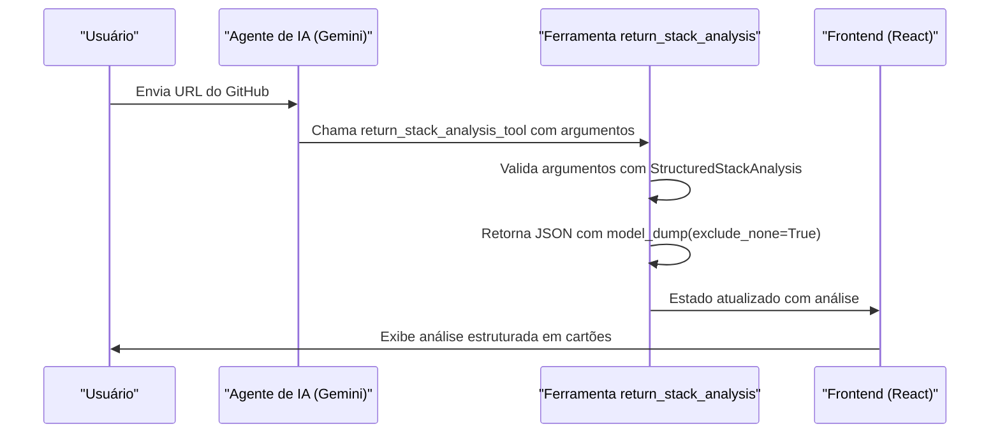

# Estrutura do Modelo StructuredStackAnalysis

<cite>
**Arquivos Referenciados neste Documento**   
- [stack_agent.py](file://agent/stack_agent.py)
- [stack-analysis-cards.tsx](file://components/ui/stack-analysis-cards.tsx)
- [page.tsx](file://app/stack-analyzer/page.tsx)
</cite>

## Sumário
1. [Introdução](#introdução)
2. [Papel Central da Classe StructuredStackAnalysis](#papel-central-da-classe-structuredstackanalysis)
3. [Campos Principais do Modelo](#campos-principais-do-modelo)
4. [Uso como Ferramenta de Retorno](#uso-como-ferramenta-de-retorno)
5. [Exemplo Prático de Preenchimento do Modelo](#exemplo-prático-de-preenchimento-do-modelo)
6. [Importância do model_dump(exclude_none=True)](#importância-do-model_dumplexclude_none=true)
7. [Fluxo Completo de Análise](#fluxo-completo-de-análise)

## Introdução
A classe Pydantic `StructuredStackAnalysis`, definida no arquivo `stack_agent.py`, desempenha um papel fundamental na modelagem da análise de stacks tecnológicos de repositórios GitHub dentro da aplicação Open Gemini Canvas. Este modelo serve como um esquema rígido e padronizado para estruturar a saída gerada por um agente de IA, garantindo que as informações sobre a arquitetura de software sejam consistentes, ricas em contexto e facilmente consumíveis tanto pelo frontend quanto por outros componentes do sistema. A documentação a seguir detalha a estrutura, os campos, o mecanismo de validação e o fluxo de dados que envolve este modelo central.

## Papel Central da Classe StructuredStackAnalysis
A classe `StructuredStackAnalysis` é o núcleo da análise estruturada realizada pelo agente de stack. Ela é definida como uma subclasse de `BaseModel` do Pydantic, o que lhe confere poderosas capacidades de validação de dados, tipagem e serialização. O seu papel principal é atuar como um contrato de dados que define exatamente como a análise de um repositório GitHub deve ser representada. Ao forçar o agente de IA (neste caso, o Gemini) a preencher este modelo, o sistema garante que a saída seja sempre previsível, completa e livre de erros de formatação. Isso é crucial para uma integração robusta com o frontend, que depende de uma estrutura de dados fixa para renderizar as informações de forma consistente.

**Seção fontes**
- [stack_agent.py](file://agent/stack_agent.py#L85-L94)

## Campos Principais do Modelo
O modelo `StructuredStackAnalysis` é composto por vários campos, cada um representando uma faceta diferente da arquitetura de um projeto de software. Esses campos são tipados como `Optional` ou listas, permitindo flexibilidade na análise enquanto mantém a estrutura.

- **`purpose`**: Um campo de texto opcional que descreve a finalidade geral do repositório, fornecendo um contexto de alto nível sobre o que o projeto faz.
- **`frontend`**: Um campo opcional do tipo `FrontendSpec`, que encapsula detalhes sobre a camada de interface do usuário. Inclui subcampos como `framework` (por exemplo, React, Vue), `language` (por exemplo, JavaScript, TypeScript), `package_manager` (por exemplo, npm, yarn) e `key_libraries`.
- **`backend`**: Um campo opcional do tipo `BackendSpec`, que descreve a camada de servidor. Inclui `framework` (por exemplo, Express, Django), `language` (por exemplo, Python, Node.js), `dependency_manager` e `architecture`.
- **`database`**: Um campo opcional do tipo `DatabaseSpec`, que especifica o tipo de banco de dados (por exemplo, PostgreSQL, MongoDB) e quaisquer notas adicionais sobre sua configuração.
- **`infrastructure`**: Um campo opcional do tipo `InfrastructureSpec`, que detalha onde o frontend e o backend são hospedados (por exemplo, Vercel, AWS) e quaisquer dependências de infraestrutura.
- **`ci_cd`**: Um campo opcional do tipo `CICDSpec`, que descreve a configuração do pipeline de integração e entrega contínua (por exemplo, GitHub Actions, CircleCI).
- **`key_root_files`**: Uma lista de objetos do tipo `KeyRootFileSpec`, cada um contendo o nome de um arquivo importante no diretório raiz (por exemplo, `Dockerfile`, `package.json`) e uma descrição de sua função.
- **`how_to_run`**: Um campo opcional do tipo `HowToRunSpec`, que fornece um resumo e uma lista de passos para configurar e executar o projeto localmente.
- **`risks_notes`**: Uma lista de objetos do tipo `RiskNoteSpec`, cada um com uma área de risco (por exemplo, "Segurança", "Manutenção") e uma nota explicativa, permitindo que o agente destaque potenciais problemas.

**Seção fontes**
- [stack_agent.py](file://agent/stack_agent.py#L39-L82)

## Uso como Ferramenta de Retorno
O modelo `StructuredStackAnalysis` é diretamente integrado ao sistema de agentes por meio da função decorada `@tool` chamada `return_stack_analysis_tool`. Esta função é registrada como uma ferramenta que o modelo de linguagem pode chamar. As instruções do sistema são explicitamente configuradas para dizer ao agente: "Sempre chame a ferramenta `return_stack_analysis` com todos os campos aplicáveis preenchidos". Isso força o Gemini a gerar sua resposta não como um texto livre, mas como uma chamada de função com argumentos que correspondem ao esquema do `StructuredStackAnalysis`. O sistema tenta primeiro obter a resposta por meio dessa chamada de ferramenta; se falhar, usa um mecanismo de fallback com `with_structured_output` para coerção direta do modelo. Esse mecanismo duplo garante uma conformidade rigorosa com o esquema esperado.



**Fontes do diagrama**
- [stack_agent.py](file://agent/stack_agent.py#L100-L106)
- [stack_agent.py](file://agent/stack_agent.py#L377-L436)

**Seção fontes**
- [stack_agent.py](file://agent/stack_agent.py#L100-L106)

## Exemplo Prático de Preenchimento do Modelo
O preenchimento do modelo `StructuredStackAnalysis` é um processo automatizado que começa com a coleta de contexto. O agente extrai a URL do GitHub da mensagem do usuário e, em seguida, usa a API do GitHub para buscar metadados do repositório, linguagens utilizadas, conteúdo do README, arquivos no diretório raiz e manifestos de dependência (como `package.json`). Essas informações brutas são então concatenadas em um prompt detalhado que é enviado ao Gemini. O prompt instrui o agente a inferir o stack tecnológico com base nesses dados. Por exemplo, a presença de `package.json` com dependências de `react` e `next` leva o agente a preencher o campo `frontend` com `framework="Next.js"`. O agente então chama a ferramenta `return_stack_analysis` com todos esses campos inferidos, que são validados e estruturados pelo modelo Pydantic antes de serem armazenados no estado do agente.

**Seção fontes**
- [stack_agent.py](file://agent/stack_agent.py#L262-L265)
- [stack_agent.py](file://agent/stack_agent.py#L338-L379)

## Importância do model_dump(exclude_none=True)
O método `model_dump(exclude_none=True)` é uma parte crítica do processo de serialização. Quando o modelo `StructuredStackAnalysis` é validado com os argumentos da chamada de ferramenta, ele pode conter campos `None` para seções que não foram inferidas (por exemplo, um projeto sem uma seção de CI/CD clara). Se esses campos `None` fossem serializados em JSON, eles apareceriam como `null` no payload enviado ao frontend. Isso poderia causar problemas de renderização, como cartões vazios ou erros no código React. Ao usar `exclude_none=True`, o Pydantic remove completamente quaisquer campos que tenham valor `None` do dicionário resultante antes da serialização. Isso garante que a resposta final seja um JSON limpo e conciso, contendo apenas os campos que foram realmente preenchidos, o que simplifica significativamente o consumo no frontend e melhora a experiência do usuário.

**Seção fontes**
- [stack_agent.py](file://agent/stack_agent.py#L104)
- [stack_agent.py](file://agent/stack_agent.py#L420)

## Fluxo Completo de Análise
O fluxo completo começa quando o usuário fornece uma URL do GitHub. O nó `gather_context_node` coleta todos os dados do repositório. Em seguida, o nó `analyze_with_gemini_node` constrói o prompt e envia para o Gemini, que responde chamando a ferramenta `return_stack_analysis_tool`. Os argumentos da chamada são validados contra o modelo `StructuredStackAnalysis`, e o resultado limpo (com `model_dump(exclude_none=True)`) é armazenado como uma string JSON no estado do agente, especificamente em `state['analysis']`. O frontend, representado pelo componente `StackAnalysisCards`, escuta mudanças nesse estado. Quando `state['show_cards']` é definido como `True` e `state['analysis']` contém dados, o componente `StackAnalysisCards` recebe a string JSON, faz o parse dela e a renderiza em uma interface de usuário rica e organizada em cartões, exibindo cada seção da análise (frontend, backend, etc.) de forma clara e visualmente atraente.

```mermaid
graph TD
A[Usuário fornece URL do GitHub] --> B[Coletar contexto do repositório]
B --> C[Construir prompt para o Gemini]
C --> D[Gemini chama return_stack_analysis_tool]
D --> E[Validar com StructuredStackAnalysis]
E --> F[Serializar com model_dump(exclude_none=True)]
F --> G[Armazenar JSON no estado do agente]
G --> H[Frontend (StackAnalysisCards) renderiza os dados]
```

**Fontes do diagrama**
- [stack_agent.py](file://agent/stack_agent.py#L409-L436)
- [stack-analysis-cards.tsx](file://components/ui/stack-analysis-cards.tsx#L107-L153)
- [page.tsx](file://app/stack-analyzer/page.tsx#L61-L110)

**Seção fontes**
- [stack_agent.py](file://agent/stack_agent.py#L489-L504)
- [stack-analysis-cards.tsx](file://components/ui/stack-analysis-cards.tsx)
- [page.tsx](file://app/stack-analyzer/page.tsx)