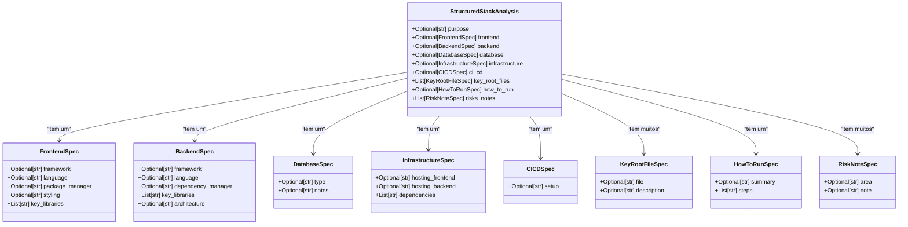
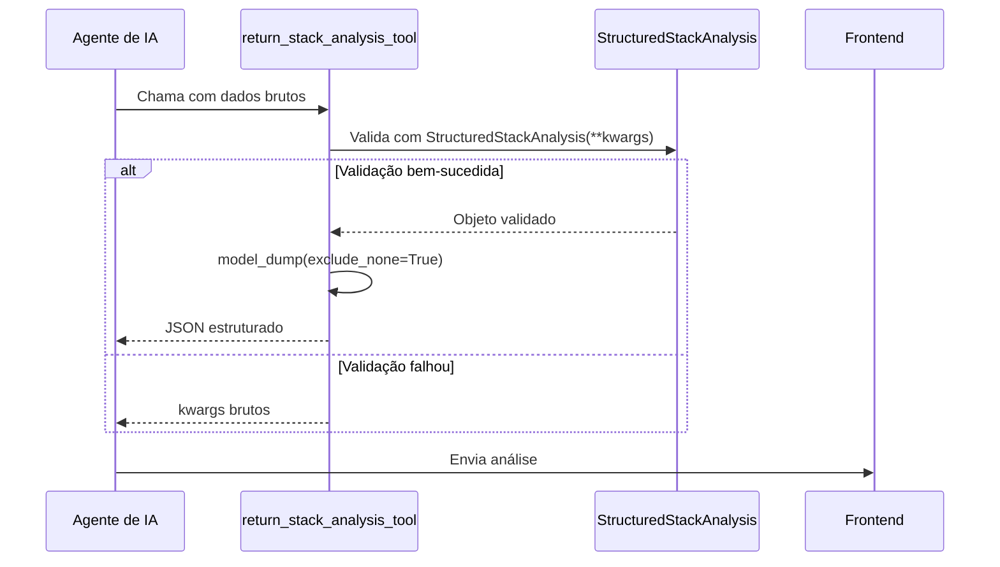

# Modelos de Dados no Backend

<cite>
**Arquivos Referenciados neste Documento**   
- [stack_agent.py](file://agent/stack_agent.py)
- [stack-analysis-cards.tsx](file://components/ui/stack-analysis-cards.tsx)
- [page.tsx](file://app/stack-analyzer/page.tsx)
</cite>

## Sumário
1. [Introdução](#introdução)
2. [Estrutura dos Esquemas Pydantic](#estrutura-dos-esquemas-pydantic)
3. [Detalhamento das Classes Aninhadas](#detalhamento-das-classes-aninhadas)
4. [Validação e Serialização de Dados](#validação-e-serialização-de-dados)
5. [Processo de Coleta e Enriquecimento de Dados](#processo-de-coleta-e-enriquecimento-de-dados)
6. [Exemplo de Instanciação](#exemplo-de-instanciação)
7. [Implicações de Alterações no Esquema](#implicações-de-alterações-no-esquema)
8. [Conclusão](#conclusão)

## Introdução

Este documento detalha a estrutura de modelos de dados utilizada no backend do sistema para realizar a análise de stacks tecnológicos de repositórios GitHub. O foco principal está na classe `StructuredStackAnalysis` e suas classes aninhadas, definidas no arquivo `stack_agent.py`. Esses modelos são implementados utilizando Pydantic, uma biblioteca Python que facilita a validação de dados, análise de tipos e serialização. O sistema coleta dados brutos de um repositório GitHub, estrutura-os de acordo com esses esquemas e os utiliza para gerar uma análise detalhada que é consumida pela interface do frontend.

**Section sources**
- [stack_agent.py](file://agent/stack_agent.py#L85-L94)

## Estrutura dos Esquemas Pydantic

A análise de stack é modelada como uma hierarquia de classes Pydantic, com a classe `StructuredStackAnalysis` atuando como o contêiner principal. Esta classe define um esquema JSON estruturado com campos opcionais que representam diferentes aspectos de um projeto de software.



**Diagram sources**
- [stack_agent.py](file://agent/stack_agent.py#L85-L94)
- [stack_agent.py](file://agent/stack_agent.py#L39-L82)

**Section sources**
- [stack_agent.py](file://agent/stack_agent.py#L85-L94)

## Detalhamento das Classes Aninhadas

Cada classe aninhada dentro de `StructuredStackAnalysis` é responsável por modelar uma parte específica da arquitetura de um repositório.

### FrontendSpec

A classe `FrontendSpec` captura as tecnologias e configurações relacionadas à camada de apresentação do aplicativo. Os campos `framework`, `language`, `package_manager` e `styling` são opcionais, permitindo que o modelo represente projetos com diferentes níveis de complexidade. O campo `key_libraries` é uma lista que armazena bibliotecas importantes como React, Vue ou Tailwind CSS.

**Section sources**
- [stack_agent.py](file://agent/stack_agent.py#L39-L44)

### BackendSpec

A classe `BackendSpec` descreve a camada de lógica de negócios. Ela inclui campos para o `framework` (por exemplo, Express, Django), a `language` de programação (por exemplo, Python, Node.js), o `dependency_manager` (por exemplo, pip, npm) e a `architecture` (por exemplo, MVC, microservices). A lista `key_libraries` armazena bibliotecas de backend como Prisma ou Flask.

**Section sources**
- [stack_agent.py](file://agent/stack_agent.py#L47-L52)

### DatabaseSpec

A classe `DatabaseSpec` é simples, contendo apenas o `type` do banco de dados (por exemplo, PostgreSQL, MongoDB) e um campo `notes` para observações adicionais sobre a configuração do banco de dados.

**Section sources**
- [stack_agent.py](file://agent/stack_agent.py#L55-L57)

### InfrastructureSpec

A classe `InfrastructureSpec` modela onde o frontend e o backend são hospedados (por exemplo, Vercel, AWS). A lista `dependencies` pode conter serviços de infraestrutura como Docker, Kubernetes ou Terraform.

**Section sources**
- [stack_agent.py](file://agent/stack_agent.py#L60-L63)

### CICDSpec

A classe `CICDSpec` contém um campo `setup` que descreve o pipeline de integração e entrega contínua, como GitHub Actions ou Jenkins.

**Section sources**
- [stack_agent.py](file://agent/stack_agent.py#L66-L67)

### KeyRootFileSpec

A classe `KeyRootFileSpec` representa arquivos importantes no diretório raiz do repositório, como `package.json` ou `Dockerfile`. O campo `file` armazena o nome do arquivo e o campo `description` fornece um resumo do seu conteúdo.

**Section sources**
- [stack_agent.py](file://agent/stack_agent.py#L70-L72)

### HowToRunSpec

A classe `HowToRunSpec` fornece instruções sobre como executar o projeto. O campo `summary` contém uma descrição geral e a lista `steps` armazena os comandos específicos necessários para configurar e iniciar o aplicativo.

**Section sources**
- [stack_agent.py](file://agent/stack_agent.py#L75-L77)

### RiskNoteSpec

A classe `RiskNoteSpec` é usada para identificar áreas de risco no projeto, como dependências desatualizadas ou falta de testes. O campo `area` especifica a categoria do risco e o campo `note` fornece uma explicação detalhada.

**Section sources**
- [stack_agent.py](file://agent/stack_agent.py#L80-L82)

## Validação e Serialização de Dados

### Uso de `Optional` e `Field(default_factory=list)`

O campo `Optional` é usado para indicar que um campo pode ser `None` ou ausente. Isso é crucial para lidar com repositórios que podem não ter uma camada de frontend ou backend definida. Para campos que são listas, como `key_libraries`, `dependencies`, `key_root_files` e `risks_notes`, o `Field(default_factory=list)` é utilizado. Isso garante que, mesmo que o campo não seja fornecido, ele será inicializado como uma lista vazia, evitando erros de `NoneType` ao tentar iterar sobre a lista.

### Função `return_stack_analysis_tool`

A função `return_stack_analysis_tool` é um componente central do sistema. Ela é decorada com `@tool` e usa `StructuredStackAnalysis` como seu esquema de argumentos. Quando o agente de IA chama esta ferramenta, ela valida os dados de entrada contra o esquema Pydantic. Se a validação falhar, os dados brutos são retornados como um fallback. Caso contrário, os dados validados são serializados.



**Diagram sources**
- [stack_agent.py](file://agent/stack_agent.py#L100-L106)

**Section sources**
- [stack_agent.py](file://agent/stack_agent.py#L100-L106)

### Serialização com `model_dump(exclude_none=True)`

O método `model_dump(exclude_none=True)` é fundamental para a comunicação eficiente com o frontend. Ele converte o objeto Pydantic em um dicionário Python, excluindo todos os campos que têm valor `None`. Isso resulta em um payload JSON mais leve e limpo, pois campos opcionais que não foram inferidos pelo agente de IA não aparecem na resposta. Isso simplifica o consumo dos dados no frontend, onde componentes como `StackAnalysisCards` podem verificar diretamente a presença de uma chave.

**Section sources**
- [stack_agent.py](file://agent/stack_agent.py#L105)

## Processo de Coleta e Enriquecimento de Dados

O processo de análise começa com a coleta de dados brutos de um repositório GitHub. As funções `_fetch_repo_info`, `_fetch_languages`, `_fetch_readme` e `_fetch_manifest_contents` são responsáveis por obter metadados, linguagens de programação, conteúdo do README e arquivos de manifesto, respectivamente. Esses dados são então enriquecidos e estruturados antes de serem passados para o prompt do Gemini.

```mermaid
flowchart TD
A[URL do GitHub] --> B{Parse URL}
B --> C[owner, repo]
C --> D[_fetch_repo_info]
C --> E[_fetch_languages]
C --> F[_fetch_readme]
C --> G[_fetch_manifest_contents]
D --> H[repo_info]
E --> I[linguagens]
F --> J[readme]
G --> K[manifestos]
H --> L[_build_analysis_prompt]
I --> L
J --> L
K --> L
L --> M[Prompt para Gemini]
M --> N[return_stack_analysis_tool]
N --> O[StructuredStackAnalysis]
O --> P[model_dump(exclude_none=True)]
P --> Q[JSON para Frontend]
```

**Diagram sources**
- [stack_agent.py](file://agent/stack_agent.py#L266-L279)
- [stack_agent.py](file://agent/stack_agent.py#L100-L106)

**Section sources**
- [stack_agent.py](file://agent/stack_agent.py#L266-L279)

## Exemplo de Instanciação

Um objeto `StructuredStackAnalysis` pode ser instanciado com dados reais coletados de um repositório. Por exemplo, para um projeto Next.js com um backend Express e um banco de dados PostgreSQL, a instanciação seria:

```python
analysis = StructuredStackAnalysis(
    purpose="Um blog moderno com SSR e API RESTful.",
    frontend=FrontendSpec(
        framework="Next.js",
        language="TypeScript",
        package_manager="npm",
        styling="Tailwind CSS",
        key_libraries=["React", "Axios"]
    ),
    backend=BackendSpec(
        framework="Express",
        language="JavaScript",
        dependency_manager="npm",
        key_libraries=["Express", "Mongoose"],
        architecture="MVC"
    ),
    database=DatabaseSpec(
        type="PostgreSQL",
        notes="Usa Prisma ORM para migrações."
    ),
    infrastructure=InfrastructureSpec(
        hosting_frontend="Vercel",
        hosting_backend="Render",
        dependencies=["Docker"]
    ),
    ci_cd=CICDSpec(
        setup="GitHub Actions para testes e deploy."
    ),
    key_root_files=[
        KeyRootFileSpec(file="package.json", description="Define dependências e scripts."),
        KeyRootFileSpec(file="Dockerfile", description="Configuração para containerização.")
    ],
    how_to_run=HowToRunSpec(
        summary="Instale as dependências e inicie os serviços.",
        steps=[
            "npm install",
            "docker-compose up",
            "npm run dev"
        ]
    ),
    risks_notes=[
        RiskNoteSpec(area="Segurança", note="Dependência 'lodash' desatualizada."),
        RiskNoteSpec(area="Desempenho", note="Falta de cache na API.")
    ]
)
```

**Section sources**
- [stack_agent.py](file://agent/stack_agent.py#L85-L94)

## Implicações de Alterações no Esquema

Alterar o esquema de `StructuredStackAnalysis` tem implicações significativas em todo o sistema. Qualquer novo campo adicionado deve ser refletido no prompt fornecido ao modelo de IA (`_build_analysis_prompt`), caso contrário, o agente não será instruído a preenchê-lo. Da mesma forma, a remoção de um campo torna os dados anteriores incompatíveis. O frontend também deve ser atualizado para lidar com as mudanças, como adicionar novos componentes para exibir o novo campo. A validação automática do Pydantic garante que o backend rejeite dados malformados, mas o prompt e o frontend precisam ser sincronizados manualmente com o esquema.

**Section sources**
- [stack_agent.py](file://agent/stack_agent.py#L266-L279)
- [stack-analysis-cards.tsx](file://components/ui/stack-analysis-cards.tsx#L0-L48)

## Conclusão

Os modelos Pydantic definidos em `stack_agent.py` fornecem uma estrutura robusta e tipada para a análise de stacks tecnológicos. A combinação de validação automática, serialização eficiente e uma hierarquia de classes bem definida permite que o sistema colete dados brutos de um repositório GitHub e os transforme em uma análise estruturada e consumível. A função `return_stack_analysis_tool` atua como um contrato de dados entre o agente de IA e o restante do sistema, garantindo a integridade e a consistência da informação. O entendimento profundo desses modelos é essencial para manter e evoluir a funcionalidade de análise de stack.