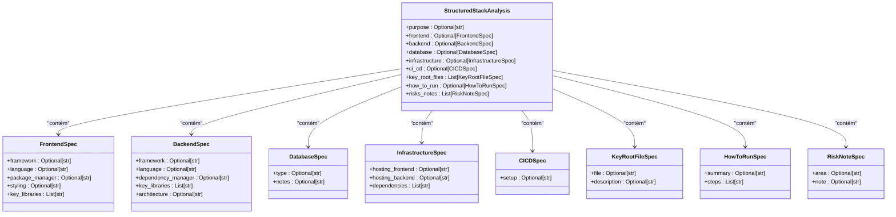
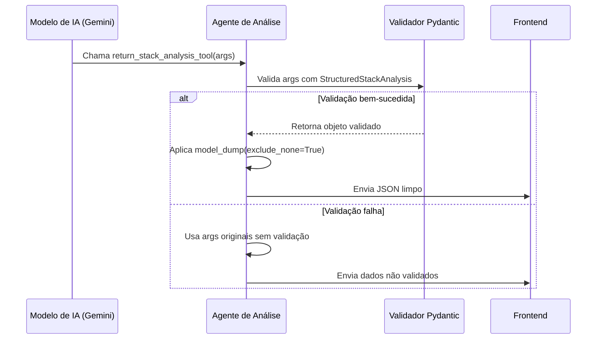
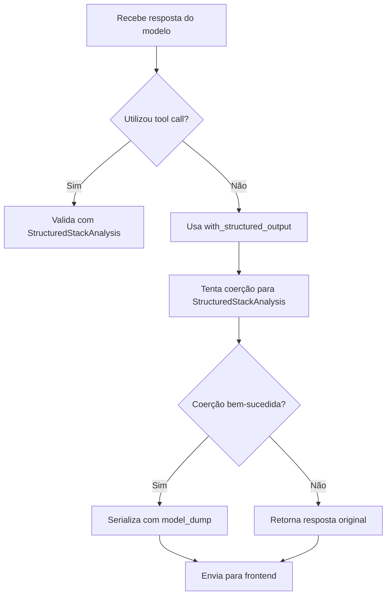
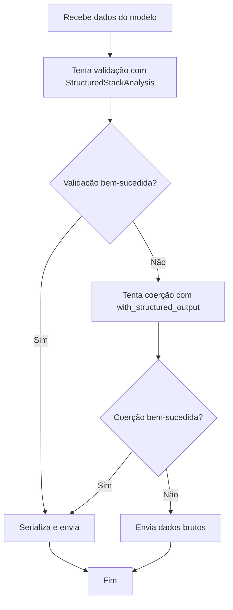
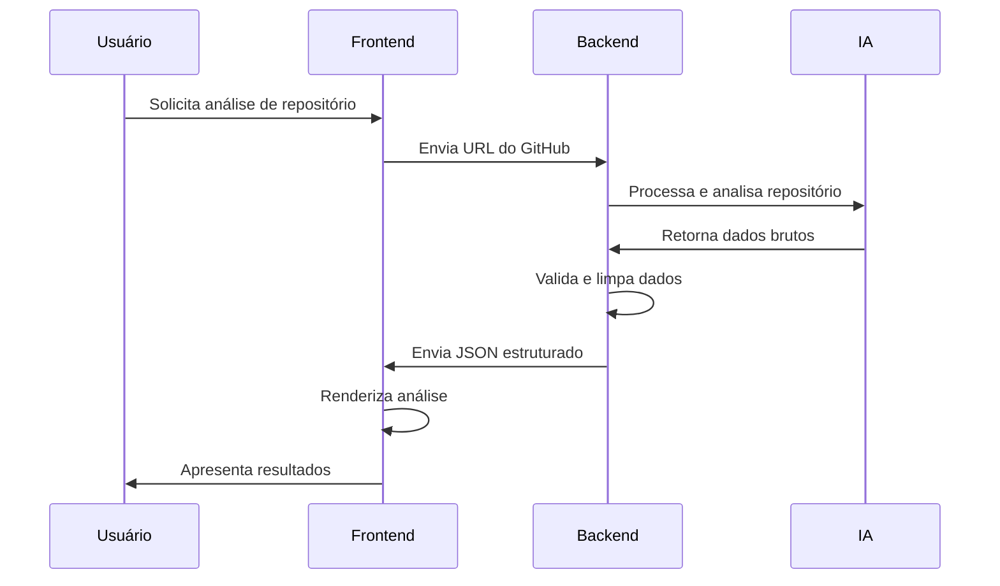

# Validação e Serialização de Dados

<cite>
**Arquivos Referenciados neste Documento**  
- [agent/stack_agent.py](file://agent/stack_agent.py)
- [app/api/copilotkit/route.ts](file://app/api/copilotkit/route.ts)
- [app/api/chat/route.ts](file://app/api/chat/route.ts)
</cite>

## Sumário
1. [Introdução](#introdução)
2. [Esquema de Validação Estruturada](#esquema-de-validação-estruturada)
3. [Processo de Validação Automática com Pydantic](#processo-de-validação-automática-com-pydantic)
4. [Serialização e Limpeza de Dados com model_dump](#serialização-e-limpeza-de-dados-com-model_dump)
5. [Tratamento de Erros de Validação](#tratamento-de-erros-de-validação)
6. [Impacto na Experiência do Usuário](#impacto-na-experiência-do-usuário)
7. [Dicas de Depuração](#dicas-de-depuração)

## Introdução

Este documento detalha o processo de validação e serialização de dados no agente de análise de stack do projeto Open Gemini Canvas. O sistema utiliza o Pydantic para garantir a integridade dos dados entre o modelo de IA (Gemini) e o frontend da aplicação. A arquitetura implementa um esquema rigoroso de validação estruturada que assegura que apenas dados bem formados e coerentes sejam transmitidos para a interface do usuário, otimizando a comunicação e melhorando a experiência do usuário.

## Esquema de Validação Estruturada

O coração do processo de validação é o esquema `StructuredStackAnalysis`, que define a estrutura esperada para a análise de stack de um repositório GitHub. Este esquema atua como uma camada de garantia de integridade de dados, assegurando que todas as respostas do modelo de IA sigam um formato predefinido.



**Fontes do Diagrama**
- [agent/stack_agent.py](file://agent/stack_agent.py#L85-L94)

**Fontes da Seção**
- [agent/stack_agent.py](file://agent/stack_agent.py#L85-L94)

## Processo de Validação Automática com Pydantic

O Pydantic realiza a validação automática dos dados retornados pelo modelo de IA, garantindo que eles estejam em conformidade com o esquema `StructuredStackAnalysis`. Este processo ocorre em dois momentos principais no fluxo do agente.

### Fluxo de Validação com Tool Calls

Quando o modelo de IA utiliza o tool call `return_stack_analysis_tool`, os argumentos fornecidos são automaticamente validados contra o esquema:



**Fontes do Diagrama**
- [agent/stack_agent.py](file://agent/stack_agent.py#L100-L106)
- [agent/stack_agent.py](file://agent/stack_agent.py#L358-L476)

**Fontes da Seção**
- [agent/stack_agent.py](file://agent/stack_agent.py#L100-L106)
- [agent/stack_agent.py](file://agent/stack_agent.py#L358-L476)

### Fallback com with_structured_output

Quando o modelo não utiliza o tool call, o agente implementa um mecanismo de fallback utilizando o método `with_structured_output` do LangChain:



**Fontes do Diagrama**
- [agent/stack_agent.py](file://agent/stack_agent.py#L410-L435)

**Fontes da Seção**
- [agent/stack_agent.py](file://agent/stack_agent.py#L410-L435)

## Serialização e Limpeza de Dados com model_dump

O método `model_dump(exclude_none=True)` desempenha um papel crucial na otimização da comunicação com o frontend, removendo campos nulos da serialização JSON final.

### Importância da Limpeza de Campos Nulos

A exclusão de campos nulos oferece vários benefícios significativos:

1. **Redução do Tamanho da Carga Útil**: Elimina campos vazios que não agregam valor, reduzindo o tamanho da resposta JSON.
2. **Melhoria na Legibilidade**: O JSON resultante é mais limpo e fácil de interpretar.
3. **Otimização de Desempenho**: Menos dados para transmitir e processar, resultando em tempos de resposta mais rápidos.
4. **Consistência na Interface**: O frontend recebe apenas dados relevantes, simplificando a lógica de renderização.

### Implementação no Agente

O método `model_dump(exclude_none=True)` é aplicado em múltiplos pontos do fluxo de análise:

```python
# No tool call principal
def return_stack_analysis_tool(**kwargs) -> Dict[str, Any]:
    try:
        validated = StructuredStackAnalysis(**kwargs)
        return validated.model_dump(exclude_none=True)  # Remove campos nulos
    except Exception:
        return kwargs

# No nó de análise principal
try:
    structured_payload = StructuredStackAnalysis(
        **args
    ).model_dump(exclude_none=True)  # Limpeza após validação
except Exception:
    structured_payload = dict(args)
```

**Fontes da Seção**
- [agent/stack_agent.py](file://agent/stack_agent.py#L104)
- [agent/stack_agent.py](file://agent/stack_agent.py#L420)

## Tratamento de Erros de Validação

O sistema implementa uma estratégia robusta de tratamento de erros para lidar com esquemas malformados ou dados inválidos retornados pelo modelo de IA.

### Estratégia de Tratamento

O agente adota uma abordagem de "falha elegante" que prioriza a continuidade do fluxo mesmo quando a validação falha:

1. **Tentativa de Validação Primária**: Primeiro, tenta validar os dados com o esquema Pydantic.
2. **Fallback para Dados Originais**: Se a validação falhar, utiliza os dados originais sem processamento.
3. **Mecanismo de Fallback Secundário**: Se o método com tool calls falhar, tenta a coerção estruturada.
4. **Último Recurso**: Se todas as tentativas de validação falharem, retorna os dados brutos.

### Impacto na Resiliência do Sistema

Essa abordagem múltipla de validação garante que o sistema permaneça funcional mesmo diante de respostas inconsistentes do modelo de IA, evitando falhas completas do agente.



**Fontes da Seção**
- [agent/stack_agent.py](file://agent/stack_agent.py#L100-L106)
- [agent/stack_agent.py](file://agent/stack_agent.py#L410-L435)

## Impacto na Experiência do Usuário

A camada de validação estruturada tem um impacto direto e positivo na experiência do usuário final.

### Benefícios para o Usuário

1. **Consistência na Apresentação**: Os dados apresentados no frontend são sempre estruturados de forma consistente.
2. **Redução de Erros de Interface**: A validação prévia evita que dados malformados causem erros na renderização.
3. **Respostas Mais Rápidas**: A otimização da serialização reduz o tempo de carregamento dos dados.
4. **Informações Relevantes**: A remoção de campos nulos garante que o usuário veja apenas informações úteis.

### Integração com o Frontend

A comunicação entre o backend e o frontend é otimizada pela validação estruturada:



**Fontes do Diagrama**
- [agent/stack_agent.py](file://agent/stack_agent.py)
- [app/api/copilotkit/route.ts](file://app/api/copilotkit/route.ts)

**Fontes da Seção**
- [agent/stack_agent.py](file://agent/stack_agent.py)
- [app/api/copilotkit/route.ts](file://app/api/copilotkit/route.ts)

## Dicas de Depuração

Quando problemas ocorrem com a estrutura inesperada de dados retornados pelo Gemini, as seguintes estratégias de depuração podem ser aplicadas.

### Problemas Comuns e Soluções

#### 1. Campos Inesperados ou Mal Nomeados

**Sintoma**: O modelo retorna campos que não existem no esquema `StructuredStackAnalysis`.

**Solução**:
- Verifique se o prompt está instruindo corretamente o modelo a usar os campos exatos do esquema.
- Confirme se o esquema Pydantic está atualizado com todos os campos necessários.
- Adicione validação adicional no frontend para campos desconhecidos.

#### 2. Dados Aninhados Malformados

**Sintoma**: Objetos aninhados (como `frontend` ou `backend`) têm estrutura incorreta.

**Solução**:
- Revise as definições das classes aninhadas no esquema Pydantic.
- Adicione exemplos claros no prompt para demonstrar a estrutura esperada.
- Implemente validação recursiva se necessário.

#### 3. Validação Constantemente Falhando

**Sintoma**: O fallback para dados brutos é acionado com frequência.

**Solução**:
- Analise os logs para identificar padrões nos dados que estão falhando na validação.
- Ajuste o esquema Pydantic para ser mais flexível com tipos de dados.
- Considere adicionar transformações de dados antes da validação.

### Ferramentas de Depuração

#### 1. Logs de Validação

Habilite logs detalhados para rastrear quando e por que a validação está falhando:

```python
# Exemplo de log de depuração
try:
    validated = StructuredStackAnalysis(**kwargs)
    logger.debug("Validação bem-sucedida")
except Exception as e:
    logger.error(f"Validação falhou: {e}")
    logger.debug(f"Dados recebidos: {kwargs}")
```

#### 2. Testes de Integração

Crie testes que simulem respostas do modelo com diferentes níveis de conformidade:

```python
# Teste com dados válidos
def test_valid_response():
    valid_data = {"purpose": "Test app", "frontend": {"framework": "React"}}
    result = return_stack_analysis_tool(**valid_data)
    assert "purpose" in result
    assert "frontend" in result

# Teste com dados inválidos
def test_invalid_response():
    invalid_data = {"invalid_field": "value"}
    result = return_stack_analysis_tool(**invalid_data)
    assert result == invalid_data  # Fallback para dados originais
```

**Fontes da Seção**
- [agent/stack_agent.py](file://agent/stack_agent.py)
- [app/api/chat/route.ts](file://app/api/chat/route.ts)