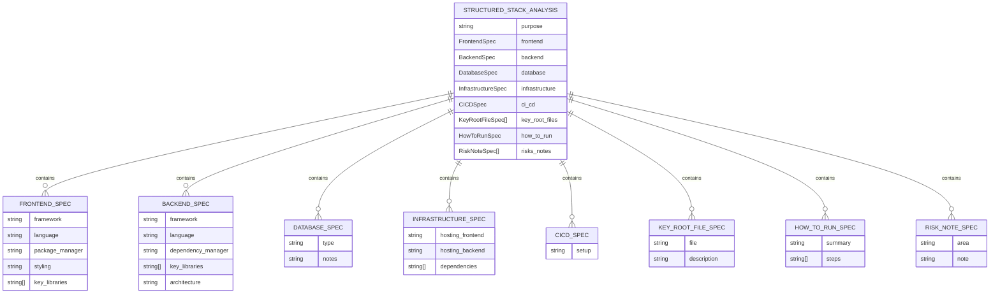

# Modelos de Dados

<cite>
**Arquivos Referenciados neste Documento**  
- [components/ui/stack-analysis-cards.tsx](file://components/ui/stack-analysis-cards.tsx)
- [agent/stack_agent.py](file://agent/stack_agent.py)
- [app/stack-analyzer/page.tsx](file://app/stack-analyzer/page.tsx)
- [agent/main.py](file://agent/main.py)
</cite>

## Sumário
1. [Introdução](#introdução)
2. [Estrutura dos Modelos de Dados](#estrutura-dos-modelos-de-dados)
3. [Modelo Frontend: StackAnalysis](#modelo-frontend-stackanalysis)
4. [Modelo Backend: StructuredStackAnalysis](#modelo-backend-structuredstackanalysis)
5. [Serialização e Consistência de Dados](#serialização-e-consistência-de-dados)
6. [Diagrama de Entidade-Relacionamento](#diagrama-de-entidade-relacionamento)
7. [Regras de Validação](#regras-de-validação)
8. [Influência dos Prompts na Estrutura de Dados](#influência-dos-prompts-na-estrutura-de-dados)
9. [Mapeamento entre Modelos Frontend e Backend](#mapeamento-entre-modelos-frontend-e-backend)
10. [Estratégias para Adicionar Novos Campos ou Tipos](#estratégias-para-adicionar-novos-campos-ou-tipos)
11. [Conclusão](#conclusão)

## Introdução

Este documento apresenta uma análise detalhada dos modelos de dados utilizados no projeto Open Gemini Canvas, com foco na integração entre os componentes frontend e backend. O sistema é projetado para analisar repositórios GitHub, extrair informações sobre a pilha tecnológica e apresentar insights estruturados ao usuário. A arquitetura utiliza uma abordagem de agentes com IA generativa (Gemini) e segue um fluxo bem definido entre a interface do usuário, o backend Python e os serviços de IA.

Os modelos de dados são fundamentais para garantir a consistência e integridade das informações ao longo de todo o pipeline, desde a coleta de dados no backend até a renderização no frontend. Este documento explora tanto os modelos TypeScript no frontend quanto os esquemas Pydantic no backend, detalhando sua estrutura, validação, serialização e mapeamento mútuo.

**Section sources**
- [components/ui/stack-analysis-cards.tsx](file://components/ui/stack-analysis-cards.tsx#L1-L50)
- [agent/stack_agent.py](file://agent/stack_agent.py#L1-L50)

## Estrutura dos Modelos de Dados

A arquitetura de dados do sistema é baseada em dois modelos principais que representam a mesma entidade de análise de stack, mas em diferentes camadas da aplicação. O modelo `StructuredStackAnalysis` no backend Python define a estrutura de dados estruturada que o agente de IA deve produzir, enquanto o modelo `StackAnalysis` no frontend TypeScript define como esses dados são consumidos e renderizados na interface do usuário.

O fluxo de dados começa com o usuário fornecendo uma URL de repositório GitHub. O backend coleta metadados do repositório, constrói um prompt contextualizado e envia para o modelo Gemini. A resposta é validada contra o esquema `StructuredStackAnalysis` e serializada para JSON. Este JSON é então transmitido para o frontend, onde é interpretado pelo componente `StackAnalysisCards` que espera um objeto compatível com a interface `StackAnalysis`.

A estrutura dos modelos é hierárquica, com seções principais como propósito, frontend, backend, banco de dados, infraestrutura, CI/CD, arquivos principais, instruções de execução e riscos/notas. Cada seção contém campos específicos que capturam informações relevantes sobre aquela parte da pilha tecnológica.

**Section sources**
- [agent/stack_agent.py](file://agent/stack_agent.py#L39-L94)
- [components/ui/stack-analysis-cards.tsx](file://components/ui/stack-analysis-cards.tsx#L31-L42)

## Modelo Frontend: StackAnalysis

O modelo frontend é definido pela interface TypeScript `StackAnalysis`, localizada em `components/ui/stack-analysis-cards.tsx`. Esta interface representa a estrutura de dados esperada pelo componente de UI responsável por exibir os resultados da análise de stack.

A interface `StackAnalysis` é composta por campos opcionais que refletem as diferentes dimensões da análise:

- `purpose`: Descrição do propósito do repositório
- `frontend`: Objeto contendo detalhes sobre a tecnologia frontend
- `backend`: Objeto contendo detalhes sobre a tecnologia backend
- `database`: Objeto com informações sobre o banco de dados
- `infrastructure`: Detalhes sobre hospedagem e dependências
- `ci_cd`: Informações sobre o pipeline de integração contínua
- `key_root_files`: Lista de arquivos importantes no diretório raiz
- `how_to_run`: Instruções para executar o projeto
- `risks_notes`: Notas sobre riscos e observações

Cada campo é opcional (indicado pelo `?`), permitindo flexibilidade na apresentação dos dados, já que nem todos os repositórios terão informações completas para todas as categorias. A interface também inclui um index signature `[key: string]: unknown` que permite campos adicionais não especificados, proporcionando extensibilidade futura.

**Section sources**
- [components/ui/stack-analysis-cards.tsx](file://components/ui/stack-analysis-cards.tsx#L31-L42)

## Modelo Backend: StructuredStackAnalysis

O modelo backend é definido pela classe Pydantic `StructuredStackAnalysis` no arquivo `agent/stack_agent.py`. Este esquema serve como contrato de dados para a saída estruturada do agente de IA, garantindo que a resposta do modelo Gemini siga uma estrutura predefinida e validada.

A classe `StructuredStackAnalysis` herda de `BaseModel` do Pydantic e utiliza anotações de tipo para definir seus campos com validação embutida:

- `purpose`: Campo opcional do tipo string
- `frontend`: Referência opcional para `FrontendSpec`
- `backend`: Referência opcional para `BackendSpec`
- `database`: Referência opcional para `DatabaseSpec`
- `infrastructure`: Referência opcional para `InfrastructureSpec`
- `ci_cd`: Referência opcional para `CICDSpec`
- `key_root_files`: Lista de objetos `KeyRootFileSpec` com valor padrão vazio
- `how_to_run`: Referência opcional para `HowToRunSpec`
- `risks_notes`: Lista de objetos `RiskNoteSpec` com valor padrão vazio

Cada especificação aninhada (`FrontendSpec`, `BackendSpec`, etc.) é definida como uma classe Pydantic separada, permitindo uma estrutura de dados profundamente hierárquica com validação em todos os níveis. O uso de `Optional[]` e `Field(default_factory=list)` garante que campos ausentes sejam tratados corretamente e que listas vazias sejam representadas de forma consistente.

**Section sources**
- [agent/stack_agent.py](file://agent/stack_agent.py#L85-L94)

## Serialização e Consistência de Dados

A serialização de dados entre as camadas frontend e backend é um aspecto crítico do sistema, garantindo que as informações extraídas pelo agente de IA sejam transmitidas de forma confiável para a interface do usuário.

O processo começa no backend com o uso do método `model_dump(exclude_none=True)` da classe `StructuredStackAnalysis`. Este método converte o objeto Pydantic em um dicionário Python, excluindo campos com valor `None`, resultando em um JSON mais limpo e eficiente. Esse JSON é então serializado e enviado como parte da resposta do agente.

No frontend, o componente `StackAnalysisCards` aceita tanto um objeto `StackAnalysis` quanto uma string JSON. Quando recebe uma string JSON, ele tenta fazer o parse com `JSON.parse()` e converter para o tipo `StackAnalysis`. Este mecanismo de aceitação dual permite flexibilidade na integração, aceitando tanto dados estruturados diretamente quanto dados serializados.

A consistência é mantida através da correspondência de nomes de campos entre os modelos frontend e backend. Por exemplo, o campo `infrastructure` no backend é mapeado diretamente para o campo `infrastructure` no frontend, com a mesma estrutura aninhada de `hosting_frontend`, `hosting_backend` e `dependencies`.

**Section sources**
- [agent/stack_agent.py](file://agent/stack_agent.py#L320-L325)
- [components/ui/stack-analysis-cards.tsx](file://components/ui/stack-analysis-cards.tsx#L118-L130)

## Diagrama de Entidade-Relacionamento



**Diagram sources**
- [agent/stack_agent.py](file://agent/stack_agent.py#L39-L94)

## Regras de Validação

O sistema implementa regras de validação em ambas as camadas, com ênfase particular no backend onde a integridade dos dados é crítica.

No backend, o Pydantic fornece validação automática baseada nas anotações de tipo e configurações de campo:

- Todos os campos são opcionais por padrão, usando `Optional[]` ou valores padrão `None`
- Listas usam `Field(default_factory=list)` para garantir que listas vazias sejam representadas como arrays vazios em vez de `null`
- A validação ocorre durante a criação do objeto com `StructuredStackAnalysis(**kwargs)`, lançando exceções para dados inválidos
- O método `model_dump(exclude_none=True)` remove campos nulos da saída JSON, mantendo a serialização limpa

No frontend, a validação é mais flexível, refletindo a natureza dinâmica da interface:

- A interface `StackAnalysis` usa campos opcionais com `?`, permitindo qualquer combinação de campos presentes ou ausentes
- O componente `StackAnalysisCards` inclui verificações de tipo com `isNonEmptyArray()` para garantir que listas sejam arrays válidos antes de renderização
- A função `humanize()` converte nomes de campos de snake_case para formato legível, melhorando a experiência do usuário
- O uso de `try/catch` ao fazer parse de JSON garante que entradas inválidas não quebrem a interface, resultando apenas na ausência de dados

**Section sources**
- [agent/stack_agent.py](file://agent/stack_agent.py#L315-L325)
- [components/ui/stack-analysis-cards.tsx](file://components/ui/stack-analysis-cards.tsx#L120-L130)

## Influência dos Prompts na Estrutura de Dados

Os prompts desempenham um papel fundamental na determinação da estrutura dos dados retornados pelo modelo de IA. O prompt de análise no backend é cuidadosamente construído para direcionar a saída do modelo Gemini para o formato esperado pelo esquema `StructuredStackAnalysis`.

O prompt inclui instruções explícitas sobre o formato de saída: "Return JSON with keys: purpose, frontend, backend, database, infrastructure, ci_cd, key_root_files, how_to_run, risks_notes." Esta direção clara orienta o modelo a produzir uma resposta estruturada com os campos exatos esperados pelo sistema.

Além disso, o prompt fornece contexto rico sobre o repositório, incluindo metadados, linguagens usadas, arquivos raiz, manifestos e conteúdo do README. Este contexto permite que o modelo faça inferências informadas sobre a pilha tecnológica, resultando em uma análise mais precisa.

A estrutura do prompt também inclui exemplos implícitos de valores esperados, como "Next.js, Express, FastAPI, Prisma, Postgres", guiando o modelo a fornecer nomes específicos de frameworks e bibliotecas em vez de categorias genéricas.

**Section sources**
- [agent/stack_agent.py](file://agent/stack_agent.py#L230-L245)

## Mapeamento entre Modelos Frontend e Backend

O mapeamento entre os modelos frontend e backend é direto e baseado em convenção de nomenclatura, facilitando a integração entre as camadas.

A correspondência de campos é quase idêntica entre `StructuredStackAnalysis` (backend) e `StackAnalysis` (frontend):

- `purpose` → `purpose`
- `frontend` → `frontend` (com campos aninhados correspondentes)
- `backend` → `backend` (com campos aninhados correspondentes)
- `database` → `database`
- `infrastructure` → `infrastructure`
- `ci_cd` → `ci_cd`
- `key_root_files` → `key_root_files`
- `how_to_run` → `how_to_run`
- `risks_notes` → `risks_notes`

As principais diferenças estão na representação de listas e campos opcionais. No backend, listas vazias são representadas como listas vazias devido ao `default_factory=list`, enquanto no frontend, campos ausentes são simplesmente omitidos. O componente frontend é projetado para lidar com ambas as representações, verificando a presença de campos antes da renderização.

Mudanças em um lado afetam diretamente o outro. Adicionar um novo campo ao modelo backend requer a atualização correspondente no modelo frontend para que o campo seja renderizado corretamente. Da mesma forma, mudanças no frontend que exigem novos dados devem ser refletidas no prompt e no esquema do backend.

**Section sources**
- [agent/stack_agent.py](file://agent/stack_agent.py#L85-L94)
- [components/ui/stack-analysis-cards.tsx](file://components/ui/stack-analysis-cards.tsx#L31-L42)

## Estratégias para Adicionar Novos Campos ou Tipos

Para adicionar novos campos ou tipos ao sistema, deve-se seguir uma abordagem coordenada entre frontend e backend:

1. **Definir o novo campo no backend**: Adicione o novo campo à classe `StructuredStackAnalysis` ou a uma de suas classes aninhadas, especificando o tipo e se é opcional. Por exemplo, para adicionar um campo `security`:
```python
class SecuritySpec(BaseModel):
    vulnerabilities: Optional[List[str]] = None
    audit_date: Optional[str] = None

class StructuredStackAnalysis(BaseModel):
    # ... campos existentes
    security: Optional[SecuritySpec] = None
```

2. **Atualizar o prompt de análise**: Modifique a função `_build_analysis_prompt` para incluir instruções sobre o novo campo, explicando o que deve ser analisado e como deve ser formatado.

3. **Atualizar o modelo frontend**: Adicione o novo campo à interface `StackAnalysis` no frontend:
```typescript
export interface StackAnalysis {
  // ... campos existentes
  security?: { vulnerabilities?: string[]; audit_date?: string }
}
```

4. **Atualizar os componentes de UI**: Modifique o componente `StackAnalysisCards` para renderizar o novo campo, adicionando um novo `SectionCard` se necessário.

5. **Testar a integração**: Verifique se o novo campo é corretamente extraído pelo agente, serializado, transmitido e renderizado na interface.

Esta abordagem garante que as mudanças sejam consistentes em todo o pipeline de dados, mantendo a integridade do sistema.

**Section sources**
- [agent/stack_agent.py](file://agent/stack_agent.py#L85-L94)
- [components/ui/stack-analysis-cards.tsx](file://components/ui/stack-analysis-cards.tsx#L31-L42)

## Conclusão

Os modelos de dados no projeto Open Gemini Canvas demonstram uma arquitetura bem projetada que equilibra flexibilidade e consistência entre as camadas frontend e backend. O uso de Pydantic no backend garante validação rigorosa dos dados extraídos pela IA, enquanto a interface TypeScript no frontend permite uma renderização flexível e robusta desses dados.

A serialização baseada em JSON com exclusão de valores nulos garante eficiência na transmissão de dados, e o mapeamento direto de campos facilita a manutenção e evolução do sistema. Os prompts cuidadosamente construídos desempenham um papel crucial em garantir que a saída do modelo de IA siga a estrutura esperada.

Para futuras extensões, a abordagem coordenada de atualização de ambos os modelos, junto com os prompts, permite uma evolução segura e consistente do sistema de análise de stack.