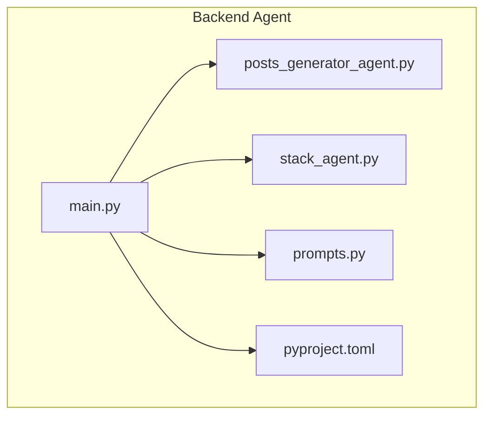
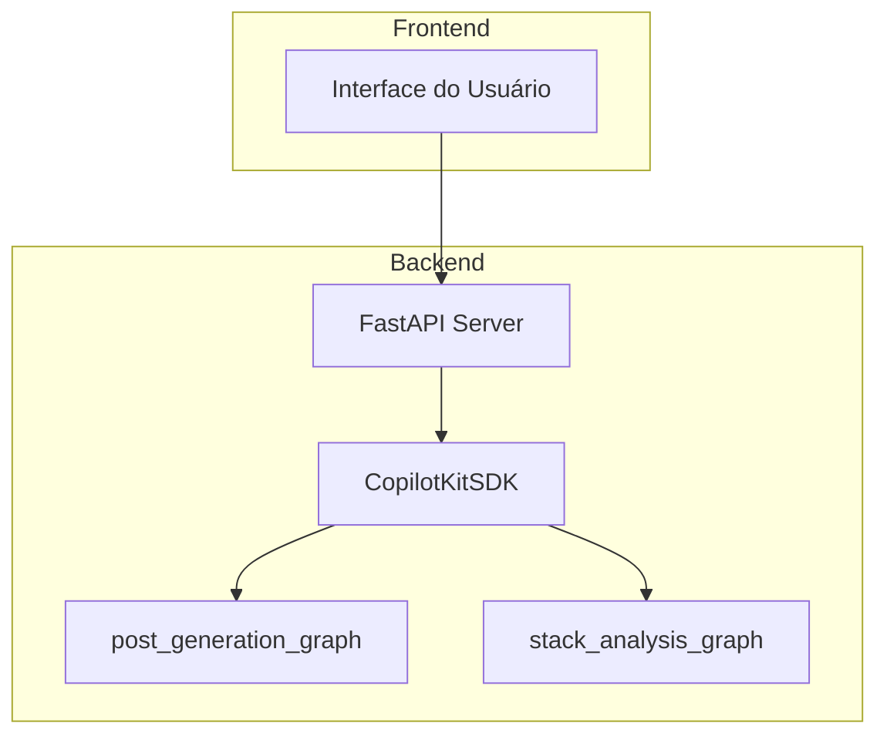
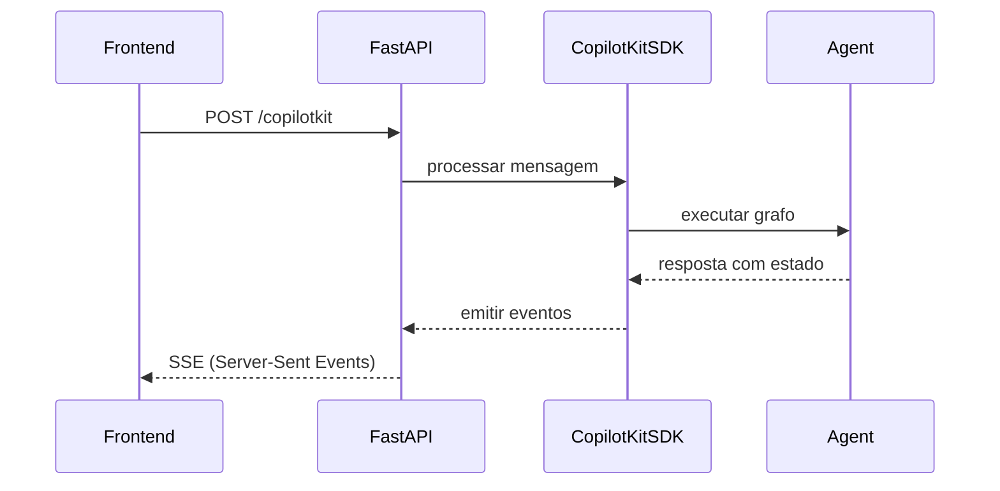
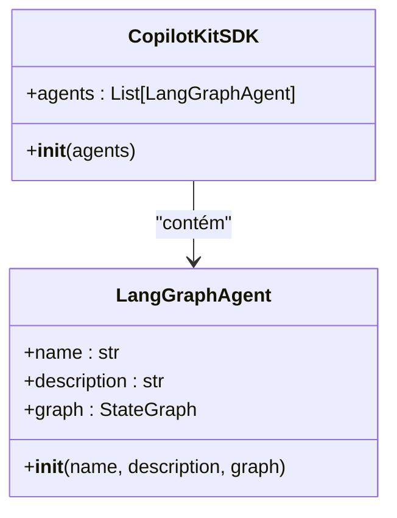
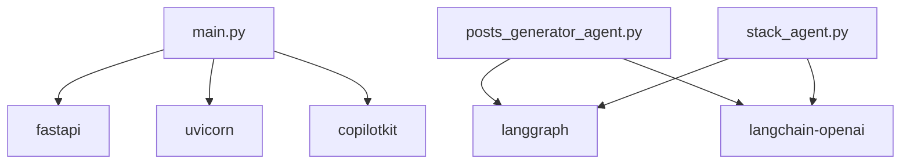

# API do Backend (FastAPI)

<cite>
**Arquivos Referenciados neste Documento**   
- [agent/main.py](file://agent/main.py)
- [agent/posts_generator_agent.py](file://agent/posts_generator_agent.py)
- [agent/stack_agent.py](file://agent/stack_agent.py)
- [agent/prompts.py](file://agent/prompts.py)
- [agent/pyproject.toml](file://agent/pyproject.toml)
</cite>

## Sumário
1. [Introdução](#introdução)
2. [Estrutura do Projeto](#estrutura-do-projeto)
3. [Componentes Principais](#componentes-principais)
4. [Visão Geral da Arquitetura](#visão-geral-da-arquitetura)
5. [Análise Detalhada dos Componentes](#análise-detalhada-dos-componentes)
6. [Análise de Dependências](#análise-de-dependências)
7. [Considerações de Desempenho](#considerações-de-desempenho)
8. [Guia de Solução de Problemas](#guia-de-solução-de-problemas)
9. [Conclusão](#conclusão)

## Introdução

Este documento detalha a API do backend implementada com FastAPI no arquivo `agent/main.py`. A aplicação serve agentes de IA construídos com LangGraph através de um servidor FastAPI, integrando-se ao CopilotKit SDK para habilitar interfaces conversacionais avançadas. A API expõe três endpoints principais: `/copilotkit` (para interação com os agentes), `/healthz` (verificação de saúde) e `/` (raiz). O servidor é inicializado com Uvicorn, suportando recarga automática em desenvolvimento.

**Section sources**
- [agent/main.py](file://agent/main.py#L1-L62)

## Estrutura do Projeto

O backend reside no diretório `agent/` e é composto por três arquivos principais:
- `main.py`: Ponto de entrada da API FastAPI, configuração do servidor e integração com o CopilotKit.
- `posts_generator_agent.py`: Define o grafo de agente `post_generation_graph` para geração de posts.
- `stack_agent.py`: Define o grafo de agente `stack_analysis_graph` para análise de repositórios GitHub.

O arquivo `prompts.py` contém os prompts do sistema utilizados pelos agentes, e `pyproject.toml` lista as dependências do projeto, incluindo FastAPI, Uvicorn, LangGraph e CopilotKit.

**Diagram sources**
- [agent/main.py](file://agent/main.py#L1-L62)
- [agent/posts_generator_agent.py](file://agent/posts_generator_agent.py#L1-L174)
- [agent/stack_agent.py](file://agent/stack_agent.py#L1-L505)

**Section sources**
- [agent/main.py](file://agent/main.py#L1-L62)
- [agent/posts_generator_agent.py](file://agent/posts_generator_agent.py#L1-L174)
- [agent/stack_agent.py](file://agent/stack_agent.py#L1-L505)
- [agent/prompts.py](file://agent/prompts.py#L1-L51)
- [agent/pyproject.toml](file://agent/pyproject.toml#L1-L27)

## Componentes Principais

Os componentes principais são os dois grafos de agentes definidos com LangGraph: `post_generation_graph` e `stack_analysis_graph`. O `post_generation_graph` é um agente especializado em gerar posts para LinkedIn e X (Twitter), utilizando uma ferramenta de busca Google para obter informações atualizadas. O `stack_analysis_graph` analisa repositórios GitHub, inferindo seu propósito e stack tecnológico (frontend, backend, banco de dados, infraestrutura) a partir de metadados, arquivos de manifesto e README.

Ambos os grafos são compilados com um `MemorySaver` para manter o estado da conversa e são integrados à API FastAPI via o `CopilotKitSDK`.

**Section sources**
- [agent/posts_generator_agent.py](file://agent/posts_generator_agent.py#L1-L174)
- [agent/stack_agent.py](file://agent/stack_agent.py#L1-L505)

## Visão Geral da Arquitetura

A arquitetura segue um padrão de integração entre FastAPI e grafos de agentes de IA. O servidor FastAPI atua como uma camada de apresentação, expondo endpoints HTTP. O `CopilotKitSDK` atua como um adaptador, conectando os grafos de agentes (definidos em LangGraph) à API. Quando uma requisição é recebida no endpoint `/copilotkit`, o SDK roteia a mensagem para o agente apropriado (`post_generation_agent` ou `stack_analysis_agent`) com base na configuração.

**Diagram sources**
- [agent/main.py](file://agent/main.py#L1-L62)
- [agent/posts_generator_agent.py](file://agent/posts_generator_agent.py#L1-L174)
- [agent/stack_agent.py](file://agent/stack_agent.py#L1-L505)

## Análise Detalhada dos Componentes

### Análise do Endpoint `/copilotkit`

O endpoint `/copilotkit` é o ponto central da API, configurado pela função `add_fastapi_endpoint` do CopilotKit. Ele é responsável por receber mensagens do frontend e roteá-las para os agentes apropriados.

**Diagram sources**
- [agent/main.py](file://agent/main.py#L1-L62)

**Section sources**
- [agent/main.py](file://agent/main.py#L1-L62)

### Análise do Endpoint `/healthz`

O endpoint `/healthz` é um endpoint de verificação de saúde simples, acessível via método HTTP GET. Ele retorna um status 200 com um JSON `{"status": "ok"}` se o servidor estiver em execução. Este endpoint é crucial para sistemas de orquestração como Kubernetes, que o utilizam para verificar a saúde da aplicação.

**Section sources**
- [agent/main.py](file://agent/main.py#L55-L58)

### Análise do Endpoint `/`

O endpoint raiz `/` é um endpoint de boas-vindas, acessível via método HTTP GET. Ele retorna um JSON simples `{"message": "Hello, World!"}`. Este endpoint é útil para verificar rapidamente se o servidor está ativo e respondendo.

**Section sources**
- [agent/main.py](file://agent/main.py#L60-L62)

### Análise da Configuração do CopilotKitSDK

O `CopilotKitSDK` é configurado com uma lista de agentes `LangGraphAgent`. Cada agente tem um nome, uma descrição e uma referência ao grafo de execução (`graph`). O SDK usa essas informações para rotear as requisições do frontend para o grafo correto.

**Diagram sources**
- [agent/main.py](file://agent/main.py#L1-L62)

**Section sources**
- [agent/main.py](file://agent/main.py#L1-L62)

## Análise de Dependências

O projeto depende de várias bibliotecas de alto nível, especificadas em `pyproject.toml`. As dependências principais incluem `fastapi` e `uvicorn` para o servidor web, `langgraph` e `langchain-openai` para a construção dos agentes, e `copilotkit` para a integração com a interface do usuário. O uso do `python-dotenv` permite a configuração flexível via variáveis de ambiente.

**Diagram sources**
- [agent/pyproject.toml](file://agent/pyproject.toml#L1-L27)

**Section sources**
- [agent/pyproject.toml](file://agent/pyproject.toml#L1-L27)

## Considerações de Desempenho

A aplicação é configurada para recarga automática em desenvolvimento (`reload=True` no Uvicorn), o que é ideal para desenvolvimento iterativo, mas deve ser desativado em produção para melhor desempenho. O uso de `MemorySaver` para persistência de estado é adequado para desenvolvimento, mas em produção, um backend de checkpoint mais robusto (como um banco de dados) deve ser considerado para escalabilidade e persistência. A comunicação com o frontend utiliza Server-Sent Events (SSE) via o CopilotKit, permitindo atualizações em tempo real do estado do agente.

**Section sources**
- [agent/main.py](file://agent/main.py#L59-L62)

## Guia de Solução de Problemas

Problemas comuns incluem falhas de autenticação com APIs externas (OpenRouter, GitHub) devido a variáveis de ambiente ausentes. Certifique-se de que `OPENROUTER_API_KEY`, `GITHUB_TOKEN` e `PORT` estão definidas. Erros de importação podem ocorrer se as dependências não forem instaladas corretamente; use `poetry install` para instalar os pacotes listados em `pyproject.toml`. Se o endpoint `/copilotkit` não responder, verifique se o servidor Uvicorn está em execução e se os grafos de agentes foram compilados corretamente.

**Section sources**
- [agent/main.py](file://agent/main.py#L1-L62)
- [agent/pyproject.toml](file://agent/pyproject.toml#L1-L27)

## Conclusão

A API do backend é uma implementação limpa e eficaz de um servidor FastAPI para servir agentes de IA. A integração com o CopilotKit simplifica a comunicação com o frontend, enquanto o uso de LangGraph permite a construção de fluxos de trabalho de agentes complexos e com estado. A configuração é simples e adequada para desenvolvimento, com um caminho claro para a produção com ajustes em persistência de estado e variáveis de ambiente.