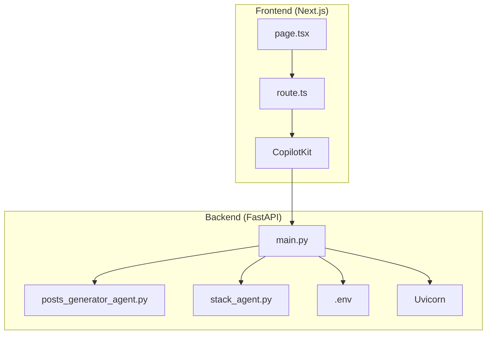
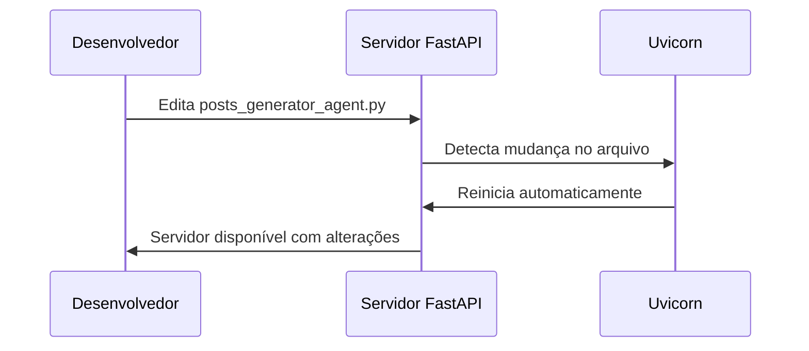

# Configuração do Servidor FastAPI

<cite>
**Arquivos Referenciados neste Documento**  
- [agent/main.py](file://agent/main.py)
- [agent/posts_generator_agent.py](file://agent/posts_generator_agent.py)
- [agent/stack_agent.py](file://agent/stack_agent.py)
</cite>

## Sumário
1. [Introdução](#introdução)
2. [Estrutura do Projeto](#estrutura-do-projeto)
3. [Função `main()` e Inicialização do Servidor](#função-main-e-inicialização-do-servidor)
4. [Configuração da Porta e Variáveis de Ambiente](#configuração-da-porta-e-variáveis-de-ambiente)
5. [Execução com Uvicorn e Parâmetros](#execução-com-uvicorn-e-parâmetros)
6. [Implicações de Segurança do Modo `reload`](#implicações-de-segurança-do-modo-reload)
7. [Recomendações para Produção](#recomendações-para-produção)
8. [Guia de Inicialização Manual](#guia-de-inicialização-manual)
9. [Conclusão](#conclusão)

## Introdução

Este documento detalha a configuração do servidor FastAPI e Uvicorn utilizada no projeto `open-gemini-canvas`, com foco na função `main()` localizada em `agent/main.py`. A aplicação é um servidor FastAPI que expõe agentes de IA integrados via `CopilotKitSDK`, permitindo a interação com dois agentes principais: um gerador de posts para LinkedIn/X e um analisador de stacks tecnológicos de repositórios GitHub.

A configuração do servidor é feita de forma simples e eficaz, utilizando variáveis de ambiente para flexibilidade, modo de recarga automática para desenvolvimento e boas práticas de inicialização. Este guia explica cada aspecto da configuração, suas implicações e recomendações para ambientes de produção.

## Estrutura do Projeto

O projeto é organizado em módulos bem definidos:

- **`agent/`**: Contém a lógica principal do servidor FastAPI, incluindo a inicialização (`main.py`), os agentes (`posts_generator_agent.py`, `stack_agent.py`) e prompts.
- **`app/`**: Frontend baseado em Next.js, com rotas de API que se comunicam com o backend.
- **`components/`**: Componentes de interface reutilizáveis.
- **`scripts/`**: Scripts de configuração do ambiente.

O servidor FastAPI é executado independentemente do frontend, permitindo escalabilidade e desenvolvimento paralelo.



**Diagram sources**
- [agent/main.py](file://agent/main.py)
- [agent/posts_generator_agent.py](file://agent/posts_generator_agent.py)
- [agent/stack_agent.py](file://agent/stack_agent.py)

## Função `main()` e Inicialização do Servidor

A função `main()` em `agent/main.py` é responsável por iniciar o servidor Uvicorn com a aplicação FastAPI. Ela é definida como uma função separada para permitir modularidade e testabilidade.

A execução condicional `if __name__ == '__main__':` garante que o servidor só seja iniciado quando o script for executado diretamente, não quando importado como módulo. Isso é uma prática comum em Python para permitir reutilização do código.

```python
def main():
    """Executa o servidor uvicorn."""
    port = int(os.getenv("PORT", "8000"))
    uvicorn.run(
        "main:app",
        host="0.0.0.0",
        port=port,
        reload=True,
    )

if __name__ == "__main__":
    main()
```

**Section sources**
- [agent/main.py](file://agent/main.py#L54-L62)

## Configuração da Porta e Variáveis de Ambiente

A porta do servidor é configurada dinamicamente através da variável de ambiente `PORT`, com um valor padrão de `8000`. Isso permite flexibilidade em diferentes ambientes (desenvolvimento, teste, produção) sem alterar o código.

A biblioteca `python-dotenv` é utilizada para carregar variáveis de ambiente a partir de um arquivo `.env`, facilitando a gestão de configurações sensíveis e específicas do ambiente.

Embora o arquivo `.env` não esteja presente no repositório (como é padrão em projetos), ele deve conter variáveis como `PORT`, `OPENROUTER_API_KEY`, `GITHUB_TOKEN`, entre outras necessárias para o funcionamento dos agentes.

**Section sources**
- [agent/main.py](file://agent/main.py#L54-L56)

## Execução com Uvicorn e Parâmetros

O servidor é executado usando `uvicorn.run()` com os seguintes parâmetros:

- **`"main:app"`**: Especifica o módulo (`main`) e a instância FastAPI (`app`) a ser carregada.
- **`host="0.0.0.0"`**: Permite que o servidor aceite conexões de qualquer interface de rede, essencial para acessibilidade externa em containers Docker ou ambientes de nuvem.
- **`port=port`**: Usa a porta definida pela variável de ambiente.
- **`reload=True`**: Ativa o modo de recarga automática, que reinicia o servidor quando arquivos do código são modificados.

Este modo é extremamente útil durante o desenvolvimento, pois elimina a necessidade de reiniciar manualmente o servidor após cada alteração.



**Diagram sources**
- [agent/main.py](file://agent/main.py#L56-L60)

## Implicações de Segurança do Modo `reload`

O parâmetro `reload=True` deve ser **desativado em produção** por questões de segurança e desempenho:

- **Segurança**: O recarregador monitora todos os arquivos do projeto, o que pode expor informações sensíveis se configurado incorretamente.
- **Desempenho**: O processo de recarga consome recursos adicionais e pode causar indisponibilidade momentânea.
- **Estabilidade**: Recargas automáticas podem levar a estados inconsistentes em aplicações com estado persistente.

Em ambientes de produção, o servidor deve ser executado com `reload=False` ou sem o parâmetro (o padrão é `False`).

**Section sources**
- [agent/main.py](file://agent/main.py#L59)

## Recomendações para Produção

Para implantação em produção, recomenda-se:

1. **Utilizar Gunicorn com workers Uvicorn**:
   ```bash
   gunicorn -k uvicorn.workers.UvicornWorker -w 4 -b 0.0.0.0:8000 main:app
   ```
   Isso fornece balanceamento de carga entre múltiplos processos, melhorando desempenho e disponibilidade.

2. **Configurar logging adequado**:
   ```python
   import logging
   logging.basicConfig(level=logging.INFO)
   ```
   Registre requisições, erros e métricas para monitoramento.

3. **Implementar monitoramento**:
   - Use ferramentas como Prometheus/Grafana para métricas.
   - Configure alertas para falhas no servidor.
   - Monitore o uso de CPU, memória e latência das requisições.

4. **Gerenciar variáveis de ambiente com segurança**:
   - Nunca comite arquivos `.env` no controle de versão.
   - Use gerenciadores de segredos em produção (como AWS Secrets Manager, Hashicorp Vault).
   - Valide a presença das variáveis críticas na inicialização.

5. **Configurar timeout e limites**:
   - Defina timeouts para requisições externas.
   - Limite o número de conexões simultâneas.

## Guia de Inicialização Manual

Para iniciar o servidor manualmente:

1. **Instale as dependências**:
   ```bash
   cd agent
   python -m venv .venv
   source .venv/bin/activate  # Linux/Mac
   # ou .venv\Scripts\activate  # Windows
   pip install -r requirements.txt  # ou poetry install
   ```

2. **Crie o arquivo `.env`**:
   ```env
   PORT=8000
   OPENROUTER_API_KEY=sua_chave_aqui
   GITHUB_TOKEN=seu_token_aqui
   ```

3. **Execute o servidor**:
   ```bash
   python main.py
   ```

4. **Verifique a saúde do servidor**:
   Acesse `http://localhost:8000/healthz` para confirmar que o servidor está ativo.

O servidor estará disponível em `http://localhost:8000` e `http://0.0.0.0:8000` (acessível na rede local).

**Section sources**
- [agent/main.py](file://agent/main.py#L54-L62)

## Conclusão

A configuração do servidor FastAPI em `agent/main.py` é simples, eficaz e segue boas práticas para desenvolvimento. O uso de variáveis de ambiente, recarga automática e inicialização condicional torna o servidor flexível e fácil de usar durante o desenvolvimento.

Para produção, é essencial desativar o modo `reload` e considerar o uso de Gunicorn com múltiplos workers para melhor desempenho e estabilidade. A gestão adequada de variáveis de ambiente e a implementação de logging e monitoramento são cruciais para manter a aplicação robusta e segura em ambientes de produção.