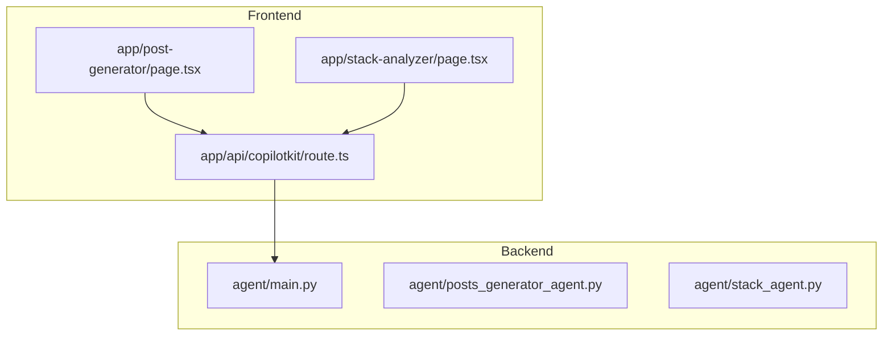
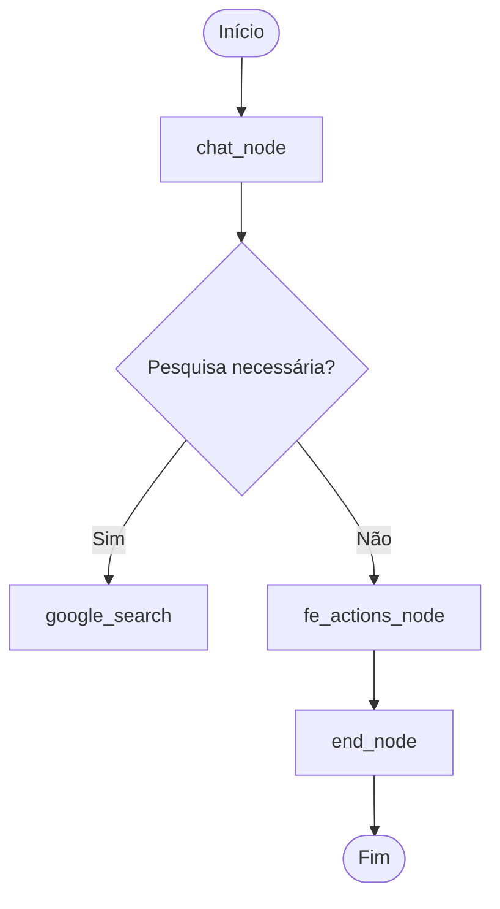
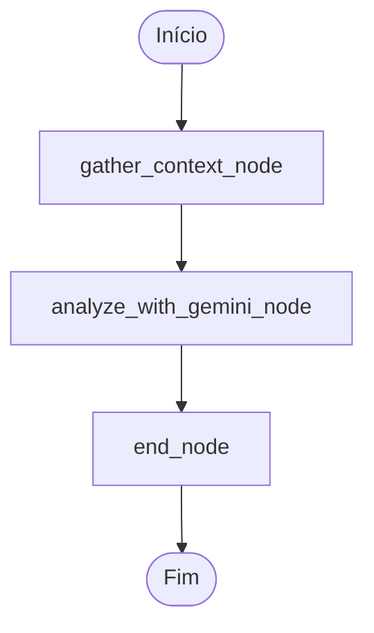

# Endpoint /copilotkit

<cite>
**Arquivos Referenciados neste Documento**  
- [agent/main.py](file://agent/main.py)
- [agent/posts_generator_agent.py](file://agent/posts_generator_agent.py)
- [agent/stack_agent.py](file://agent/stack_agent.py)
- [app/api/copilotkit/route.ts](file://app/api/copilotkit/route.ts)
- [app/post-generator/page.tsx](file://app/post-generator/page.tsx)
- [app/stack-analyzer/page.tsx](file://app/stack-analyzer/page.tsx)
</cite>

## Sumário
1. [Introdução](#introdução)
2. [Estrutura do Projeto](#estrutura-do-projeto)
3. [Componentes Principais](#componentes-principais)
4. [Visão Geral da Arquitetura](#visão-geral-da-arquitetura)
5. [Análise Detalhada dos Componentes](#análise-detalhada-dos-componentes)
6. [Análise de Dependências](#análise-de-dependências)
7. [Considerações de Desempenho](#considerações-de-desempenho)
8. [Guia de Solução de Problemas](#guia-de-solução-de-problemas)
9. [Conclusão](#conclusão)

## Introdução

O endpoint `/copilotkit` é um ponto central de integração entre o frontend da aplicação e os agentes de IA baseados em LangGraph, hospedados em um servidor FastAPI. Ele é configurado usando a função `add_fastapi_endpoint` do pacote `copilotkit.integrations.fastapi` e serve como interface para dois agentes principais: `post_generation_agent` e `stack_analysis_agent`. Este documento detalha a configuração, funcionamento, estrutura de requisição e resposta, integração com o frontend, tratamento de erros, segurança e orientações para depuração e extensão.

## Estrutura do Projeto

O projeto é organizado em três diretórios principais: `agent`, `app` e `components`. O backend reside em `agent`, onde o servidor FastAPI é configurado em `main.py`. O frontend está em `app`, utilizando Next.js, com páginas específicas para cada agente. O endpoint `/copilotkit` é exposto pelo backend e consumido pelo frontend via rota Next.js em `app/api/copilotkit/route.ts`.



**Fontes do Diagrama**  
- [agent/main.py](file://agent/main.py)
- [app/api/copilotkit/route.ts](file://app/api/copilotkit/route.ts)

**Fontes da Seção**  
- [agent/main.py](file://agent/main.py)
- [app/api/copilotkit/route.ts](file://app/api/copilotkit/route.ts)

## Componentes Principais

Os componentes principais são os dois agentes LangGraph: `post_generation_graph` e `stack_analysis_graph`. O primeiro gera posts para LinkedIn e X com base em pesquisas web, enquanto o segundo analisa repositórios GitHub para inferir propósito e stack tecnológico. Ambos são registrados no `CopilotKitSDK` e expostos via o endpoint `/copilotkit`.

**Fontes da Seção**  
- [agent/main.py](file://agent/main.py#L19-L32)
- [agent/posts_generator_agent.py](file://agent/posts_generator_agent.py#L173)
- [agent/stack_agent.py](file://agent/stack_agent.py#L504)

## Visão Geral da Arquitetura

A arquitetura segue um padrão de servidor backend FastAPI que hospeda agentes LangGraph, acessados por um frontend Next.js. O SDK CopilotKit facilita a comunicação bidirecional, permitindo streaming de eventos e execução de ações no frontend.

```mermaid
graph LR
Client[Frontend Next.js] --> API[/copilotkit]
API --> SDK[CopilotKitSDK]
SDK --> Agent1[post_generation_agent]
SDK --> Agent2[stack_analysis_agent]
Agent1 --> LLM[OpenRouter/Gemini]
Agent2 --> LLM
```

**Fontes do Diagrama**  
- [agent/main.py](file://agent/main.py)
- [app/api/copilotkit/route.ts](file://app/api/copilotkit/route.ts)

## Análise Detalhada dos Componentes

### Análise do Componente post_generation_agent

O agente `post_generation_agent` utiliza um grafo LangGraph (`post_generation_graph`) para gerar posts. Ele inicia com uma análise da mensagem do usuário, realiza pesquisas web se necessário, e gera conteúdo para LinkedIn e X.



**Fontes do Diagrama**  
- [agent/posts_generator_agent.py](file://agent/posts_generator_agent.py)

**Fontes da Seção**  
- [agent/posts_generator_agent.py](file://agent/posts_generator_agent.py)

### Análise do Componente stack_analysis_agent

O agente `stack_analysis_agent` analisa repositórios GitHub. Ele extrai metadados, linguagens, README, arquivos manifestos e usa um modelo de IA para inferir a estrutura do projeto.



**Fontes do Diagrama**  
- [agent/stack_agent.py](file://agent/stack_agent.py)

**Fontes da Seção**  
- [agent/stack_agent.py](file://agent/stack_agent.py)

### Integração com o Frontend

O frontend utiliza o SDK CopilotKit para se conectar ao endpoint. A função `useCopilotAction` é usada para renderizar posts gerados. A configuração é feita em `app/api/copilotkit/route.ts`, que encaminha as requisições para o backend.

**Fontes da Seção**  
- [app/api/copilotkit/route.ts](file://app/api/copilotkit/route.ts)
- [app/post-generator/page.tsx](file://app/post-generator/page.tsx#L150-L190)
- [app/stack-analyzer/page.tsx](file://app/stack-analyzer/page.tsx)

## Análise de Dependências

O backend depende de `fastapi`, `uvicorn`, `langgraph`, `copilotkit` e `langchain_openai`. O frontend depende de `@copilotkit/react-core` e `@copilotkit/react-ui`. Ambos compartilham a configuração de OpenRouter para acesso ao modelo Gemini.

```mermaid
graph TD
A[agent/main.py] --> B[fastapi]
A --> C[copilotkit]
A --> D[langgraph]
E[app/api/copilotkit/route.ts] --> F[@copilotkit/runtime]
G[app/post-generator/page.tsx] --> H[@copilotkit/react-core]
```

**Fontes do Diagrama**  
- [agent/main.py](file://agent/main.py)
- [app/api/copilotkit/route.ts](file://app/api/copilotkit/route.ts)

**Fontes da Seção**  
- [agent/main.py](file://agent/main.py)
- [app/api/copilotkit/route.ts](file://app/api/copilotkit/route.ts)

## Considerações de Desempenho

O uso de `MemorySaver` como checkpointer permite manter o estado entre requisições, mas pode consumir memória em alta carga. O streaming de eventos é habilitado via `copilotkit_emit_state`, permitindo atualizações em tempo real na UI. A ausência de autenticação pode ser um gargalo de segurança em produção.

## Guia de Solução de Problemas

Erros comuns incluem agente não encontrado (nome incorreto no frontend), falha na conexão com OpenRouter (chave API inválida) e parsing de URL do GitHub falhando. Para depurar, verifique os logs do servidor FastAPI e as mensagens de estado emitidas pelos agentes.

**Fontes da Seção**  
- [agent/main.py](file://agent/main.py)
- [agent/stack_agent.py](file://agent/stack_agent.py#L50-L70)

## Conclusão

O endpoint `/copilotkit` é uma peça fundamental na integração entre frontend e agentes de IA. Sua configuração simples com `add_fastapi_endpoint` e o uso do `CopilotKitSDK` permitem uma integração robusta e escalável. Recomenda-se adicionar autenticação para uso em produção e monitorar o consumo de memória do servidor.