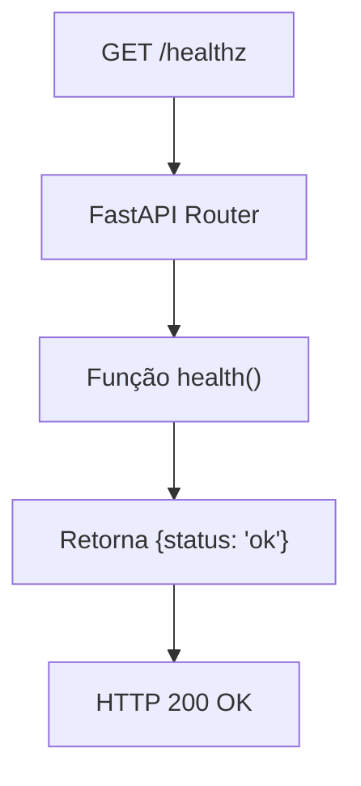

# Endpoint /healthz

<cite>
**Arquivos Referenciados neste Documento**   
- [agent/main.py](file://agent/main.py)
- [README.md](file://README.md)
- [agent/posts_generator_agent.py](file://agent/posts_generator_agent.py)
- [agent/stack_agent.py](file://agent/stack_agent.py)
</cite>

## Sumário
1. [Introdução](#introdução)
2. [Implementação Técnica](#implementação-técnica)
3. [Uso em Produção e Orquestração](#uso-em-produção-e-orquestração)
4. [Exemplo de Chamada](#exemplo-de-chamada)
5. [Boas Práticas e Extensibilidade](#boas-práticas-e-extensibilidade)
6. [Considerações de Segurança](#considerações-de-segurança)

## Introdução

O endpoint `/healthz` é um mecanismo simples e eficaz de verificação de saúde (health check) implementado no serviço FastAPI do projeto Open Gemini Canvas. Localizado no arquivo `agent/main.py`, este endpoint serve como um indicador básico de que o servidor backend está ativo, respondendo a requisições e capaz de processar tráfego. Ele é uma prática padrão em arquiteturas modernas de microserviços e aplicações em nuvem, permitindo que sistemas de monitoramento, orquestradores (como Kubernetes) e pipelines de CI/CD verifiquem rapidamente o estado operacional do serviço sem sobrecarregar o sistema com operações complexas.

**Section sources**
- [agent/main.py](file://agent/main.py#L38-L40)

## Implementação Técnica

O endpoint é implementado como uma rota GET no framework FastAPI. A função `health()` é decorada com `@app.get("/healthz")` e retorna um objeto JSON simples contendo um único par chave-valor: `{"status": "ok"}`. A simplicidade intencional desta implementação garante que a verificação de saúde seja rápida, leve e com um tempo de resposta mínimo, pois não envolve consultas a bancos de dados, chamadas a APIs externas ou qualquer outro processo que possa falhar independentemente do estado do servidor principal.



**Diagram sources**
- [agent/main.py](file://agent/main.py#L38-L40)

**Section sources**
- [agent/main.py](file://agent/main.py#L38-L40)

## Uso em Produção e Orquestração

Este endpoint é fundamental para a operação confiável do serviço em ambientes de produção. Ele é utilizado por:

1.  **Sistemas de Monitoramento**: Ferramentas como Prometheus, Datadog ou New Relic podem sondar este endpoint em intervalos regulares para gerar alertas e dashboards de disponibilidade.
2.  **Orquestradores de Contêineres (ex: Kubernetes)**: O Kubernetes utiliza este endpoint como uma *liveness probe* para determinar se um contêiner está funcionando corretamente. Se o endpoint falhar várias vezes consecutivas, o Kubernetes reiniciará o contêiner. Ele também pode ser usado como uma *readiness probe* para decidir quando um contêiner recém-iniciado está pronto para receber tráfego.
3.  **Pipelines de CI/CD**: Após uma nova implantação, os pipelines podem verificar o endpoint `/healthz` para confirmar que a nova versão do serviço foi iniciada com sucesso antes de prosseguir com a liberação de tráfego.

**Section sources**
- [README.md](file://README.md#L110-L160)

## Exemplo de Chamada

A chamada ao endpoint pode ser feita facilmente usando ferramentas de linha de comando como `curl`:

```bash
curl -X GET http://localhost:8000/healthz
```

A resposta esperada é:

```json
{"status": "ok"}
```

Em um ambiente JavaScript (como um frontend Next.js), a chamada pode ser feita com `fetch`:

```javascript
fetch('/api/healthz')
  .then(response => response.json())
  .then(data => console.log(data.status)); // Imprime 'ok'
```

**Section sources**
- [agent/main.py](file://agent/main.py#L38-L40)

## Boas Práticas e Extensibilidade

A implementação atual segue a boa prática de ser **intencionalmente simples** e **não autenticada**. Isso é crucial porque:

*   **Simplicidade**: Um health check complexo pode falhar por motivos que não refletem o estado real do servidor (ex: um banco de dados temporariamente lento), levando a reinícios desnecessários.
*   **Sem Autenticação**: O endpoint deve ser acessível a qualquer sistema de monitoramento sem a necessidade de gerenciar credenciais, simplificando a configuração.

No entanto, o documento `README.md` menciona o uso de serviços externos como a **Gemini API** (via OpenRouter) e a **GitHub API**. Uma evolução natural para um *health check mais abrangente* seria a adição de um endpoint `/readyz` (ou a extensão do `/healthz`) que verifique a conectividade com essas dependências críticas. Por exemplo, o serviço poderia tentar uma chamada de "ping" à API do OpenRouter para garantir que a integração com o modelo de IA esteja funcionando. Isso diferenciaria entre o servidor estar "vivo" (apenas o processo está rodando) e "pronto" (todas as dependências externas necessárias estão disponíveis).

**Section sources**
- [agent/main.py](file://agent/main.py#L38-L40)
- [README.md](file://README.md#L110-L160)
- [agent/posts_generator_agent.py](file://agent/posts_generator_agent.py#L1-L174)
- [agent/stack_agent.py](file://agent/stack_agent.py#L1-L505)

## Considerações de Segurança

A decisão de não exigir autenticação para o endpoint `/healthz` é uma escolha de design comum e geralmente segura. O endpoint não expõe nenhuma informação sensível além do estado de funcionamento do servidor, que é considerado informação pública em muitos contextos. Restringir o acesso a este endpoint pode complicar desnecessariamente a configuração de ferramentas de monitoramento e orquestração. A principal preocupação de segurança seria um ataque de negação de serviço (DoS), mas a simplicidade extrema da rota (sem processamento complexo) a torna altamente resistente a esse tipo de ataque.

**Section sources**
- [agent/main.py](file://agent/main.py#L38-L40)