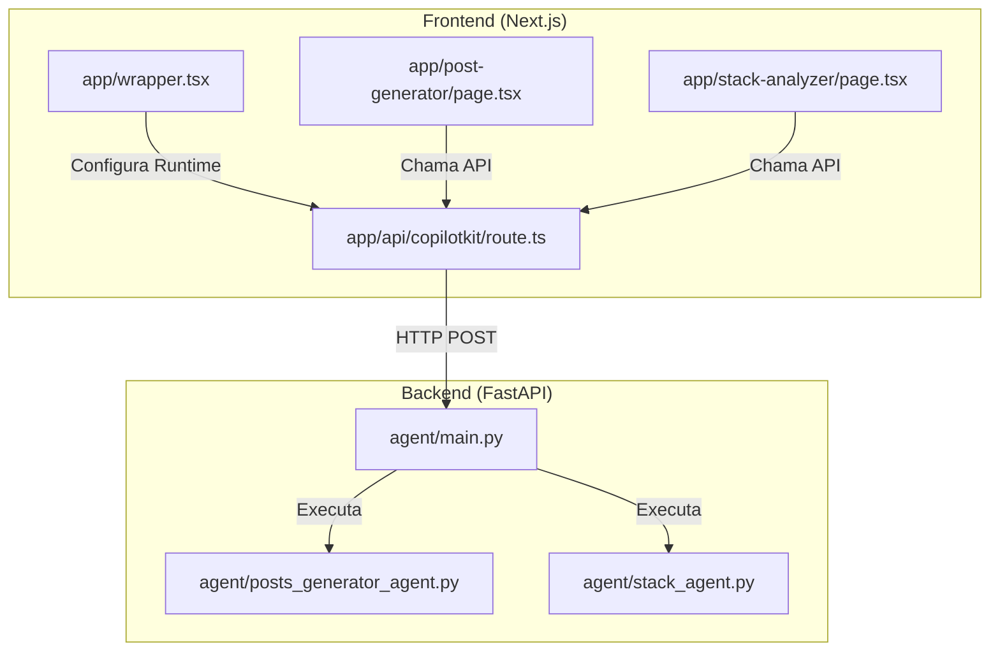
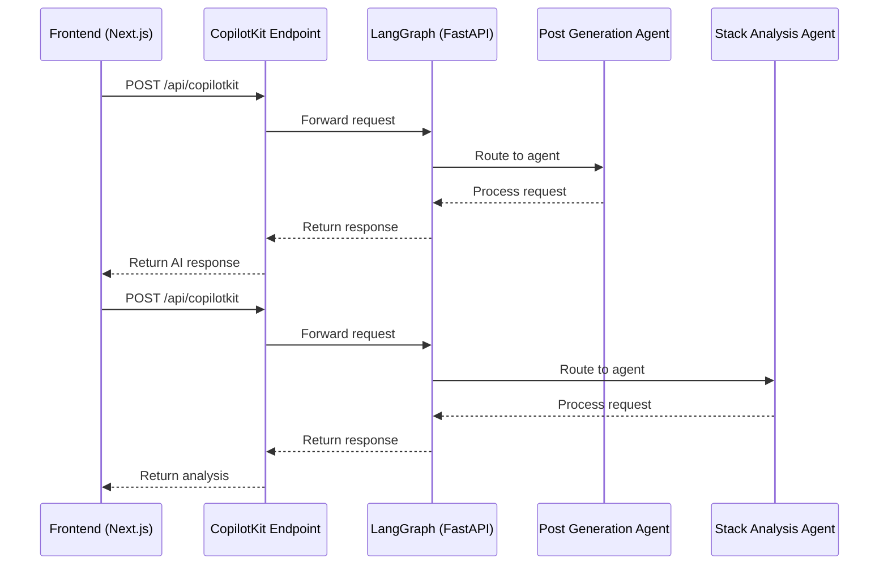
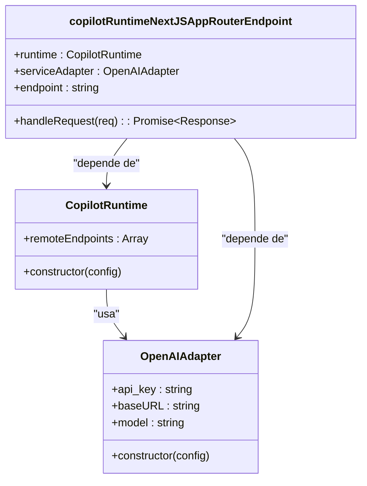
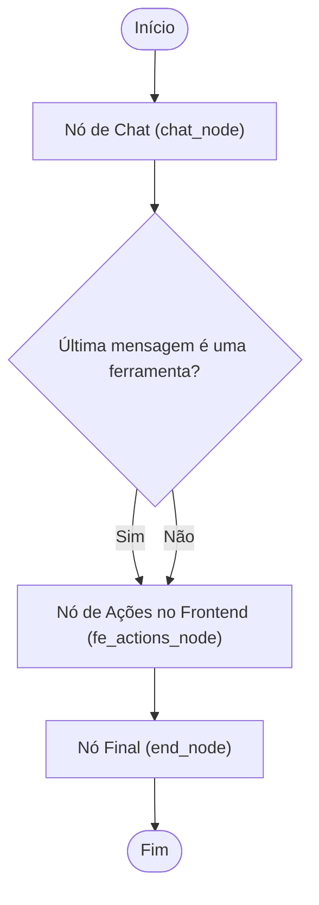
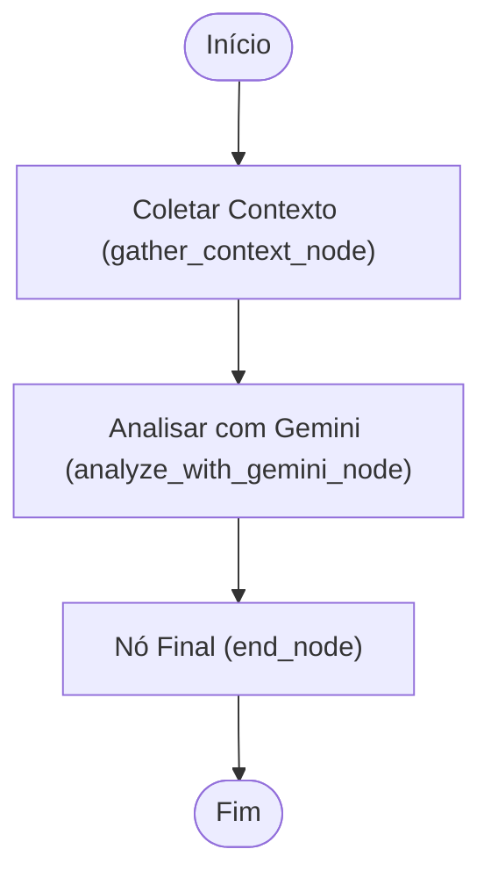

# API CopilotKit

<cite>
**Arquivos Referenciados neste Documento**   
- [app/api/copilotkit/route.ts](file://app/api/copilotkit/route.ts)
- [agent/main.py](file://agent/main.py)
- [agent/posts_generator_agent.py](file://agent/posts_generator_agent.py)
- [agent/stack_agent.py](file://agent/stack_agent.py)
- [.env.example](file://.env.example)
- [agent/.env.example](file://agent/.env.example)
- [app/wrapper.tsx](file://app/wrapper.tsx)
</cite>

## Sumário
1. [Introdução](#introdução)
2. [Estrutura do Projeto](#estrutura-do-projeto)
3. [Componentes Principais](#componentes-principais)
4. [Visão Geral da Arquitetura](#visão-geral-da-arquitetura)
5. [Análise Detalhada dos Componentes](#análise-detalhada-dos-componentes)
6. [Análise de Dependências](#análise-de-dependências)
7. [Considerações de Desempenho](#considerações-de-desempenho)
8. [Guia de Solução de Problemas](#guia-de-solução-de-problemas)
9. [Conclusão](#conclusão)

## Introdução

O endpoint `/api/copilotkit/route.ts` desempenha um papel central na arquitetura de integração entre o frontend Next.js e os agentes de IA backend, facilitando a comunicação através do framework CopilotKit. Este documento detalha a arquitetura, funcionamento, configuração e interações do endpoint, explicando como ele conecta o frontend React com os agentes backend implementados em Python com FastAPI e LangGraph. O sistema permite funcionalidades avançadas como geração de posts para redes sociais e análise de stacks tecnológicos de repositórios GitHub, tudo orquestrado por meio de um runtime de IA configurado com o modelo Gemini via OpenRouter.

## Estrutura do Projeto

A estrutura do projeto reflete uma arquitetura de microsserviços clara, com separação entre frontend e backend:



**Diagram sources**
- [app/api/copilotkit/route.ts](file://app/api/copilotkit/route.ts)
- [agent/main.py](file://agent/main.py)

**Section sources**
- [app/api/copilotkit/route.ts](file://app/api/copilotkit/route.ts)
- [agent/main.py](file://agent/main.py)

## Componentes Principais

O componente principal é o endpoint `/api/copilotkit/route.ts`, que atua como gateway entre o frontend Next.js e o runtime do CopilotKit. Ele utiliza o adaptador `OpenAIAdapter` para se conectar ao serviço OpenRouter, que por sua vez fornece acesso ao modelo Gemini. O endpoint é configurado para se comunicar com o backend FastAPI através da URL definida em `NEXT_PUBLIC_LANGGRAPH_URL`. O frontend, por meio do componente `wrapper.tsx`, inicializa o `CopilotKit` com a URL do endpoint, estabelecendo assim a conexão necessária para a troca de mensagens entre as camadas.

**Section sources**
- [app/api/copilotkit/route.ts](file://app/api/copilotkit/route.ts)
- [app/wrapper.tsx](file://app/wrapper.tsx)

## Visão Geral da Arquitetura

A arquitetura do sistema é baseada em um padrão de comunicação cliente-servidor com um runtime de IA intermediário. O frontend Next.js envia requisições HTTP POST para o endpoint `/api/copilotkit`, que processa essas requisições utilizando o `copilotRuntimeNextJSAppRouterEndpoint`. Este processamento envolve a roteirização das mensagens para os agentes apropriados no backend FastAPI, que são expostos através do endpoint `/copilotkit` no servidor LangGraph. A comunicação entre o frontend e o backend é mediada pelo CopilotKit, que gerencia o estado, as mensagens e as chamadas de ferramentas, garantindo uma experiência de IA integrada e responsiva.



**Diagram sources**
- [app/api/copilotkit/route.ts](file://app/api/copilotkit/route.ts)
- [agent/main.py](file://agent/main.py)

## Análise Detalhada dos Componentes

### Análise do Endpoint CopilotKit

O endpoint `/api/copilotkit/route.ts` é responsável por inicializar o runtime do CopilotKit e configurar o adaptador de serviço para comunicação com o modelo de IA. A função `POST` exportada processa requisições do frontend, utilizando o `copilotRuntimeNextJSAppRouterEndpoint` para lidar com a lógica de roteamento e processamento. O `CopilotRuntime` é configurado com `remoteEndpoints` apontando para a URL do servidor LangGraph, permitindo a delegação de tarefas para os agentes backend.

#### Configuração do Runtime e Adaptador



**Diagram sources**
- [app/api/copilotkit/route.ts](file://app/api/copilotkit/route.ts)

**Section sources**
- [app/api/copilotkit/route.ts](file://app/api/copilotkit/route.ts)

### Análise dos Agentes Backend

Os agentes backend são implementados em Python utilizando FastAPI e LangGraph, sendo responsáveis pela execução das tarefas de IA. O `main.py` configura o servidor FastAPI e registra os endpoints do CopilotKit, enquanto os agentes específicos (`posts_generator_agent.py` e `stack_agent.py`) definem os fluxos de trabalho para geração de posts e análise de stacks, respectivamente.

#### Agente de Geração de Posts

O agente de geração de posts utiliza o modelo Gemini para criar conteúdo para redes sociais com base em prompts e contexto fornecido. Ele implementa um grafo de estado com nós para processamento de chat, ações no frontend e finalização, permitindo uma interação dinâmica e contextualizada com o usuário.



**Diagram sources**
- [agent/posts_generator_agent.py](file://agent/posts_generator_agent.py)

**Section sources**
- [agent/posts_generator_agent.py](file://agent/posts_generator_agent.py)

#### Agente de Análise de Stack

O agente de análise de stack é projetado para examinar repositórios GitHub e inferir sua finalidade e stack tecnológica. Ele coleta metadados do repositório, analisa arquivos de manifesto e o README, e utiliza o modelo de IA para gerar uma análise estruturada do projeto.



**Diagram sources**
- [agent/stack_agent.py](file://agent/stack_agent.py)

**Section sources**
- [agent/stack_agent.py](file://agent/stack_agent.py)

## Análise de Dependências

A análise de dependências revela uma arquitetura bem modularizada, com dependências claras entre os componentes frontend e backend. O frontend depende do pacote `@copilotkit/react-core` para integração com o runtime, enquanto o backend utiliza `@copilotkit/runtime` para comunicação com o frontend. Ambos os lados dependem do serviço OpenRouter para acesso ao modelo Gemini, com as credenciais de API sendo gerenciadas através de variáveis de ambiente.

```mermaid
graph LR
A[Frontend] --> B[@copilotkit/react-core]
B --> C[OpenRouter]
D[Backend] --> E[@copilotkit/runtime]
E --> C[OpenRouter]
C --> F[Gemini]
```

**Diagram sources**
- [.env.example](file://.env.example)
- [agent/.env.example](file://agent/.env.example)

**Section sources**
- [.env.example](file://.env.example)
- [agent/.env.example](file://agent/.env.example)

## Considerações de Desempenho

O sistema foi projetado com considerações de desempenho em mente, utilizando técnicas como cache de estado e otimização de chamadas de API. O uso do LangGraph permite a execução eficiente de fluxos de trabalho complexos, enquanto o CopilotKit gerencia o estado entre as interações, reduzindo a necessidade de chamadas de API redundantes. A configuração do modelo com temperatura 1.0 para geração de posts e 0.4 para análise de stack reflete um equilíbrio entre criatividade e precisão, otimizando o desempenho para cada caso de uso específico.

## Guia de Solução de Problemas

Problemas comuns na comunicação entre frontend e backend geralmente estão relacionados à configuração incorreta das variáveis de ambiente ou à indisponibilidade do servidor backend. Para depurar esses problemas, verifique se as variáveis `OPENROUTER_API_KEY` e `NEXT_PUBLIC_LANGGRAPH_URL` estão corretamente definidas em ambos os arquivos `.env`. Além disso, certifique-se de que o servidor FastAPI está em execução e acessível na URL especificada. O endpoint de saúde `/healthz` no backend pode ser usado para verificar o status do servidor.

**Section sources**
- [.env.example](file://.env.example)
- [agent/main.py](file://agent/main.py)

## Conclusão

O endpoint `/api/copilotkit/route.ts` é o componente central que permite a integração fluida entre o frontend Next.js e os agentes de IA backend, facilitando a criação de aplicações com funcionalidades avançadas de IA. A arquitetura modular e bem definida, combinada com o uso de padrões modernos de desenvolvimento, resulta em um sistema robusto, escalável e fácil de manter. A documentação detalhada dos componentes, fluxos de trabalho e configurações fornece uma base sólida para o desenvolvimento e a solução de problemas, garantindo o sucesso do projeto.