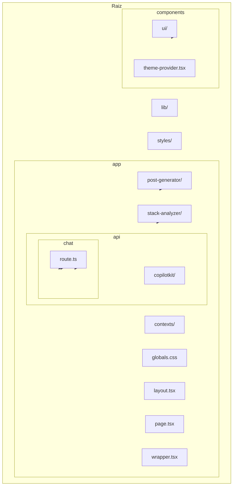
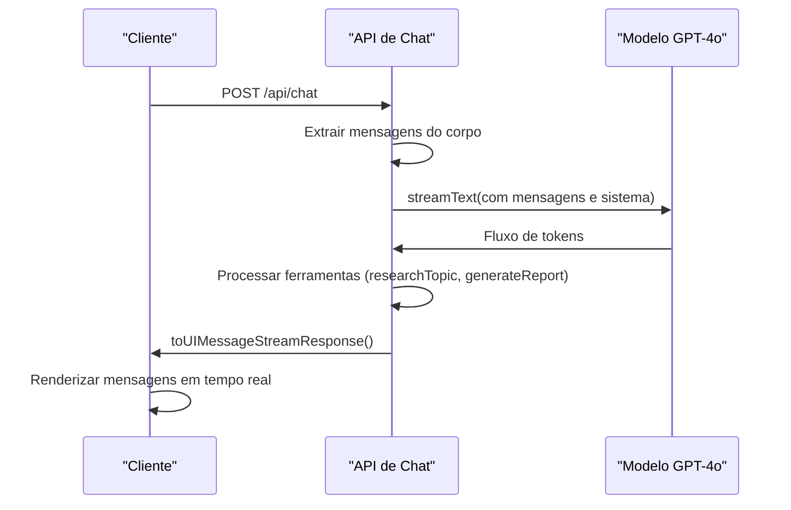
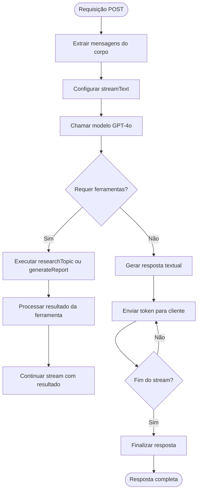
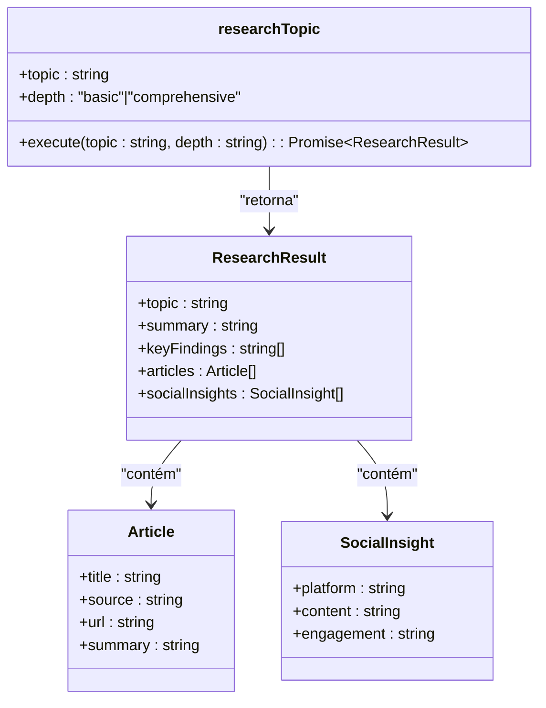
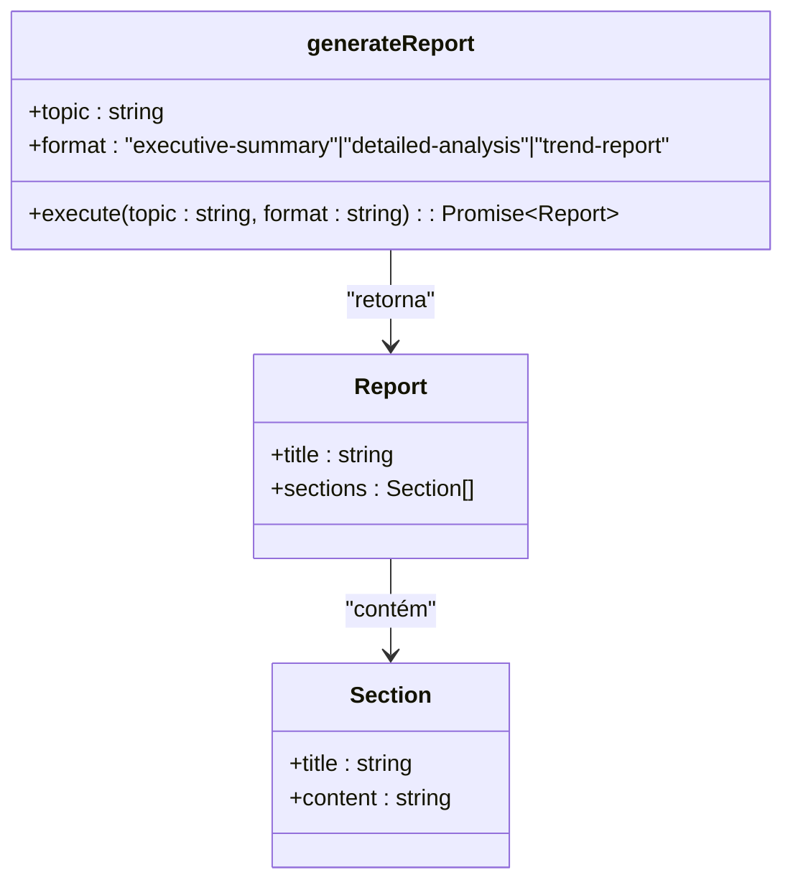
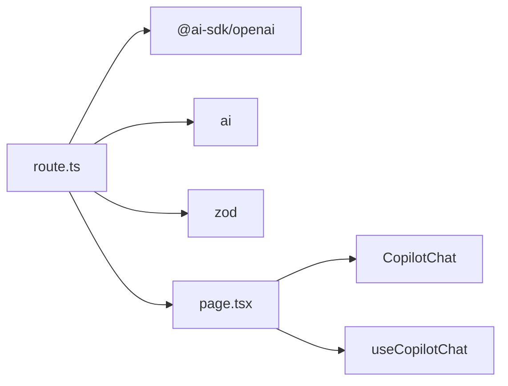

# API de Chat

<cite>
**Arquivos Referenciados neste Documento**  
- [route.ts](file://app/api/chat/route.ts)
- [page.tsx](file://app/post-generator/page.tsx)
- [page.tsx](file://app/stack-analyzer/page.tsx)
- [prompts.ts](file://app/prompts/prompts.ts)
</cite>

## Sumário
1. [Introdução](#introdução)
2. [Estrutura do Projeto](#estrutura-do-projeto)
3. [Componentes Principais](#componentes-principais)
4. [Visão Geral da Arquitetura](#visão-geral-da-arquitetura)
5. [Análise Detalhada dos Componentes](#análise-detalhada-dos-componentes)
6. [Análise de Dependências](#análise-de-dependências)
7. [Considerações de Desempenho](#considerações-de-desempenho)
8. [Guia de Solução de Problemas](#guia-de-solução-de-problemas)
9. [Conclusão](#conclusão)

## Introdução

A API de Chat implementada no arquivo `route.ts` é um endpoint RESTful que fornece funcionalidades avançadas de chat com streaming de texto, utilizando a biblioteca `ai-sdk` e o modelo GPT-4o da OpenAI. Este sistema é projetado para atuar como um agente de pesquisa avançada, combinando tecnologias do Google DeepMind e Gemini para fornecer respostas inteligentes, pesquisas abrangentes e geração de relatórios estruturados. A rota suporta mensagens com contexto, streaming de respostas em tempo real e ferramentas personalizadas para pesquisa e geração de conteúdo.

**Section sources**
- [route.ts](file://app/api/chat/route.ts#L1-L114)

## Estrutura do Projeto

A estrutura do projeto é organizada em um padrão de diretórios típico de uma aplicação Next.js, com separação clara entre componentes, páginas, APIs e utilitários. O endpoint de chat reside no diretório `app/api/chat/`, seguindo as convenções do framework para rotas do servidor.

**Diagram sources**
- [route.ts](file://app/api/chat/route.ts#L1-L114)

**Section sources**
- [route.ts](file://app/api/chat/route.ts#L1-L114)

## Componentes Principais

O componente principal é a função `POST` no arquivo `route.ts`, que implementa o endpoint de chat com streaming. Esta função processa requisições HTTP POST, extrai mensagens do corpo da requisição e utiliza o método `streamText` para gerar respostas contínuas. O sistema inclui duas ferramentas personalizadas: `researchTopic` para pesquisa de tópicos e `generateReport` para geração de relatórios, ambas com esquemas de entrada validados usando Zod.

A função também define um prompt de sistema detalhado que configura o agente de IA com conhecimento especializado em pesquisa avançada, análise de padrões e geração de conteúdo multimodal. O parâmetro `maxDuration` é configurado para 30 segundos para evitar timeouts em ambientes como o Vercel.

**Section sources**
- [route.ts](file://app/api/chat/route.ts#L6-L114)

## Visão Geral da Arquitetura

A arquitetura da API de chat é baseada em um padrão de servidor de API com streaming, onde as requisições são processadas em tempo real e as respostas são transmitidas continuamente para o cliente. O sistema utiliza o modelo GPT-4o da OpenAI através da biblioteca `ai-sdk`, permitindo interações complexas com contexto de mensagens.

**Diagram sources**
- [route.ts](file://app/api/chat/route.ts#L6-L114)

## Análise Detalhada dos Componentes

### Análise do Endpoint de Chat

O endpoint de chat implementa uma função `POST` assíncrona que processa requisições de chat com streaming. A função utiliza o método `streamText` da biblioteca `ai-sdk` para gerar respostas contínuas, permitindo que o cliente receba tokens à medida que são gerados, criando uma experiência de chat em tempo real.

#### Função POST e Streaming de Texto

**Diagram sources**
- [route.ts](file://app/api/chat/route.ts#L6-L114)

#### Sistema de Mensagens com Contexto

O sistema mantém contexto através do array de mensagens passado para o modelo. Cada mensagem contém um papel (usuário, assistente, sistema) e conteúdo, permitindo que o modelo entenda a história da conversa e gere respostas coerentes.

**Section sources**
- [route.ts](file://app/api/chat/route.ts#L6-L114)

### Ferramentas Personalizadas

O endpoint implementa duas ferramentas personalizadas que estendem a funcionalidade do agente de IA: `researchTopic` e `generateReport`.

#### Ferramenta researchTopic

A ferramenta `researchTopic` permite que o agente realize pesquisas sobre tópicos específicos, simulando a coleta de informações da internet com rigor científico. A ferramenta aceita dois parâmetros: o tópico a ser pesquisado e a profundidade da pesquisa (básica ou abrangente).

**Diagram sources**
- [route.ts](file://app/api/chat/route.ts#L30-L74)

#### Ferramenta generateReport

A ferramenta `generateReport` gera relatórios abrangentes com base nos resultados da pesquisa. A ferramenta permite especificar o formato do relatório (resumo executivo, análise detalhada ou relatório de tendências).

**Diagram sources**
- [route.ts](file://app/api/chat/route.ts#L75-L113)

### Prompt do Sistema

O prompt do sistema define o comportamento do agente de IA, configurando-o como um especialista em pesquisa avançada com tecnologias DeepMind e Gemini. O prompt estabelece diretrizes claras para a geração de respostas, enfatizando rigor científico, análise de padrões e geração de conteúdo multimodal.

**Section sources**
- [route.ts](file://app/api/chat/route.ts#L10-L28)

## Análise de Dependências

A API de chat depende de várias bibliotecas e componentes do sistema. As dependências principais incluem `@ai-sdk/openai` para integração com o modelo GPT-4o, `ai` para funcionalidades de streaming e `zod` para validação de esquemas.

**Diagram sources**
- [route.ts](file://app/api/chat/route.ts#L1-L5)
- [page.tsx](file://app/post-generator/page.tsx#L1-L410)

**Section sources**
- [route.ts](file://app/api/chat/route.ts#L1-L114)
- [page.tsx](file://app/post-generator/page.tsx#L1-L410)

## Considerações de Desempenho

A API implementa várias otimizações de desempenho para garantir uma experiência de usuário fluida. O parâmetro `maxDuration` é definido como 30 segundos para evitar timeouts em ambientes serverless como o Vercel. O uso de streaming permite que os usuários comecem a ver respostas imediatamente, sem esperar pela conclusão do processamento completo.

O limite de `maxSteps` definido como 3 controla o número máximo de etapas de execução de ferramentas, prevenindo loops infinitos e garantindo tempos de resposta previsíveis. O sistema também simula resultados de pesquisa ao invés de realizar chamadas HTTP reais, otimizando o desempenho e reduzindo custos.

**Section sources**
- [route.ts](file://app/api/chat/route.ts#L4-L4)
- [route.ts](file://app/api/chat/route.ts#L110-L113)

## Guia de Solução de Problemas

### Tratamento de Erros

Embora o código fornecido não inclua tratamento explícito de erros, em uma implementação de produção seria essencial adicionar blocos try-catch para lidar com falhas na extração de mensagens, erros de conexão com a API da OpenAI e falhas na execução de ferramentas.

### Extensão com Novas Ferramentas

Para estender a funcionalidade com novas ferramentas, basta adicionar novas entradas ao objeto `tools` na chamada `streamText`. Cada nova ferramenta deve ter um esquema de entrada validado com Zod, uma descrição clara e uma função de execução assíncrona.

### Integração com Frontend

O frontend consome esta API principalmente através do componente `CopilotChat` no arquivo `post-generator/page.tsx`. O componente utiliza hooks como `useCopilotChat` para gerenciar o estado da conversa e `appendMessage` para enviar novas mensagens ao endpoint.

**Section sources**
- [route.ts](file://app/api/chat/route.ts#L6-L114)
- [page.tsx](file://app/post-generator/page.tsx#L1-L410)

## Conclusão

A API de Chat implementada no projeto Open Gemini Canvas representa uma solução sofisticada para interações de IA com streaming de texto. Ao combinar o poder do modelo GPT-4o com ferramentas personalizadas para pesquisa e geração de relatórios, o sistema oferece uma experiência de usuário rica e responsiva. A arquitetura bem projetada, com separação clara de responsabilidades e otimizações de desempenho, torna este endpoint uma base sólida para aplicações de chat avançadas. A integração com o frontend através de componentes React bem estruturados demonstra um fluxo de trabalho coeso entre backend e frontend, permitindo a geração dinâmica de conteúdo baseado em pesquisa.