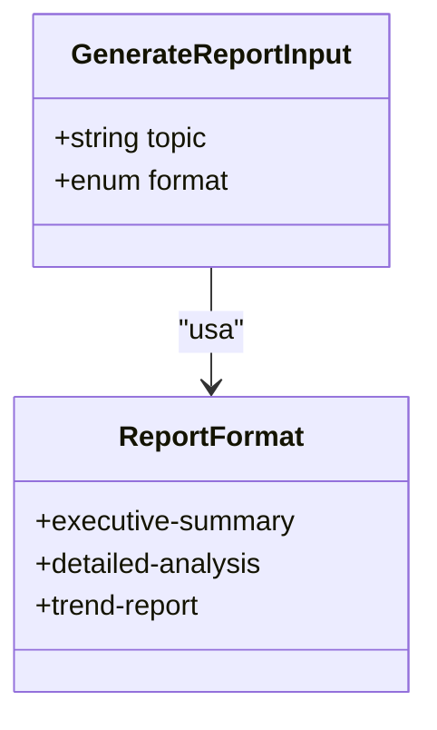
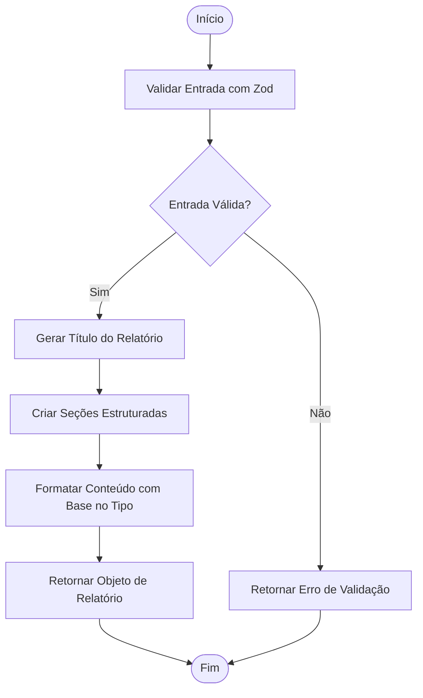
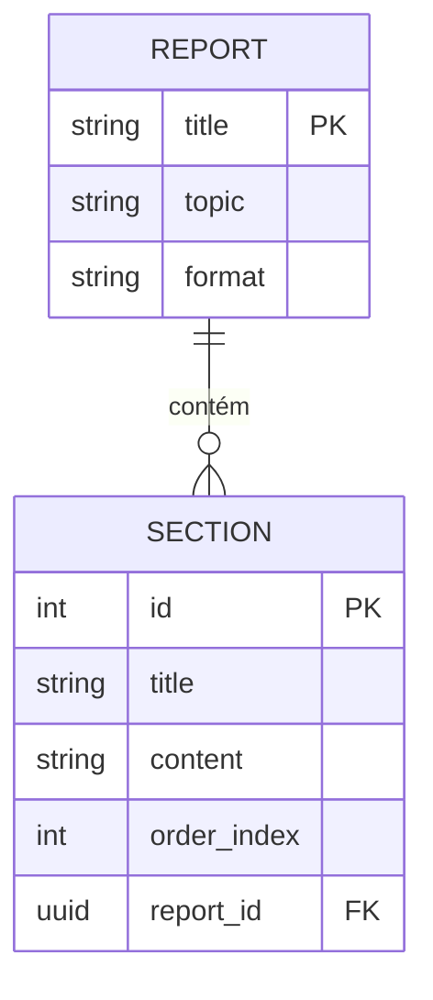
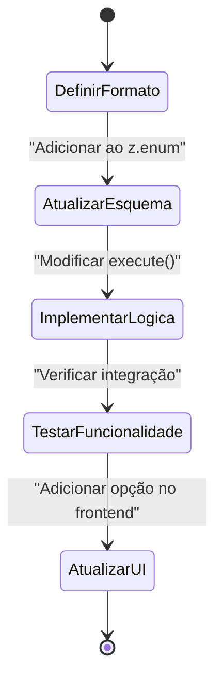
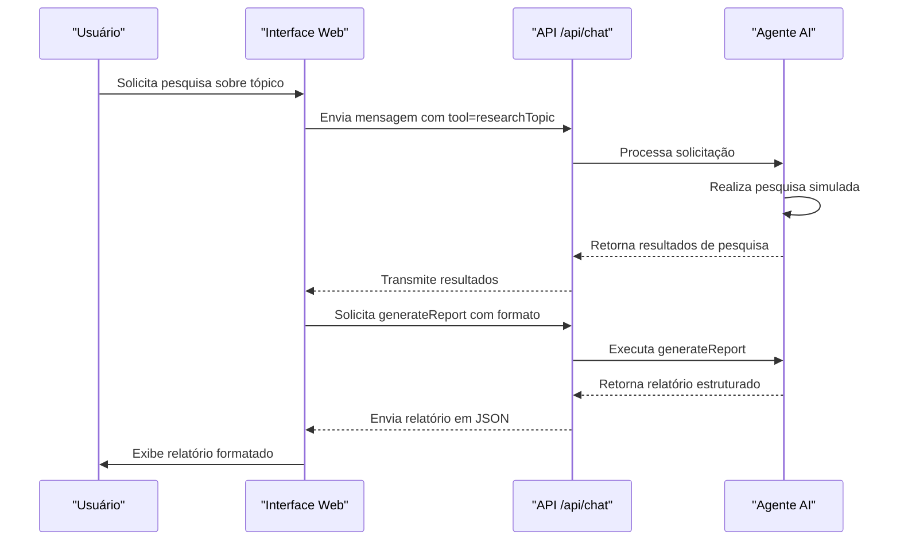

# Ferramenta generateReport

<cite>
**Arquivos Referenciados neste Documento**  
- [route.ts](file://app/api/chat/route.ts)
- [prompts.ts](file://app/prompts/prompts.ts)
- [copilotkit/route.ts](file://app/api/copilotkit/route.ts)
</cite>

## Sumário

1. [Introdução](#introdução)
2. [Estrutura do Esquema de Entrada](#estrutura-do-esquema-de-entrada)
3. [Formatos de Relatório Suportados](#formatos-de-relatório-suportados)
4. [Lógica de Execução da Ferramenta](#lógica-de-execução-da-ferramenta)
5. [Estrutura da Saída do Relatório](#estrutura-da-saída-do-relatório)
6. [Exemplos de Requisição e Resposta](#exemplos-de-requisição-e-resposta)
7. [Integração com o Frontend](#integração-com-o-frontend)
8. [Personalização de Modelos de Relatório](#personalização-de-modelos-de-relatório)
9. [Extensão com Novos Formatos](#extensão-com-novos-formatos)
10. [Integração com Serviços de Exportação](#integração-com-serviços-de-exportação)
11. [Fluxos de Trabalho de Análise de Dados](#fluxos-de-trabalho-de-análise-de-dados)
12. [Conclusão](#conclusão)

## Introdução

A ferramenta `generateReport` é uma funcionalidade central do sistema de inteligência artificial baseado em Gemini e DeepMind, implementada no endpoint `/api/chat/route.ts`. Ela permite a geração automatizada de relatórios estruturados a partir de tópicos pesquisados, com diferentes níveis de profundidade e formatação. Essa ferramenta é projetada para suportar decisões estratégicas, análises detalhadas e monitoramento de tendências, integrando-se diretamente com o fluxo de pesquisa e análise do agente AI.

A função opera como uma ferramenta acessível ao modelo de linguagem, permitindo que o agente transforme dados de pesquisa em documentos profissionais e prontos para apresentação. A implementação utiliza validação rigorosa de entrada com Zod e gera saídas padronizadas que podem ser facilmente consumidas pelo frontend.

**Section sources**
- [route.ts](file://app/api/chat/route.ts#L75-L98)

## Estrutura do Esquema de Entrada

O esquema de entrada da ferramenta `generateReport` é definido utilizando a biblioteca Zod, garantindo validação de tipo e integridade dos dados recebidos. O objeto de entrada contém dois campos principais:

- **topic**: Uma string que representa o tema central do relatório a ser gerado. Este campo é obrigatório e descrito como "O tópico para o relatório".
- **format**: Um campo enumerado que define o estilo e a profundidade do relatório, com três opções predefinidas: `executive-summary`, `detailed-analysis` e `trend-report`.

A validação é implementada com `z.enum`, assegurando que apenas os valores permitidos sejam aceitos. Qualquer tentativa de usar um formato não listado resultará em erro de validação antes da execução da função.



**Diagram sources**
- [route.ts](file://app/api/chat/route.ts#L83-L87)

**Section sources**
- [route.ts](file://app/api/chat/route.ts#L83-L87)

## Formatos de Relatório Suportados

A ferramenta suporta três formatos distintos de relatório, cada um direcionado a um público e propósito específico:

### Resumo Executivo (executive-summary)
Projetado para tomadores de decisão sênior, este formato apresenta uma visão concisa e estratégica do tópico, destacando implicações comerciais e recomendações de alto nível.

### Análise Detalhada (detailed-analysis)
Voltado para analistas e especialistas técnicos, este formato fornece uma exploração aprofundada do tópico, incluindo dados, métricas e evidências de suporte.

### Relatório de Tendências (trend-report)
Focado em previsões e evoluções de mercado, este formato identifica padrões emergentes, projeções futuras e oportunidades inovadoras relacionadas ao tópico.

Esses formatos são definidos estaticamente no esquema Zod e podem ser expandidos conforme necessário para atender a novas necessidades de relatórios.

**Section sources**
- [route.ts](file://app/api/chat/route.ts#L85)

## Lógica de Execução da Ferramenta

A função `execute` da ferramenta `generateReport` simula a geração de um relatório estruturado com base no tópico e formato fornecidos. Embora a implementação atual seja simulada, ela demonstra claramente a estrutura esperada da saída.

O título do relatório é gerado dinamicamente, convertendo o valor do campo `format` em uma versão legível (substituindo hífens por espaços e convertendo para maiúsculas) e combinando-o com o tópico. O conteúdo é organizado em seções predefinidas que são consistentes entre os diferentes formatos, mas podem ser personalizadas com base no tipo de relatório.

A função retorna um objeto com as propriedades `title` e `sections`, onde cada seção contém um título e conteúdo textual. Esta estrutura padronizada facilita a renderização no frontend e a exportação para outros formatos.



**Diagram sources**
- [route.ts](file://app/api/chat/route.ts#L88-L98)

**Section sources**
- [route.ts](file://app/api/chat/route.ts#L88-L98)

## Estrutura da Saída do Relatório

A saída gerada pela ferramenta `generateReport` segue uma estrutura hierárquica consistente, composta por:

- **title**: Uma string que combina o formato do relatório com o tópico pesquisado.
- **sections**: Um array de objetos, cada um contendo:
  - `title`: O título da seção (ex: "Resumo Executivo", "Principais Descobertas", "Recomendações")
  - `content`: O texto descritivo da seção, gerado com base no tópico fornecido.

As seções principais incluem "Resumo Executivo", que fornece uma visão geral estratégica; "Principais Descobertas", que destaca os insights mais relevantes da pesquisa; e "Recomendações", que oferece orientações práticas para ação. Esta estrutura pode ser expandida ou modificada para diferentes formatos de relatório.



**Diagram sources**
- [route.ts](file://app/api/chat/route.ts#L88-L98)

**Section sources**
- [route.ts](file://app/api/chat/route.ts#L88-L98)

## Exemplos de Requisição e Resposta

### Exemplo de Requisição
```json
{
  "tool": "generateReport",
  "input": {
    "topic": "Inteligência Artificial em Saúde",
    "format": "executive-summary"
  }
}
```

### Exemplo de Resposta
```json
{
  "title": "EXECUTIVE SUMMARY: Inteligência Artificial em Saúde",
  "sections": [
    {
      "title": "Resumo Executivo",
      "content": "A Inteligência Artificial em Saúde representa uma oportunidade transformadora para organizações empresariais que buscam melhorar a eficiência operacional e a vantagem competitiva."
    },
    {
      "title": "Principais Descobertas",
      "content": "Nossa pesquisa indica um potencial significativo de crescimento e oportunidades imediatas de implementação para soluções de IA na saúde."
    },
    {
      "title": "Recomendações",
      "content": "As organizações devem priorizar a adoção de IA na saúde nos próximos 12 meses para manter o posicionamento competitivo."
    }
  ]
}
```

Esses exemplos demonstram como a ferramenta pode ser utilizada para gerar relatórios prontos para uso com base em tópicos dinâmicos.

**Section sources**
- [route.ts](file://app/api/chat/route.ts#L88-L98)

## Integração com o Frontend

O frontend do sistema pode consumir a saída da ferramenta `generateReport` para renderizar relatórios de forma dinâmica e interativa. A estrutura padronizada da resposta permite que componentes UI genéricos sejam utilizados para exibir diferentes tipos de relatórios.

O componente `ui/stack-analysis-cards.tsx` pode ser adaptado para exibir seções do relatório, enquanto o sistema de contexto `LayoutContext.tsx` pode gerenciar o estado do relatório atual. A renderização pode incluir:
- Título destacado do relatório
- Abas ou acordeões para navegação entre seções
- Ícones diferenciados por tipo de formato
- Botões de exportação integrados

A resposta em formato JSON é ideal para integração com frameworks React, permitindo atualizações eficientes do DOM com base nas seções recebidas.

**Section sources**
- [route.ts](file://app/api/chat/route.ts#L88-L98)
- [stack-analysis-cards.tsx](file://components/ui/stack-analysis-cards.tsx)

## Personalização de Modelos de Relatório

Embora a implementação atual use conteúdo simulado, o sistema está arquitetado para suportar modelos de relatório personalizados. Isso pode ser alcançado através de:

1. **Templates por formato**: Criar templates específicos para cada valor de `format`, com estruturas de seção diferentes.
2. **Dados dinâmicos**: Substituir o conteúdo simulado por dados reais obtidos da ferramenta `researchTopic`.
3. **Configuração externa**: Armazenar modelos de relatório em arquivos JSON ou banco de dados, permitindo atualizações sem alteração de código.
4. **Variáveis de contexto**: Incorporar informações do usuário, organização ou configurações específicas no conteúdo gerado.

A separação clara entre a definição da ferramenta e sua lógica de execução facilita a substituição da implementação simulada por uma versão completa que integra dados de pesquisa reais.

**Section sources**
- [route.ts](file://app/api/chat/route.ts#L88-L98)
- [prompts.ts](file://app/prompts/prompts.ts)

## Extensão com Novos Formatos

O sistema pode ser facilmente estendido para suportar novos formatos de relatório. Para adicionar um novo formato:

1. Atualize o `z.enum` no `inputSchema` para incluir o novo valor (ex: `comparative-analysis`, `risk-assessment`).
2. Modifique a função `execute` para gerar conteúdo apropriado para o novo formato.
3. Adicione lógica condicional baseada no valor de `format` para personalizar seções e conteúdo.
4. Atualize a documentação e interfaces do usuário para refletir o novo formato disponível.

Essa extensibilidade permite que o sistema evolua para atender a necessidades de relatórios especializados em diferentes domínios ou departamentos da organização.



**Diagram sources**
- [route.ts](file://app/api/chat/route.ts#L83-L98)

**Section sources**
- [route.ts](file://app/api/chat/route.ts#L83-L98)

## Integração com Serviços de Exportação

A estrutura de saída da ferramenta `generateReport` é ideal para integração com serviços de exportação, permitindo que os relatórios sejam baixados em múltiplos formatos:

### Exportação para PDF
Utilize bibliotecas como `pdfmake` ou serviços como Puppeteer para converter o JSON do relatório em documentos PDF com formatação profissional, incluindo:
- Cabeçalhos e rodapés personalizados
- Numeração de páginas
- Estilos de título e corpo de texto
- Logotipos da organização

### Exportação para Markdown
Converta diretamente o objeto JSON em Markdown, utilizando:
- `#` para o título principal
- `##` para títulos de seção
- Parágrafos para o conteúdo
- Metadados YAML opcional no início

Esta funcionalidade pode ser implementada como uma função auxiliar que transforma a saída de `generateReport` em strings formatadas, que podem então ser baixadas como arquivos.

**Section sources**
- [route.ts](file://app/api/chat/route.ts#L88-L98)

## Fluxos de Trabalho de Análise de Dados

A ferramenta `generateReport` integra-se em um fluxo de trabalho mais amplo de análise de dados que começa com a pesquisa e termina com a apresentação:

1. **Pesquisa Inicial**: O usuário inicia com a ferramenta `researchTopic` para coletar informações sobre um tópico.
2. **Análise de Dados**: Os resultados da pesquisa são processados e analisados pelo agente AI.
3. **Geração de Relatório**: O comando `generateReport` é invocado com o tópico pesquisado e o formato desejado.
4. **Revisão e Edição**: O usuário pode revisar o relatório no frontend e solicitar modificações.
5. **Exportação e Compartilhamento**: O relatório final é exportado para PDF ou Markdown e compartilhado com stakeholders.

Este fluxo demonstra como a ferramenta serve como o componente de geração de relatórios em um sistema completo de inteligência empresarial assistida por IA.



**Diagram sources**
- [route.ts](file://app/api/chat/route.ts)
- [copilotkit/route.ts](file://app/api/copilotkit/route.ts)

**Section sources**
- [route.ts](file://app/api/chat/route.ts#L75-L98)

## Conclusão

A ferramenta `generateReport` representa um componente essencial do sistema de inteligência artificial, transformando dados de pesquisa em relatórios profissionais e estruturados. Sua implementação com validação Zod, suporte a múltiplos formatos e saída padronizada a torna flexível e escalável. A integração com o fluxo de pesquisa existente e a capacidade de exportação para formatos como PDF e Markdown permitem que ela atenda a diversas necessidades de análise e apresentação de dados. Com personalização adicional e integração de dados reais, esta ferramenta pode evoluir para um sistema completo de geração automatizada de relatórios empresariais.