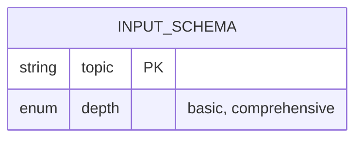
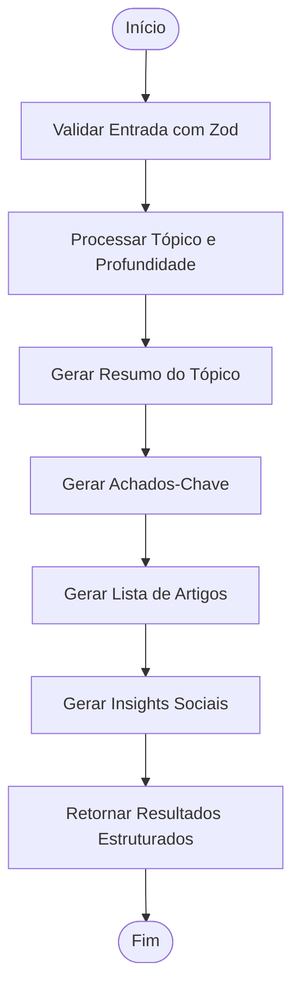
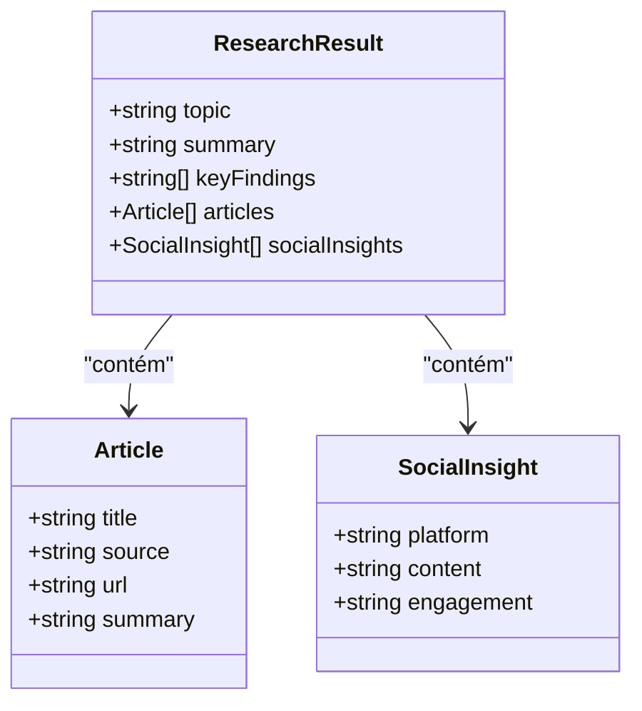
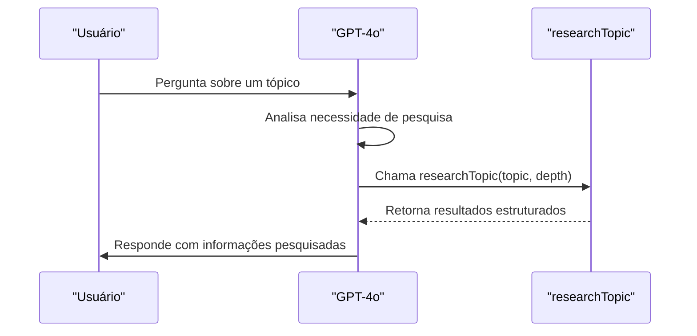

# Ferramenta researchTopic

<cite>
**Arquivos Referenciados neste Documento**  
- [app/api/chat/route.ts](file://app/api/chat/route.ts)
</cite>

## Sumário
1. [Introdução](#introdução)
2. [Esquema de Entrada com Zod](#esquema-de-entrada-com-zod)
3. [Funcionamento do Método execute](#funcionamento-do-método-execute)
4. [Estrutura da Saída Gerada](#estrutura-da-saída-gerada)
5. [Exemplos de Uso](#exemplos-de-uso)
6. [Integração com GPT-4o](#integração-com-gpt-4o)
7. [Casos de Uso no Frontend](#casos-de-uso-no-frontend)
8. [Extensão com Fontes Reais de Dados](#extensão-com-fontes-reais-de-dados)
9. [Conclusão](#conclusão)

## Introdução

A ferramenta `researchTopic` é um componente central do sistema de agentes de IA implementado no projeto, projetado para simular pesquisas avançadas sobre tópicos específicos com resultados estruturados. Integrada ao endpoint `/api/chat/route.ts`, esta ferramenta permite que o modelo GPT-4o realize pesquisas simuladas com profundidade configurável, gerando insights detalhados, artigos relacionados e conteúdo para mídias sociais. A ferramenta combina metodologias de pesquisa científica do DeepMind com capacidades multimodais do Gemini, proporcionando uma experiência de pesquisa avançada diretamente integrada à interface conversacional.

**Section sources**
- [app/api/chat/route.ts](file://app/api/chat/route.ts#L0-L114)

## Esquema de Entrada com Zod

O esquema de entrada da ferramenta `researchTopic` é definido utilizando a biblioteca Zod, garantindo validação rigorosa dos parâmetros fornecidos. O esquema é implementado como um objeto Zod com dois campos obrigatórios:

- **topic**: Uma string que representa o tópico a ser pesquisado. Este campo é descrito como "The topic to research" e é essencial para direcionar a pesquisa simulada.
- **depth**: Um enum com dois valores possíveis: "basic" e "comprehensive". Este campo controla a profundidade da pesquisa requerida, permitindo ao usuário escolher entre uma análise superficial ou uma investigação detalhada.

A implementação do esquema utiliza `z.object()` para definir a estrutura dos dados de entrada, com `z.string()` para validar o campo de tópico e `z.enum()` para restringir as opções de profundidade. Esta abordagem garante que apenas entradas válidas sejam processadas pela ferramenta, prevenindo erros devido a dados mal formatados.



**Diagram sources**
- [app/api/chat/route.ts](file://app/api/chat/route.ts#L50-L55)

**Section sources**
- [app/api/chat/route.ts](file://app/api/chat/route.ts#L50-L55)

## Funcionamento do Método execute

O método `execute` da ferramenta `researchTopic` é uma função assíncrona que simula os resultados de uma pesquisa abrangente sobre um tópico específico. Recebe como parâmetros o `topic` e a `depth`, embora atualmente a profundidade não altere o comportamento da simulação. O método retorna um objeto estruturado contendo múltiplas seções de resultados:

1. **Processamento de Entrada**: Os parâmetros `topic` e `depth` são recebidos e utilizados para personalizar os resultados simulados.
2. **Geração de Resultados**: O método constrói um objeto de resposta com várias seções, todas personalizadas com base no tópico fornecido.
3. **Simulação de Pesquisa**: Em vez de realizar uma pesquisa real, o método gera resultados simulados que imitam uma pesquisa abrangente com dados estatísticos, artigos acadêmicos e insights de mídias sociais.

O método está integrado ao sistema de streaming de texto, permitindo que os resultados sejam transmitidos progressivamente para a interface do usuário. Embora atualmente simule resultados, a estrutura está pronta para ser expandida com fontes de dados reais, como APIs de pesquisa acadêmica ou bases de conhecimento.



**Diagram sources**
- [app/api/chat/route.ts](file://app/api/chat/route.ts#L55-L80)

**Section sources**
- [app/api/chat/route.ts](file://app/api/chat/route.ts#L55-L80)

## Estrutura da Saída Gerada

A ferramenta `researchTopic` gera uma saída estruturada e abrangente que simula os resultados de uma pesquisa profissional. A resposta inclui cinco componentes principais:

### Resumo
Um resumo abrangente do tópico pesquisado, destacando tendências significativas em adoção empresarial e crescimento de mercado. O texto é personalizado com o tópico fornecido, criando uma narrativa coerente sobre seu impacto e potencial.

### Achados-Chave
Três principais descobertas apresentadas como uma lista, incluindo:
- Estatísticas de adoção (ex: aumento de 300% em ambientes empresariais)
- Melhorias de eficiência relatadas por empresas líderes
- Previsões de mercado (ex: indústria de $50B até 2025)

### Artigos Relacionados
Duas referências a artigos de publicações respeitadas:
- **Harvard Business Review**: Análise detalhada da implementação em empresas Fortune 500
- **MIT Technology Review**: Análise técnica aprofundada com métricas de ROI

Cada artigo inclui título, fonte, URL de exemplo e um resumo contextualizado.

### Insights Sociais
Dois exemplos de conteúdo para mídias sociais:
- **Twitter**: Um thread iniciando com "🧵 THREAD:" destacando a revolução em fluxos de trabalho empresariais
- **LinkedIn**: Uma postagem profissional compartilhando resultados de implementação com métricas específicas

Cada insight inclui a plataforma, conteúdo simulado e métricas de engajamento (curtidas, retweets, comentários).



**Diagram sources**
- [app/api/chat/route.ts](file://app/api/chat/route.ts#L60-L80)

**Section sources**
- [app/api/chat/route.ts](file://app/api/chat/route.ts#L60-L80)

## Exemplos de Uso

### Payload de Entrada - Profundidade Básica
```json
{
  "topic": "Inteligência Artificial em Saúde",
  "depth": "basic"
}
```

### Payload de Entrada - Profundidade Abrangente
```json
{
  "topic": "Blockchain em Finanças",
  "depth": "comprehensive"
}
```

### Saída Gerada para "Inteligência Artificial em Saúde"
```json
{
  "topic": "Inteligência Artificial em Saúde",
  "summary": "Pesquisa abrangente sobre Inteligência Artificial em Saúde revela tendências significativas na adoção empresarial e no crescimento do mercado.",
  "keyFindings": [
    "A adoção de Inteligência Artificial em Saúde aumentou 300% em ambientes empresariais no último ano",
    "Empresas líderes relatam melhorias de 40% na eficiência ao implementar soluções de Inteligência Artificial em Saúde",
    "Analistas de mercado prevêem que a Inteligência Artificial em Saúde será uma indústria de US$ 50 bilhões até 2025"
  ],
  "articles": [
    {
      "title": "O Futuro da Inteligência Artificial em Saúde: Tendências e Previsões Empresariais",
      "source": "Harvard Business Review",
      "url": "https://hbr.org/example",
      "summary": "Análise detalhada da implementação de Inteligência Artificial em Saúde em empresas da Fortune 500"
    },
    {
      "title": "Como a Inteligência Artificial em Saúde está Transformando Operações Empresariais",
      "source": "MIT Technology Review",
      "url": "https://technologyreview.com/example",
      "summary": "Análise técnica aprofundada sobre aplicações de Inteligência Artificial em Saúde e métricas de ROI"
    }
  ],
  "socialInsights": [
    {
      "platform": "Twitter",
      "content": "🧵 THREAD: Inteligência Artificial em Saúde está revolucionando fluxos de trabalho empresariais. Aqui está o que todo líder empresarial precisa saber...",
      "engagement": "2.3K curtidas, 450 retweets"
    },
    {
      "platform": "LinkedIn",
      "content": "Acabamos de implementar Inteligência Artificial em Saúde em nossa organização. Os resultados falam por si: processos 40% mais rápidos, insights 60% melhores.",
      "engagement": "1.8K reações, 200 comentários"
    }
  ]
}
```

**Section sources**
- [app/api/chat/route.ts](file://app/api/chat/route.ts#L55-L80)

## Integração com GPT-4o

A ferramenta `researchTopic` é invocada diretamente pelo modelo GPT-4o através do sistema de ferramentas do framework AI SDK. Quando o modelo determina que uma pesquisa é necessária para responder adequadamente ao usuário, ele chama a ferramenta com os parâmetros apropriados. O processo de integração funciona da seguinte maneira:

1. **Detecção de Necessidade**: O GPT-4o analisa a consulta do usuário e decide se uma pesquisa é necessária.
2. **Chamada da Ferramenta**: O modelo invoca `researchTopic` com o tópico extraído e o nível de profundidade apropriado.
3. **Processamento Assíncrono**: A ferramenta processa a solicitação de forma assíncrona, simulando resultados de pesquisa.
4. **Retorno de Resultados**: Os resultados estruturados são retornados ao modelo.
5. **Geração de Resposta Final**: O GPT-4o utiliza os resultados da pesquisa para formular uma resposta informada e detalhada ao usuário.

A integração é configurada no objeto `streamText` como parte do array de ferramentas disponíveis, com o GPT-4o tendo acesso a esta funcionalidade como parte de sua infraestrutura de IA avançada.



**Diagram sources**
- [app/api/chat/route.ts](file://app/api/chat/route.ts#L0-L114)

**Section sources**
- [app/api/chat/route.ts](file://app/api/chat/route.ts#L0-L114)

## Casos de Uso no Frontend

A ferramenta `researchTopic` é fundamental para vários casos de uso no frontend, especialmente na geração de conteúdo baseado em pesquisa:

### Geração de Postagens para Redes Sociais
O frontend pode utilizar os insights sociais gerados para criar automaticamente postagens para Twitter e LinkedIn, personalizadas com dados relevantes sobre tópicos específicos. Isso permite que usuários gerem conteúdo profissional de alta qualidade rapidamente.

### Análise de Mercado
Ao pesquisar tópicos relacionados a tecnologias ou indústrias, o frontend pode exibir resumos de mercado, achados-chave e previsões, ajudando tomadores de decisão a entender tendências emergentes.

### Apoio à Redação de Artigos
Os artigos relacionados e resumos gerados podem servir como referências rápidas para usuários que estão escrevendo artigos ou relatórios, fornecendo fontes e dados estatísticos relevantes.

### Apresentações Executivas
A combinação de resumo, achados-chave e recomendações pode ser formatada diretamente em slides para apresentações executivas, acelerando o processo de preparação.

### Pesquisa Competitiva
Usuários podem pesquisar tecnologias ou estratégias concorrentes para entender melhor o cenário competitivo e identificar oportunidades de diferenciação.

**Section sources**
- [app/api/chat/route.ts](file://app/api/chat/route.ts#L55-L80)

## Extensão com Fontes Reais de Dados

Embora atualmente a ferramenta `researchTopic` simule resultados, ela pode ser facilmente estendida para utilizar fontes de dados reais. As principais estratégias de extensão incluem:

### Integração com APIs de Pesquisa
Substituir a lógica de simulação por chamadas a APIs de pesquisa acadêmica (Google Scholar, PubMed), notícias (NewsAPI) ou bases de conhecimento especializadas.

### Conexão com Bases de Dados
Integrar com bancos de dados de mercado, relatórios de analistas ou fontes de dados governamentais para fornecer estatísticas e previsões precisas.

### Web Scraping Seletivo
Implementar scraping ético de sites de publicações respeitadas para obter artigos e resumos reais, respeitando políticas de robots.txt e termos de uso.

### Cache de Resultados
Adicionar um sistema de cache para armazenar resultados de pesquisas anteriores, melhorando o desempenho e reduzindo chamadas repetidas à mesma consulta.

### Personalização por Domínio
Expandir o esquema de entrada para incluir parâmetros adicionais como setor, região geográfica ou período temporal, permitindo pesquisas mais direcionadas.

A estrutura atual da ferramenta facilita essas extensões, pois a interface de entrada e saída já está bem definida, exigindo apenas modificações na implementação do método `execute`.

**Section sources**
- [app/api/chat/route.ts](file://app/api/chat/route.ts#L55-L80)

## Conclusão

A ferramenta `researchTopic` representa um componente poderoso do sistema de agentes de IA, simulando pesquisas abrangentes com resultados estruturados que combinam resumos, achados-chave, artigos acadêmicos e insights para mídias sociais. Integrada ao GPT-4o através do endpoint `/api/chat/route.ts`, a ferramenta utiliza validação rigorosa com Zod e uma estrutura de saída bem definida para fornecer informações valiosas aos usuários. Embora atualmente simule resultados, sua arquitetura está pronta para ser expandida com fontes de dados reais, transformando-a em uma ferramenta de pesquisa verdadeiramente poderosa. Os casos de uso no frontend, especialmente na geração de conteúdo baseado em pesquisa, demonstram seu valor prático para usuários que precisam de informações rápidas e bem estruturadas sobre tópicos variados.