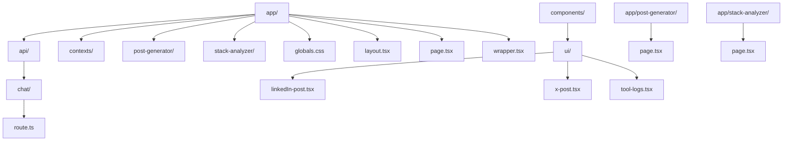
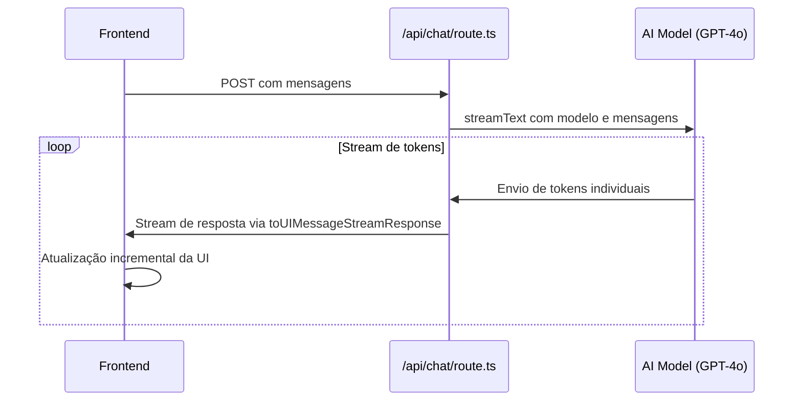
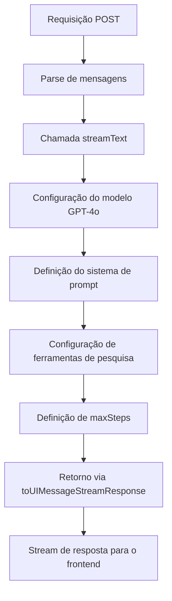
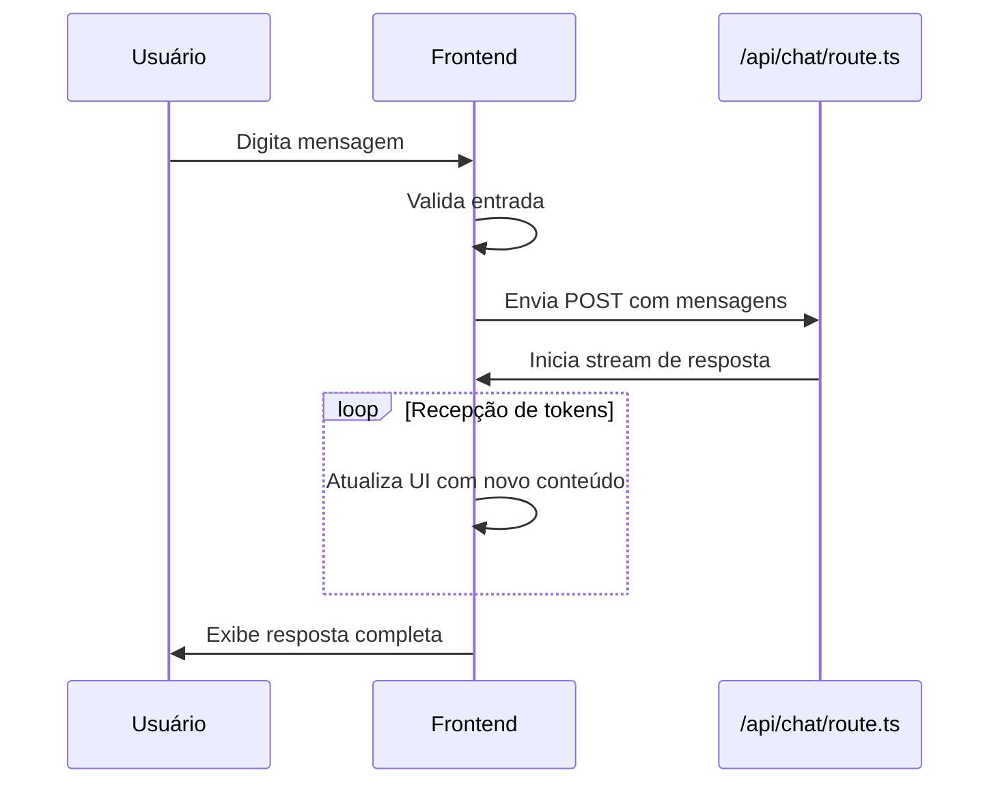
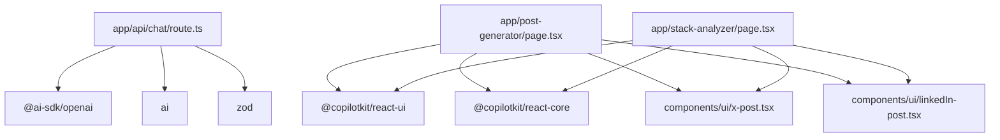

# Mecanismo de Streaming de Chat

<cite>
**Arquivos Referenciados neste Documento**  
- [app/api/chat/route.ts](file://app/api/chat/route.ts)
- [app/post-generator/page.tsx](file://app/post-generator/page.tsx)
- [app/stack-analyzer/page.tsx](file://app/stack-analyzer/page.tsx)
- [components/ui/linkedIn-post.tsx](file://components/ui/linkedIn-post.tsx)
- [components/ui/x-post.tsx](file://components/ui/x-post.tsx)
</cite>

## Sumário
1. [Introdução](#introdução)
2. [Estrutura do Projeto](#estrutura-do-projeto)
3. [Componentes Principais](#componentes-principais)
4. [Visão Geral da Arquitetura](#visão-geral-da-arquitetura)
5. [Análise Detalhada dos Componentes](#análise-detalhada-dos-componentes)
6. [Análise de Dependências](#análise-de-dependências)
7. [Considerações de Desempenho](#considerações-de-desempenho)
8. [Guia de Solução de Problemas](#guia-de-solução-de-problemas)
9. [Conclusão](#conclusão)

## Introdução

Este documento detalha o mecanismo de streaming de texto implementado na rota `/api/chat/route.ts` usando a função `streamText` do `ai-sdk`. O sistema permite respostas em tempo real no frontend, proporcionando uma experiência de chat interativa e responsiva. O documento explora como o streaming é configurado, o papel da função `toUIMessageStreamResponse` na conversão do stream para um formato consumível pela interface, e como o parâmetro `maxDuration` é definido para evitar timeouts no ambiente Vercel. Também são abordados exemplos de consumo do stream no frontend, o formato das mensagens trocadas, implicações de desempenho, erros comuns e estratégias de otimização para baixa latência.

## Estrutura do Projeto

O projeto é organizado em uma estrutura baseada em funcionalidades com diretórios bem definidos para diferentes tipos de componentes. A arquitetura segue um padrão comum em aplicações Next.js com componentes de UI reutilizáveis e páginas específicas para diferentes funcionalidades.

**Diagrama de fontes**
- [app/api/chat/route.ts](file://app/api/chat/route.ts)
- [app/post-generator/page.tsx](file://app/post-generator/page.tsx)
- [app/stack-analyzer/page.tsx](file://app/stack-analyzer/page.tsx)
- [components/ui/linkedIn-post.tsx](file://components/ui/linkedIn-post.tsx)
- [components/ui/x-post.tsx](file://components/ui/x-post.tsx)

**Fontes da seção**
- [app/api/chat/route.ts](file://app/api/chat/route.ts)
- [app/post-generator/page.tsx](file://app/post-generator/page.tsx)
- [app/stack-analyzer/page.tsx](file://app/stack-analyzer/page.tsx)

## Componentes Principais

Os componentes principais do sistema de streaming de chat incluem a rota de API que processa as mensagens, os componentes de interface que exibem os posts gerados e os componentes de chat que gerenciam a interação com o usuário. A integração entre esses componentes permite uma experiência de chat em tempo real com geração de conteúdo multimodal.

**Fontes da seção**
- [app/api/chat/route.ts](file://app/api/chat/route.ts#L1-L114)
- [components/ui/linkedIn-post.tsx](file://components/ui/linkedIn-post.tsx#L1-L366)
- [components/ui/x-post.tsx](file://components/ui/x-post.tsx#L1-L326)

## Visão Geral da Arquitetura

A arquitetura do sistema de streaming de chat é baseada em uma comunicação assíncrona entre o frontend e o backend, utilizando o protocolo de streaming para fornecer respostas em tempo real. O frontend envia mensagens para a rota `/api/chat`, que processa as solicitações usando o modelo GPT-4o da OpenAI e retorna um stream de respostas que são exibidas imediatamente na interface do usuário.

**Diagrama de fontes**
- [app/api/chat/route.ts](file://app/api/chat/route.ts#L1-L114)

## Análise Detalhada dos Componentes

### Análise do Mecanismo de Streaming

O mecanismo de streaming é implementado na rota `/api/chat/route.ts` usando a função `streamText` do `ai-sdk`. Esta função permite que o modelo de IA gere respostas token por token, que são enviadas imediatamente ao cliente sem esperar a conclusão da resposta completa.

#### Implementação do Streaming na Rota de API

A função `streamText` é configurada com o modelo GPT-4o da OpenAI, as mensagens do usuário e um sistema de prompt que define o comportamento do agente de pesquisa avançado. O resultado do `streamText` é convertido para um formato consumível pela interface usando o método `toUIMessageStreamResponse`.

**Diagrama de fontes**
- [app/api/chat/route.ts](file://app/api/chat/route.ts#L1-L114)

#### Configuração de Tempo Máximo

O parâmetro `maxDuration` é definido como 30 segundos no nível do módulo para evitar timeouts no ambiente Vercel. Esta configuração é crucial para garantir que as funções serverless não excedam o tempo limite de execução, mantendo a estabilidade do sistema.

**Fontes da seção**
- [app/api/chat/route.ts](file://app/api/chat/route.ts#L3-L3)

### Componentes de Interface do Usuário

Os componentes de interface são responsáveis por exibir os posts gerados em formatos específicos para diferentes plataformas de mídia social. Eles são integrados ao sistema de chat para fornecer visualizações em tempo real do conteúdo gerado.

#### Componente LinkedInPost

O componente `LinkedInPost` renderiza posts no formato do LinkedIn com elementos visuais específicos da plataforma, como verificação de perfil, estatísticas de engajamento e barra de ações. O componente possui versões compactas para exibição no fluxo de chat.

**Fontes da seção**
- [components/ui/linkedIn-post.tsx](file://components/ui/linkedIn-post.tsx#L1-L366)

#### Componente XPost

O componente `XPost` renderiza posts no formato do X (antigo Twitter) com elementos visuais específicos da plataforma, como estatísticas de engajamento e barra de ações. Assim como o componente do LinkedIn, possui uma versão compacta para exibição no fluxo de chat.

**Fontes da seção**
- [components/ui/x-post.tsx](file://components/ui/x-post.tsx#L1-L326)

### Integração do Chat no Frontend

O frontend utiliza o componente `CopilotChat` para gerenciar a interface de chat e a interação com o usuário. O componente é configurado para exibir mensagens e processar a entrada do usuário, integrando-se com o sistema de streaming de texto.

#### Fluxo de Mensagens no Frontend

O frontend consome o stream de texto da API e atualiza a interface em tempo real conforme os tokens são recebidos. O componente `CopilotChat` gerencia o estado do chat e a exibição das mensagens, permitindo uma experiência de conversação fluida.

**Fontes da seção**
- [app/post-generator/page.tsx](file://app/post-generator/page.tsx#L265-L333)
- [app/stack-analyzer/page.tsx](file://app/stack-analyzer/page.tsx#L206-L278)

## Análise de Dependências

O sistema de streaming de chat depende de várias bibliotecas e componentes para funcionar corretamente. A análise de dependências revela a integração entre diferentes partes do sistema e como elas colaboram para fornecer a funcionalidade de chat em tempo real.

**Diagrama de fontes**
- [app/api/chat/route.ts](file://app/api/chat/route.ts)
- [app/post-generator/page.tsx](file://app/post-generator/page.tsx)
- [app/stack-analyzer/page.tsx](file://app/stack-analyzer/page.tsx)

## Considerações de Desempenho

O mecanismo de streaming de texto oferece vantagens significativas em termos de experiência do usuário, pois permite que as respostas sejam exibidas imediatamente conforme são geradas, reduzindo a percepção de latência. No entanto, existem considerações importantes de desempenho que devem ser levadas em conta.

A configuração de `maxDuration` como 30 segundos é uma otimização crucial para o ambiente Vercel, evitando timeouts de funções serverless. Esta configuração limita a duração máxima de qualquer operação de streaming, garantindo que o sistema permaneça responsivo e estável mesmo sob carga.

O uso de streaming também reduz o tempo de espera inicial para o usuário, pois a primeira parte da resposta pode ser exibida em milissegundos, enquanto o modelo continua gerando o restante da resposta. Isso melhora significativamente a experiência do usuário em comparação com abordagens de resposta completa.

## Guia de Solução de Problemas

### Interrupções de Conexão

As interrupções de conexão são um erro comum em sistemas de streaming. Quando uma conexão é interrompida, o stream é encerrado e o cliente precisa reestabelecer a conexão para continuar a conversação. Para mitigar este problema, o frontend deve implementar lógica de reconexão automática e armazenar o estado da conversação localmente.

### Tratamento de Erros

O sistema deve implementar tratamento robusto de erros para lidar com falhas na geração de texto, timeouts de API e erros de rede. O frontend deve exibir mensagens de erro claras ao usuário e oferecer opções para tentar novamente a operação.

### Otimizações para Baixa Latência

Para minimizar a latência, recomenda-se:
- Minimizar o processamento no backend antes de iniciar o stream
- Utilizar conexões persistentes quando possível
- Implementar cache de respostas frequentes
- Otimizar o tamanho das respostas para reduzir o tempo de transmissão

**Fontes da seção**
- [app/api/chat/route.ts](file://app/api/chat/route.ts#L1-L114)
- [app/post-generator/page.tsx](file://app/post-generator/page.tsx#L265-L333)
- [app/stack-analyzer/page.tsx](file://app/stack-analyzer/page.tsx#L206-L278)

## Conclusão

O mecanismo de streaming de texto implementado na rota `/api/chat/route.ts` fornece uma experiência de chat em tempo real eficaz e responsiva. A utilização da função `streamText` do `ai-sdk` permite que as respostas sejam transmitidas token por token ao cliente, proporcionando uma sensação de conversação natural. A função `toUIMessageStreamResponse` desempenha um papel crucial na conversão do stream bruto em um formato consumível pela interface do usuário.

A configuração de `maxDuration` como 30 segundos é uma medida importante para garantir a estabilidade no ambiente Vercel, evitando timeouts de funções serverless. Os componentes de interface do usuário, como `LinkedInPost` e `XPost`, são bem projetados para exibir conteúdo gerado em formatos específicos de plataformas de mídia social, com versões compactas para integração no fluxo de chat.

O sistema demonstra uma arquitetura bem estruturada com separação clara de responsabilidades entre os componentes de frontend e backend, permitindo uma experiência de usuário fluida e responsiva. Para melhorias futuras, recomenda-se a implementação de mecanismos de reconexão robustos e estratégias de cache para otimizar ainda mais o desempenho e a experiência do usuário.