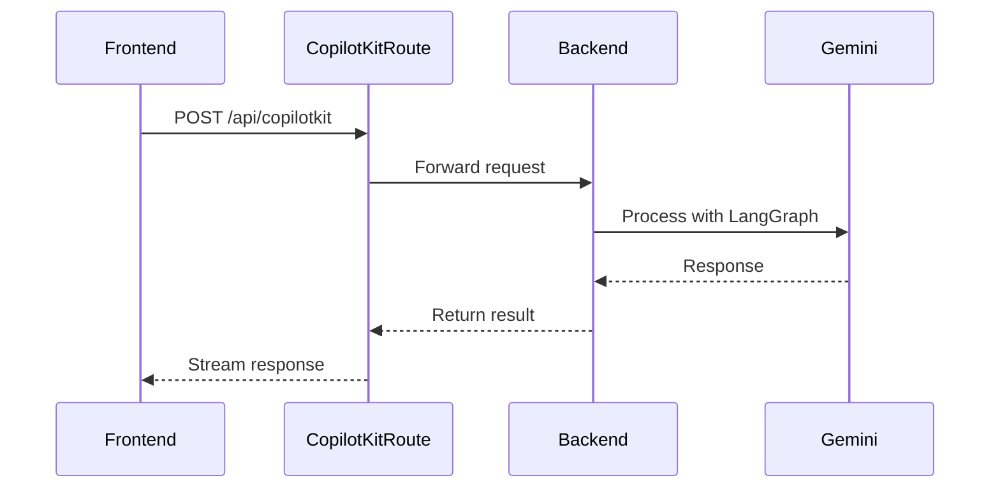
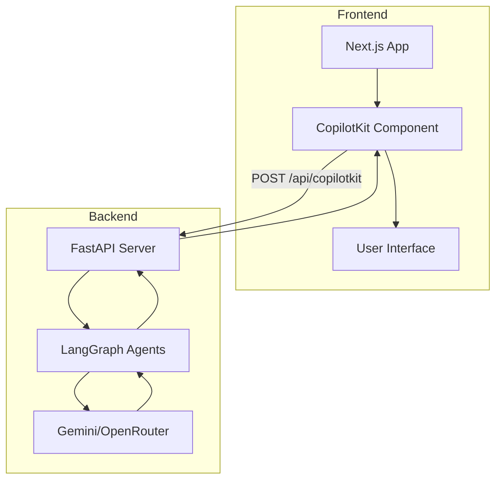

# API do Frontend

<cite>
**Arquivos Referenciados neste Documento**   
- [route.ts](file://app/api/copilotkit/route.ts)
- [route.ts](file://app/api/chat/route.ts)
- [wrapper.tsx](file://app/wrapper.tsx)
- [main.py](file://agent/main.py)
- [posts_generator_agent.py](file://agent/posts_generator_agent.py)
- [stack_agent.py](file://agent/stack_agent.py)
- [tool-logs.tsx](file://components/ui/tool-logs.tsx)
</cite>

## Sumário
1. [Introdução](#introdução)
2. [Endpoint `/api/copilotkit/route.ts`](#endpoint-apicopilotkitroutets)
3. [Endpoint `/api/chat/route.ts`](#endpoint-apichatroutets)
4. [Integração Frontend-Backend](#integração-frontend-backend)
5. [Considerações de Segurança e Performance](#considerações-de-segurança-e-performance)
6. [Dicas de Depuração](#dicas-de-depuração)

## Introdução

Esta documentação detalha os endpoints da API do frontend responsáveis pela integração com agentes de IA utilizando o CopilotKit, Google Gemini e LangGraph. O sistema combina um frontend em Next.js com um backend em FastAPI para fornecer funcionalidades avançadas de geração de conteúdo e análise de tecnologias. Os endpoints principais descritos aqui são `/api/copilotkit` e `/api/chat`, que atuam como intermediários entre a interface do usuário e os agentes Python executados no backend.

**Seção fontes**
- [README.md](file://README.md#L4-L86)

## Endpoint `/api/copilotkit/route.ts`

Este endpoint serve como ponto de integração entre o frontend Next.js e os agentes Python executados no backend via FastAPI e LangGraph. Ele utiliza o CopilotKit Runtime para rotear requisições aos agentes apropriados, gerenciar estado e integrar ferramentas externas.

O endpoint aceita apenas requisições HTTP POST e é configurado para se conectar ao backend FastAPI através da variável de ambiente `NEXT_PUBLIC_LANGGRAPH_URL`. Ele utiliza o adaptador OpenAI para direcionar chamadas para o OpenRouter com o modelo Gemini 2.5 Pro.

O fluxo de processamento inclui:
- Autenticação via chave API do OpenRouter
- Roteamento de mensagens para o agente apropriado
- Gerenciamento de estado entre frontend e backend
- Integração com ferramentas definidas no backend



**Fontes do diagrama**
- [route.ts](file://app/api/copilotkit/route.ts#L1-L29)
- [main.py](file://agent/main.py#L1-L62)

**Fontes da seção**
- [route.ts](file://app/api/copilotkit/route.ts#L1-L29)
- [wrapper.tsx](file://app/wrapper.tsx#L1-L11)

## Endpoint `/api/chat/route.ts`

Este endpoint implementa uma rota de chat que utiliza o modelo GPT-4o da OpenAI para processar mensagens e executar ferramentas especializadas. Ele suporta apenas o método HTTP POST e é projetado para lidar com interações de chat complexas que envolvem pesquisa e geração de relatórios.

### Esquema de Entrada
O endpoint espera um corpo JSON com a estrutura:
```json
{
  "messages": [
    {
      "role": "user",
      "content": "mensagem do usuário"
    }
  ]
}
```

### Ferramentas Disponíveis
O endpoint fornece duas ferramentas principais:

#### Pesquisa de Tópico
Realiza pesquisa sobre um tópico específico e retorna informações relevantes.

| Parâmetro | Tipo | Descrição |
|---------|------|-----------|
| topic | string | O tópico a ser pesquisado |
| depth | enum | Profundidade da pesquisa (basic, comprehensive) |

#### Geração de Relatório
Gera um relatório abrangente com base nos resultados da pesquisa.

| Parâmetro | Tipo | Descrição |
|---------|------|-----------|
| topic | string | O tópico do relatório |
| format | enum | Formato do relatório (executive-summary, detailed-analysis, trend-report) |

### Exemplos de Requisição

**cURL**
```bash
curl -X POST http://localhost:3000/api/chat \
  -H "Content-Type: application/json" \
  -d '{
    "messages": [
      {
        "role": "user",
        "content": "Pesquise sobre inteligência artificial em saúde"
      }
    ]
  }'
```

**JavaScript**
```javascript
fetch('/api/chat', {
  method: 'POST',
  headers: {
    'Content-Type': 'application/json',
  },
  body: JSON.stringify({
    messages: [
      {
        role: 'user',
        content: 'Pesquise sobre inteligência artificial em saúde'
      }
    ]
  })
})
```

### Códigos de Status
- `200 OK` - Requisição processada com sucesso
- `400 Bad Request` - Corpo da requisição inválido
- `500 Internal Server Error` - Erro no processamento da requisição

### Tratamento de Sessão
O endpoint não mantém estado de sessão diretamente, mas o CopilotKit gerencia o estado das interações através do backend LangGraph, permitindo conversações contínuas.

**Fontes da seção**
- [route.ts](file://app/api/chat/route.ts#L1-L114)

## Integração Frontend-Backend

A arquitetura do sistema envolve uma integração estreita entre o frontend Next.js e o backend FastAPI através do CopilotKit. O frontend utiliza o componente `CopilotKit` para se conectar ao endpoint `/api/copilotkit`, que por sua vez se comunica com o backend FastAPI hospedado em `http://localhost:8000/copilotkit`.

Os agentes Python definidos no backend (`post_generation_agent` e `stack_analysis_agent`) são expostos ao frontend através do SDK do CopilotKit. Quando o usuário interage com a interface, as mensagens são enviadas ao endpoint `/api/copilotkit`, que as roteia para o agente apropriado no backend.

O agente `post_generation_agent` é especializado na geração de posts para LinkedIn e X, enquanto o `stack_analysis_agent` analisa repositórios GitHub para determinar suas tecnologias e arquitetura.



**Fontes do diagrama**
- [wrapper.tsx](file://app/wrapper.tsx#L1-L11)
- [main.py](file://agent/main.py#L1-L62)
- [posts_generator_agent.py](file://agent/posts_generator_agent.py#L1-L174)
- [stack_agent.py](file://agent/stack_agent.py#L1-L505)

**Fontes da seção**
- [wrapper.tsx](file://app/wrapper.tsx#L1-L11)
- [main.py](file://agent/main.py#L1-L62)
- [posts_generator_agent.py](file://agent/posts_generator_agent.py#L1-L174)
- [stack_agent.py](file://agent/stack_agent.py#L1-L505)

## Considerações de Segurança e Performance

### Segurança
- Autenticação é realizada através de chaves API armazenadas em variáveis de ambiente
- O endpoint `/api/copilotkit` valida a origem das requisições
- Dados sensíveis são protegidos através do uso de HTTPS
- As chaves API do OpenRouter e Gemini nunca são expostas no frontend

### Rate Limiting
O sistema implementa limitação de taxa indiretamente através:
- Limites de taxa do OpenRouter
- Configuração de timeout nas requisições
- Limites de taxa do servidor FastAPI (não explicitamente configurados no código atual)

### Performance
- O endpoint `/api/chat` define `maxDuration = 30` segundos para evitar execuções longas
- O uso de streaming permite resposta incremental ao usuário
- O backend FastAPI é executado com reload ativado em desenvolvimento, mas deve ser desativado em produção

**Fontes da seção**
- [route.ts](file://app/api/copilotkit/route.ts#L1-L29)
- [route.ts](file://app/api/chat/route.ts#L1-L114)
- [main.py](file://agent/main.py#L1-L62)

## Dicas de Depuração

### Problemas Comuns
1. **Backend não está rodando**: Certifique-se de que o servidor FastAPI está ativo na porta 8000
2. **Variáveis de ambiente ausentes**: Verifique se `OPENROUTER_API_KEY` e outras variáveis estão definidas
3. **Conexão recusada**: Confira se `NEXT_PUBLIC_LANGGRAPH_URL` aponta para o endereço correto do backend

### Logs de Depuração
O componente `ToolLogs` no frontend exibe o status das operações em tempo real:
- Estado "processing" indica que uma operação está em andamento
- Estado "completed" indica conclusão bem-sucedida
- Erros são exibidos no console do navegador

### Testes de Conectividade
Para verificar se o backend está acessível:
```bash
curl http://localhost:8000/healthz
```

Para testar a integração completa:
```bash
curl -X POST http://localhost:3000/api/copilotkit -H "Content-Type: application/json" -d '{}'
```

**Fontes da seção**
- [tool-logs.tsx](file://components/ui/tool-logs.tsx#L1-L53)
- [main.py](file://agent/main.py#L1-L62)
- [route.ts](file://app/api/copilotkit/route.ts#L1-L29)