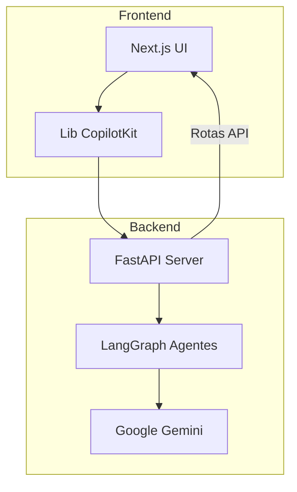

# Stack Tecnológica

<cite>
**Arquivos Referenciados neste Documento**   
- [package.json](file://package.json)
- [agent/pyproject.toml](file://agent/pyproject.toml)
- [next.config.mjs](file://next.config.mjs)
- [README.md](file://README.md)
- [agent/main.py](file://agent/main.py)
- [app/api/copilotkit/route.ts](file://app/api/copilotkit/route.ts)
- [app/post-generator/page.tsx](file://app/post-generator/page.tsx)
- [app/stack-analyzer/page.tsx](file://app/stack-analyzer/page.tsx)
- [agent/posts_generator_agent.py](file://agent/posts_generator_agent.py)
- [agent/stack_agent.py](file://agent/stack_agent.py)
</cite>

## Sumário
1. [Introdução](#introdução)
2. [Arquitetura Geral da Stack](#arquitetura-geral-da-stack)
3. [Frontend com Next.js](#frontend-com-nextjs)
4. [Backend com FastAPI](#backend-com-fastapi)
5. [Orquestração de Agentes com LangGraph](#orquestração-de-agentes-com-langgraph)
6. [Modelo de Linguagem Google Gemini](#modelo-de-linguagem-google-gemini)
7. [Integração entre Frontend e Backend](#integração-entre-frontend-e-backend)
8. [Ferramentas de Desenvolvimento](#ferramentas-de-desenvolvimento)
9. [Orientações para Novos Desenvolvedores](#orientações-para-novos-desenvolvedores)
10. [Conclusão](#conclusão)

## Introdução

O projeto open-gemini-canvas é uma demonstração prática de como integrar tecnologias avançadas de IA em uma aplicação full-stack moderna. Ele combina o poder do Google Gemini, um dos modelos de linguagem multimodal mais avançados, com a orquestração de agentes via LangGraph, tudo integrado a uma interface de usuário elegante construída com Next.js. O backend, desenvolvido em FastAPI, serve como uma ponte entre a UI e os agentes de IA, permitindo uma experiência de usuário fluida e rica em recursos. Este documento detalha cada camada da stack tecnológica, explicando o papel de cada tecnologia e como elas se integram para criar uma aplicação coesa e poderosa.

**Seção fontes**
- [README.md](file://README.md#L1-L86)

## Arquitetura Geral da Stack

A arquitetura do open-gemini-canvas segue um padrão clássico de aplicação full-stack, com uma divisão clara entre frontend e backend, mas com uma camada sofisticada de orquestração de IA no meio. O frontend, baseado em Next.js, é responsável pela renderização da interface de usuário e pela interação direta com o usuário. Ele se comunica com o backend FastAPI através de rotas API. O backend, por sua vez, não apenas serve dados, mas também hospeda e orquestra agentes de IA construídos com LangGraph. Esses agentes utilizam o modelo Google Gemini para processamento de linguagem natural e tomada de decisões. A biblioteca CopilotKit atua como o "fio condutor", facilitando a integração entre a UI e os agentes de IA, permitindo que ações de IA sejam renderizadas diretamente na interface.

**Fontes do diagrama**
- [README.md](file://README.md#L1-L86)
- [package.json](file://package.json#L1-L85)
- [agent/pyproject.toml](file://agent/pyproject.toml#L1-L27)

## Frontend com Next.js

O frontend do projeto é construído com Next.js, uma estrutura React que permite renderização do lado do servidor (SSR), geração de sites estáticos (SSG) e uma experiência de desenvolvimento otimizada. Ele é responsável por fornecer uma interface de usuário moderna e responsiva. O projeto utiliza o framework Tailwind CSS para estilização, permitindo a criação de designs personalizados com classes utilitárias. O arquivo `package.json` lista as principais dependências do frontend, incluindo `react`, `next`, `tailwindcss` e uma série de componentes da biblioteca Radix UI, como `@radix-ui/react-dialog` e `@radix-ui/react-accordion`, que fornecem componentes acessíveis e sem estilos pré-definidos. A integração com a IA é feita principalmente através da biblioteca `@copilotkit/react-core` e `@copilotkit/react-ui`, que permitem a criação de experiências de chat e ações de IA diretamente na UI.

**Seção fontes**
- [package.json](file://package.json#L1-L85)
- [next.config.mjs](file://next.config.mjs#L1-L14)

## Backend com FastAPI

O backend é implementado em Python usando FastAPI, uma estrutura moderna e de alto desempenho para construir APIs. Ele é responsável por servir os agentes de IA e atuar como uma camada de integração. O arquivo `agent/pyproject.toml` define as dependências do backend, com destaque para `fastapi`, `uvicorn` (o servidor ASGI), `langgraph` e `langchain[google-genai]`. O ponto de entrada principal do backend é o arquivo `agent/main.py`, onde um servidor FastAPI é inicializado. Esse arquivo cria um SDK do CopilotKit, registra os agentes (como o `post_generation_agent` e o `stack_analysis_agent`) e os expõe através de uma rota API `/copilotkit`. A rota `/healthz` fornece um endpoint simples para verificar a saúde do serviço.

**Seção fontes**
- [agent/pyproject.toml](file://agent/pyproject.toml#L1-L27)
- [agent/main.py](file://agent/main.py#L1-L62)

## Orquestração de Agentes com LangGraph

LangGraph é a tecnologia central que permite a criação de agentes de IA complexos e com estado. Ele estende a biblioteca LangChain, permitindo a definição de fluxos de trabalho (workflows) como grafos de estados. No projeto, dois agentes são definidos: um para geração de posts e outro para análise de stack. O arquivo `agent/posts_generator_agent.py` define um grafo de estado com três nós: `chat_node`, `fe_actions_node` e `end_node`. Esse grafo controla o fluxo da conversa, desde a análise da entrada do usuário até a geração de conteúdo e a renderização na UI. O `stack_agent.py` implementa um agente mais complexo que faz scraping de repositórios GitHub, analisa manifestos de dependência e usa o Gemini para gerar uma análise estruturada da stack tecnológica. A classe `StackAgentState` define o estado do agente, incluindo logs de ferramentas e a análise em si.

**Seção fontes**
- [agent/posts_generator_agent.py](file://agent/posts_generator_agent.py#L1-L163)
- [agent/stack_agent.py](file://agent/stack_agent.py#L1-L503)

## Modelo de Linguagem Google Gemini

Google Gemini é o modelo de linguagem de grande porte (LLM) que fornece o poder cognitivo para os agentes. Ele é usado tanto para compreensão de linguagem quanto para geração de texto. No backend, o modelo é instanciado usando `ChatGoogleGenerativeAI` da biblioteca `langchain-google-genai`, com a chave de API fornecida pela variável de ambiente `GOOGLE_API_KEY`. O modelo `gemini-2.5-pro` é especificado nos arquivos de agente. O Gemini é capaz de realizar pesquisas na web (usando a ferramenta `google_search`) e de gerar saídas estruturadas em JSON, o que é crucial para a funcionalidade de análise de stack. A integração com o frontend é indireta, ocorrendo através do backend FastAPI e da orquestração do LangGraph.

**Seção fontes**
- [agent/posts_generator_agent.py](file://agent/posts_generator_agent.py#L1-L163)
- [agent/stack_agent.py](file://agent/stack_agent.py#L1-L503)

## Integração entre Frontend e Backend

A integração entre o frontend e o backend é facilitada pela biblioteca CopilotKit. No frontend, o arquivo `app/api/copilotkit/route.ts` define uma rota API que atua como um proxy. Ele cria uma instância do `CopilotRuntime` e a configura com um `GoogleGenerativeAIAdapter`, apontando para o endpoint do backend FastAPI (geralmente `http://localhost:8000/copilotkit`). Quando o frontend faz uma chamada para `/api/copilotkit`, essa rota no Next.js encaminha a solicitação ao backend FastAPI. No backend, o SDK do CopilotKit recebe a solicitação, a roteia para o agente LangGraph apropriado, e o resultado é enviado de volta ao frontend. Isso permite que ações de IA definidas no backend (como `generate_post`) sejam renderizadas dinamicamente na UI do frontend, como demonstrado no componente `useCopilotAction` em `post-generator/page.tsx`.

**Seção fontes**
- [app/api/copilotkit/route.ts](file://app/api/copilotkit/route.ts#L1-L25)
- [app/post-generator/page.tsx](file://app/post-generator/page.tsx#L1-L410)

## Ferramentas de Desenvolvimento

O projeto utiliza um conjunto de ferramentas modernas para otimizar o fluxo de trabalho de desenvolvimento. O gerenciador de pacotes `pnpm` é usado em vez do `npm` ou `yarn` por sua velocidade e eficiência no gerenciamento de dependências. O script `dev` no `package.json` usa o pacote `concurrently` para iniciar o frontend e o backend simultaneamente com um único comando (`pnpm dev`). Isso inicia o servidor Next.js com `next dev --turbopack` e o servidor FastAPI com `cd agent && poetry run python main.py`. O Poetry é usado no backend para gerenciar o ambiente Python e as dependências, conforme definido no `pyproject.toml`. Scripts de instalação (`setup-agent.bat` e `setup-agent.sh`) automatizam a configuração do ambiente do agente, garantindo que todos os desenvolvedores tenham uma configuração consistente.

**Seção fontes**
- [package.json](file://package.json#L1-L85)
- [scripts/setup-agent.bat](file://scripts/setup-agent.bat)
- [scripts/setup-agent.sh](file://scripts/setup-agent.sh)

## Orientações para Novos Desenvolvedores

Para se familiarizar com o projeto, novos desenvolvedores devem seguir estas etapas:
1.  **Configuração Inicial**: Clone o repositório, crie os arquivos `.env` no diretório raiz e em `agent/` com a chave da API do Google Gemini, e execute `pnpm install`.
2.  **Entender o Frontend**: Explore os componentes em `components/ui/` e as páginas em `app/`. O `page.tsx` redireciona para `post-generator`, que é o ponto de entrada principal.
3.  **Explorar o Backend**: Analise o `main.py` para entender como o servidor FastAPI é configurado. Em seguida, estude os arquivos `posts_generator_agent.py` e `stack_agent.py` para compreender a lógica dos agentes.
4.  **Executar a Aplicação**: Use `pnpm dev` para iniciar ambos os servidores. Acesse `http://localhost:3000` para ver a UI e interagir com os agentes.
5.  **Integração**: Observe como a rota `api/copilotkit` no frontend se conecta ao backend e como os componentes `useCopilotAction` e `useCoAgent` vinculam a lógica de IA à interface do usuário.

**Seção fontes**
- [README.md](file://README.md#L1-L86)
- [package.json](file://package.json#L1-L85)

## Conclusão

A stack tecnológica do open-gemini-canvas representa uma combinação poderosa e bem integrada de tecnologias modernas. O Next.js fornece uma base robusta para o frontend, enquanto o FastAPI oferece um backend de alto desempenho. A verdadeira inovação reside na camada de IA, onde o LangGraph permite a criação de agentes complexos e com estado, impulsionados pelo modelo avançado Google Gemini. A biblioteca CopilotKit atua como um elemento unificador, fechando o loop entre a lógica de IA e a interface de usuário. Juntas, essas tecnologias demonstram como é possível construir aplicações de IA sofisticadas que são não apenas funcionais, mas também oferecem uma experiência de usuário integrada e natural.