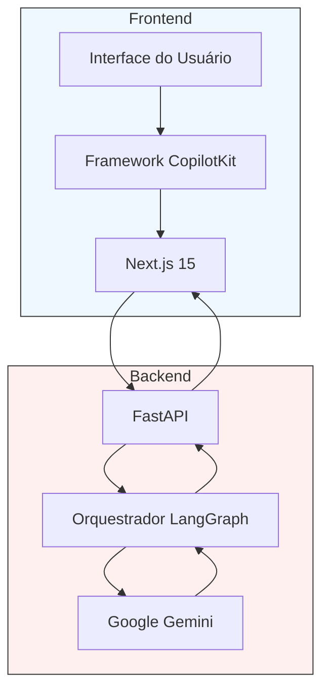
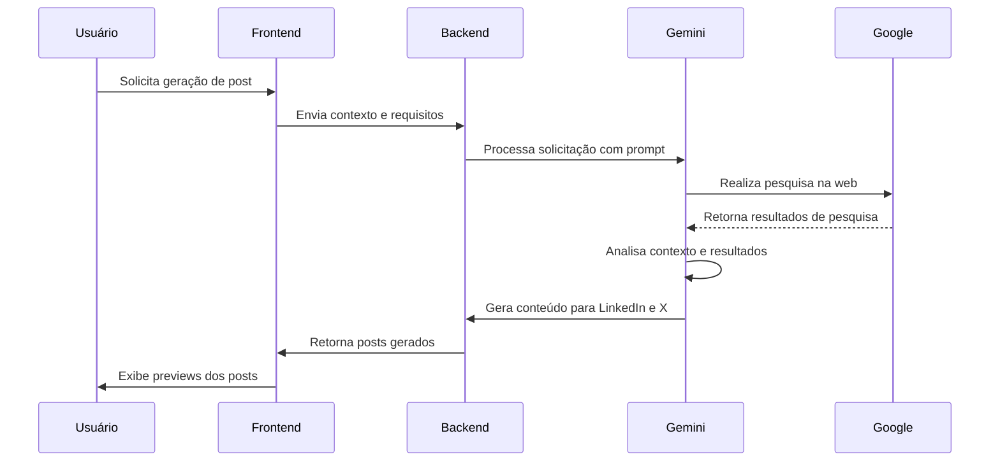
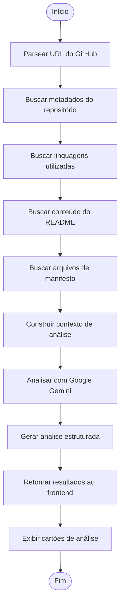
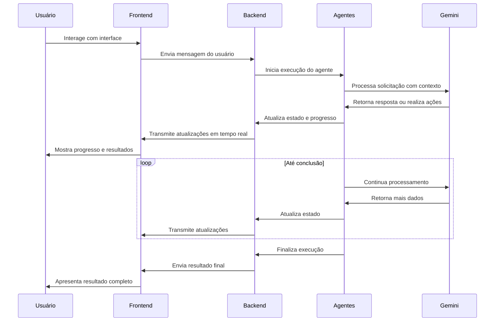

# Visão Geral do Sistema

<cite>
**Arquivos Referenciados neste Documento**   
- [README.md](file://README.md)
- [agent/main.py](file://agent/main.py)
- [agent/posts_generator_agent.py](file://agent/posts_generator_agent.py)
- [agent/stack_agent.py](file://agent/stack_agent.py)
- [app/post-generator/page.tsx](file://app/post-generator/page.tsx)
- [app/stack-analyzer/page.tsx](file://app/stack-analyzer/page.tsx)
- [agent/prompts.py](file://agent/prompts.py)
- [app/prompts/prompts.ts](file://app/prompts/prompts.ts)
- [components/ui/stack-analysis-cards.tsx](file://components/ui/stack-analysis-cards.tsx)
</cite>

## Tabela de Conteúdos
1. [Introdução](#introdução)
2. [Arquitetura de Camadas](#arquitetura-de-camadas)
3. [Agentes de IA](#agentes-de-ia)
4. [Fluxo de Dados](#fluxo-de-dados)
5. [Decisões Técnicas Fundamentais](#decisões-técnicas-fundamentais)
6. [Exemplos Práticos de Uso](#exemplos-práticos-de-uso)
7. [Conclusão](#conclusão)

## Introdução

O **open-gemini-canvas** é uma aplicação full-stack moderna que combina tecnologias avançadas para criar agentes de inteligência artificial com interface integrada e experiência de usuário fluida. O projeto demonstra como integrar **Next.js**, **FastAPI**, **Google Gemini** e **LangGraph** para construir agentes especializados que realizam tarefas complexas com base em IA generativa.

A aplicação é projetada como um canvas de IA, onde diferentes agentes podem ser ativados para realizar funções específicas, proporcionando uma experiência de usuário coesa e poderosa. O sistema é particularmente eficaz para tarefas que exigem pesquisa em tempo real, análise estruturada de dados e geração de conteúdo contextualizado.

O projeto é organizado em duas camadas principais: uma camada frontend baseada em Next.js que fornece a interface de usuário, e uma camada backend baseada em FastAPI que executa a lógica dos agentes. A integração entre essas camadas é facilitada pelo CopilotKit, que permite uma comunicação bidirecional rica entre o frontend e os agentes de IA.

**Section sources**
- [README.md](file://README.md#L1-L86)

## Arquitetura de Camadas

A arquitetura do open-gemini-canvas segue uma abordagem clara de separação de preocupações, dividindo o sistema em camadas distintas que se comunicam através de interfaces bem definidas. Esta separação permite que cada componente seja desenvolvido, testado e escalado independentemente.

**Diagram sources**
- [agent/main.py](file://agent/main.py#L1-L62)
- [app/post-generator/page.tsx](file://app/post-generator/page.tsx#L1-L410)

### Camada Frontend

A camada frontend é construída com **Next.js 15**, uma estrutura React moderna que oferece renderização do lado do servidor (SSR), roteamento avançado e suporte a API routes. O frontend é responsável por:

- Apresentar a interface de usuário ao usuário
- Capturar entradas do usuário
- Exibir resultados gerados pelos agentes
- Gerenciar o estado da interface

O frontend contém duas páginas principais: `post-generator` e `stack-analyzer`, cada uma dedicada a um agente específico. Essas páginas utilizam componentes UI modernos e estilizados para criar uma experiência visual agradável e funcional.

### Camada Backend

A camada backend é implementada com **FastAPI**, um framework Python moderno e de alto desempenho para construção de APIs. O backend é responsável por:

- Receber requisições do frontend
- Orquestrar a execução dos agentes de IA
- Integrar com o Google Gemini para processamento de IA
- Retornar resultados ao frontend

O arquivo `main.py` no diretório `agent/` serve como ponto de entrada do backend, configurando o servidor FastAPI e registrando os agentes disponíveis através do CopilotKit.

**Section sources**
- [agent/main.py](file://agent/main.py#L1-L62)
- [app/post-generator/page.tsx](file://app/post-generator/page.tsx#L1-L410)
- [app/stack-analyzer/page.tsx](file://app/stack-analyzer/page.tsx#L1-L347)

## Agentes de IA

O sistema implementa dois agentes de IA especializados, cada um projetado para executar tarefas específicas com alta eficácia. Esses agentes são orquestrados pelo LangGraph e aproveitam o poder do Google Gemini para processamento de linguagem natural e geração de conteúdo.

### Agente Gerador de Posts

O **Agente Gerador de Posts** é especializado na criação de conteúdo para redes sociais, especificamente para LinkedIn e X (Twitter). Este agente combina pesquisa em tempo real com geração de conteúdo contextualizado para produzir posts profissionais e relevantes.

**Diagram sources**
- [agent/posts_generator_agent.py](file://agent/posts_generator_agent.py#L1-L163)
- [app/post-generator/page.tsx](file://app/post-generator/page.tsx#L1-L410)

O agente utiliza uma abordagem em duas etapas:
1. Primeiro, realiza uma pesquisa na web usando a ferramenta de busca do Google integrada ao Gemini para coletar informações atualizadas sobre o tópico solicitado.
2. Em seguida, utiliza essas informações contextualizadas para gerar posts adequados para cada plataforma, aplicando diferentes estilos e formatos para LinkedIn (mais formal e profissional) e X (mais conciso e com hashtags).

O frontend exibe os posts gerados em previews que simulam a aparência real das plataformas, permitindo que o usuário visualize como o conteúdo será apresentado antes de compartilhá-lo.

### Agente Analisador de Stack

O **Agente Analisador de Stack** é especializado na análise de repositórios GitHub para identificar tecnologias, estrutura de projeto e outras características relevantes. Este agente realiza uma análise profunda do código e metadados do repositório para fornecer insights valiosos.

**Diagram sources**
- [agent/stack_agent.py](file://agent/stack_agent.py#L1-L503)
- [components/ui/stack-analysis-cards.tsx](file://components/ui/stack-analysis-cards.tsx#L1-L258)

O agente segue um fluxo de trabalho sofisticado:
1. Extrai o proprietário e o nome do repositório da URL fornecida pelo usuário.
2. Busca metadados do repositório através da API do GitHub, incluindo informações sobre linguagens, arquivos raiz e conteúdo do README.
3. Coleta arquivos de manifesto importantes (como package.json, requirements.txt, etc.) para identificar dependências e configurações.
4. Constrói um contexto abrangente com todas essas informações.
5. Utiliza o Google Gemini para analisar esse contexto e gerar uma análise estruturada do stack tecnológico.
6. Retorna os resultados em formato JSON estruturado, que são então exibidos no frontend como cartões organizados por categoria.

Os resultados são apresentados no frontend através do componente `StackAnalysisCards`, que organiza a análise em seções lógicas como Frontend, Backend, Banco de Dados, Infraestrutura, CI/CD, entre outras.

**Section sources**
- [agent/posts_generator_agent.py](file://agent/posts_generator_agent.py#L1-L163)
- [agent/stack_agent.py](file://agent/stack_agent.py#L1-L503)
- [app/post-generator/page.tsx](file://app/post-generator/page.tsx#L1-L410)
- [app/stack-analyzer/page.tsx](file://app/stack-analyzer/page.tsx#L1-L347)
- [components/ui/stack-analysis-cards.tsx](file://components/ui/stack-analysis-cards.tsx#L1-L258)

## Fluxo de Dados

O fluxo de dados no sistema open-gemini-canvas é bidirecional e altamente interativo, permitindo uma experiência de usuário dinâmica e responsiva. O CopilotKit desempenha um papel crucial nesse fluxo, facilitando a comunicação entre o frontend e os agentes de IA.

**Diagram sources**
- [agent/main.py](file://agent/main.py#L1-L62)
- [agent/posts_generator_agent.py](file://agent/posts_generator_agent.py#L1-L163)
- [agent/stack_agent.py](file://agent/stack_agent.py#L1-L503)

O fluxo começa quando o usuário interage com a interface frontend, seja digitando uma mensagem ou clicando em uma sugestão. O frontend envia essa entrada para o backend FastAPI, que então inicia a execução do agente apropriado através do CopilotKit.

Durante a execução, o agente pode realizar várias ações, como pesquisas na web ou chamadas a ferramentas. O estado do agente é atualizado continuamente e essas atualizações são transmitidas de volta ao frontend em tempo real, permitindo que o usuário veja o progresso do processamento.

Quando o agente completa sua tarefa, ele retorna o resultado final ao backend, que o envia ao frontend para apresentação ao usuário. Esse fluxo bidirecional permite uma experiência de usuário altamente interativa, onde o usuário pode ver o agente "pensando" e trabalhando em tempo real.

**Section sources**
- [agent/main.py](file://agent/main.py#L1-L62)
- [agent/posts_generator_agent.py](file://agent/posts_generator_agent.py#L1-L163)
- [agent/stack_agent.py](file://agent/stack_agent.py#L1-L503)

## Decisões Técnicas Fundamentais

O projeto open-gemini-canvas incorpora várias decisões técnicas fundamentais que contribuem para sua eficácia e usabilidade. Essas decisões refletem uma compreensão profunda das melhores práticas em desenvolvimento de aplicações de IA.

### Uso do CopilotKit para Integração de IA no Frontend

Uma das decisões mais importantes foi o uso do **CopilotKit** para integrar a IA diretamente no frontend. O CopilotKit permite que os agentes de IA sejam expostos como componentes da interface do usuário, criando uma experiência de usuário coesa onde a IA se sente como parte integrante do aplicativo, e não apenas uma caixa de chat separada.

Esta integração permite funcionalidades avançadas como:
- Atualizações de estado em tempo real durante o processamento do agente
- Exibição de logs de ferramentas e progresso do agente
- Chamada de ações específicas do frontend a partir dos agentes
- Sugestões contextuais baseadas no estado atual do aplicativo

### Orquestração com LangGraph

O uso do **LangGraph** para orquestrar os fluxos dos agentes é outra decisão técnica crucial. O LangGraph permite definir fluxos de trabalho complexos como grafos de estado, onde cada nó representa uma etapa no processo do agente.

Esta abordagem oferece várias vantagens:
- Clareza na definição do fluxo de trabalho do agente
- Capacidade de manter estado entre etapas diferentes
- Suporte a execução assíncrona e não bloqueante
- Facilidade de depuração e monitoramento do progresso do agente

Os agentes no projeto são definidos como grafos de estado usando a API do LangGraph, com nós que representam diferentes etapas do processamento, como coleta de contexto, análise com Gemini e geração de resultados.

### Separação Clara entre Frontend e Backend

A separação clara entre o frontend Next.js e o backend FastAPI permite que cada camada seja otimizada para suas responsabilidades específicas. O frontend pode focar na experiência do usuário e na apresentação de dados, enquanto o backend pode focar na lógica de negócios e na integração com serviços de IA.

Esta arquitetura também facilita o desenvolvimento paralelo, onde equipes diferentes podem trabalhar no frontend e backend simultaneamente, e permite a escalabilidade independente de cada camada conforme as necessidades do sistema evoluem.

**Section sources**
- [agent/main.py](file://agent/main.py#L1-L62)
- [agent/posts_generator_agent.py](file://agent/posts_generator_agent.py#L1-L163)
- [agent/stack_agent.py](file://agent/stack_agent.py#L1-L503)
- [app/post-generator/page.tsx](file://app/post-generator/page.tsx#L1-L410)

## Exemplos Práticos de Uso

O sistema open-gemini-canvas oferece vários exemplos práticos de uso que demonstram seu valor em cenários do mundo real.

### Geração de Conteúdo Profissional

Um exemplo prático é a geração de conteúdo profissional para LinkedIn. Um usuário pode solicitar ao agente que gere um post sobre "tendências recentes em inteligência artificial". O agente então:

1. Realiza uma pesquisa na web para coletar informações atualizadas sobre tendências em IA
2. Analisa essas informações para identificar os pontos mais relevantes
3. Gera um post para LinkedIn com um título atraente e conteúdo bem estruturado, usando um tom profissional adequado para a plataforma
4. Simultaneamente, gera uma versão mais concisa para X (Twitter) com hashtags relevantes

O resultado é um conteúdo de alta qualidade que é tanto informativo quanto otimizado para cada plataforma específica, economizando tempo significativo para o usuário.

### Identificação de Tecnologias em Projetos

Outro exemplo prático é a análise de um repositório GitHub para identificar sua stack tecnológica. Um usuário pode fornecer a URL de um repositório como "https://github.com/facebook/react" e solicitar uma análise.

O agente então:
1. Extrai metadados do repositório, incluindo linguagens usadas, arquivos raiz e conteúdo do README
2. Coleta arquivos de manifesto importantes para identificar dependências
3. Analisa essa informação para determinar o stack tecnológico
4. Gera uma análise estruturada que identifica o framework frontend (React), linguagem (JavaScript), gerenciador de pacotes (npm/yarn), bibliotecas chave, arquitetura, e muito mais

O resultado é uma visão abrangente da tecnologia utilizada no projeto, apresentada de forma organizada e fácil de entender, que pode ser valiosa para desenvolvedores que querem entender rapidamente a arquitetura de um projeto de código aberto.

**Section sources**
- [README.md](file://README.md#L1-L86)
- [app/post-generator/page.tsx](file://app/post-generator/page.tsx#L1-L410)
- [app/stack-analyzer/page.tsx](file://app/stack-analyzer/page.tsx#L1-L347)

## Conclusão

O projeto open-gemini-canvas demonstra uma integração sofisticada de tecnologias modernas para criar uma aplicação full-stack de IA poderosa e fácil de usar. Ao combinar Next.js, FastAPI, Google Gemini e LangGraph com o CopilotKit, o sistema oferece uma experiência de usuário coesa onde agentes de IA especializados podem realizar tarefas complexas com alta eficácia.

A arquitetura de camadas claras, a orquestração de fluxos com LangGraph e a integração de IA no frontend com CopilotKit representam decisões técnicas sólidas que contribuem para a robustez e usabilidade do sistema. Os agentes especializados para geração de posts e análise de stack demonstram como a IA pode ser aplicada a problemas do mundo real, proporcionando valor significativo aos usuários.

O projeto serve como um excelente template para desenvolvedores que desejam construir aplicações de IA com interfaces integradas e experiências de usuário ricas, mostrando como combinar diferentes tecnologias para criar soluções mais do que a soma de suas partes.